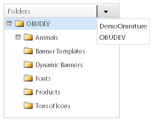
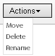
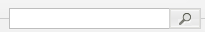
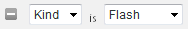
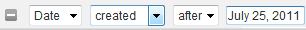

# A propos des bannières {#about-banners}

Vous pouvez utiliser les bannières publicitaires pour gérer les bannières publicitaires de votre site Web.

## Utilisation des bannières {#concept_5BBE01FEC6134393B43CC917C8CC64DA}

<!-- 

c_about_banners.xml

 -->

Vous pouvez utiliser deux méthodes pour ajouter des bannières publicitaires à votre site Web.

La première méthode consiste à ajouter des bannières au moyen de Target, Search&amp;Promote. Les bannières sont des fragments de code HTML qui s’affichent au moment où un client effectue une recherche sur votre site Web. Votre bannière peut inclure du texte ou une image au format GIF, JPEG ou PNG, ou une combinaison des deux. Vous pouvez choisir parmi des tailles prédéfinies ou définir vos propres dimensions personnalisées en fonction de votre page. Le code HTML que vous utilisez pour afficher la bannière peut également spécifier le style de police à utiliser et la bordure. Cette méthode d&#39;ajout d&#39;une bannière offre des fonctionnalités de base et ne nécessite pas de logiciel supplémentaire.

La deuxième méthode consiste à utiliser Adobe Dynamic Media Classic, un service de publication et de gestion dynamique des médias. Un compte Adobe Dynamic Media Classic valide vous permet de gérer et de diffuser directement le contenu des bannières vers Target, Search&amp;Promote, à l’aide de Dynamic Media Classic. Dans la recherche/le marchandisage de site, vous configurez l’accès à votre compte Dynamic Media Classic. Ouvrez ensuite le navigateur de supports Dynamic Media Classic et sélectionnez un fichier de supports dynamiques à utiliser comme bannière.

>[!NOTE]
>
>Avant de pouvoir utiliser des fichiers de médias dynamiques comme bannières dans la recherche/le marchandisage de site, les fichiers sont d’abord téléchargés et préparés pour publication dans Scene7 Publishing System. Vous pouvez télécharger des fichiers à partir de la recherche/marchandisage sur le site et les préparer automatiquement pour publication par Scene7 Publishing System. Vous pouvez également télécharger et publier des fichiers depuis Scene7 Publishing System.

## Intégration de bannières à Adobe Scene7 Publishing System {#section_D4D7ADEA6A6348E68EDA138E184FE579}

Vous pouvez utiliser les types de fichier Dynamic Media Classic comme bannières dans la recherche/le marchandisage de sites, y compris les images, les bannières dynamiques et les modèles, tels que les modèles d’image ou les modèles Flash.

Les modèles sont créés dynamiquement et des fichiers d’images superposés adressables, tels que des fichiers superposés dans des applications de retouche d’images telles qu’Adobe Photoshop®. Contrairement à un fichier image statique, un modèle peut inclure des paramètres. Grâce aux paramètres, vous pouvez personnaliser les propriétés d’image variables et le contenu de l’image.

>[!NOTE]
>
>Vous pouvez également créer des modèles à partir de conceptions basées sur des mises en page à l’aide de la fonction Publication de modèles dans Scene7 Publishing System et de fichiers d’Adobe Illustrator et d’Adobe InDesign.

Voir Publication [de](https://help.adobe.com/en_US/scene7/using/WSFBFBAD30-2694-4b18-B7CE-894F9FC5CDDF.html) modèles dans le Guide de l’utilisateur de Dynamic Media Classic (Scene7).

Un modèle peut contenir n’importe quel nombre de calques d’image et de texte. Vous pouvez convertir un fichier statique contenant des calques, tels qu’un fichier PSD superposé, en modèle ou créer des modèles dans Dynamic Media Classic. Vous pouvez créer des calques de texte dans des modèles à l’aide de polices que vous avez téléchargées dans Scene7 Publishing System. Après avoir ajouté du texte à un modèle, vous pouvez le mettre en forme en modifiant sa justification, ses polices, sa taille et sa couleur.

L’écran Paramètres de Dynamic Media Classic vous permet de convertir n’importe quel aspect d’un modèle en paramètre adressable. Ce faisant, vous pouvez modifier l’image superposée à utiliser ou la valeur de texte à utiliser dans votre modèle. Les paramètres sont transmis avec la chaîne URL, ce qui vous permet de modifier n’importe quel paramètre pour personnaliser dynamiquement l’image de réponse générée à partir du serveur d’images.

Vous pouvez en savoir plus sur l’utilisation de Dynamic Media Classic pour créer des modèles et paramétrer les propriétés des calques afin de les utiliser dans des bannières.

Reportez-vous à la section [Concepts de base des](https://help.adobe.com/en_US/scene7/using/WS60B68844-9054-4099-BF69-3DC998A04D3C.html) modèles du Guide de l’utilisateur de Dynamic Media Classic (Scene7).

**Téléchargement et publication de fichiers**

Vous devez télécharger et publier des fichiers dans Dynamic Media Classic avant de pouvoir les utiliser pour des bannières dans la recherche/le marchandisage de site. Ce prérequis inclut également tous les fichiers utilisés par un modèle d’image ou un modèle Flash. Utilisez votre compte Dynamic Media Classic pour télécharger et publier des fichiers numériques. Vous pouvez également utiliser la recherche sur site/le marchandisage pour télécharger un fichier numérique, puis demander à Dynamic Media Classic de le publier automatiquement en fonction de vos paramètres de téléchargement. Si vous tentez de sélectionner un fichier qui n’est pas encore téléchargé et publié, vous en êtes averti dans l’interface utilisateur et vous avez la possibilité de le télécharger avant de continuer.

Vous pouvez en savoir plus sur le téléchargement et la publication de fichiers numériques à l’aide de Scene7 Publishing System.

Voir [Téléchargement et publication de fichiers](https://help.adobe.com/en_US/scene7/using/WS3673AD39-098B-4f08-8A24-CA51261B7366.html) dans le Guide de l’utilisateur de Dynamic Media Classic (Scene7).

>[!NOTE]
>
>Pour utiliser la fonctionnalité de téléchargement dans la visionneuse de fichiers de Dynamic Media Classic, assurez-vous que le compte de contenu de Dynamic Media Classic que vous utilisez a déjà le rôle &quot;Administrateur de société SPS&quot;.

Voir Configuration [de l’](https://help.adobe.com/en_US/scene7/using/WS662101DF-D697-47a7-A7D8-B52FD8E94438.html) administration dans le Guide de l’utilisateur de Dynamic Media Classic (Scene7).

**Modification des paramètres de modèle de média dynamique classique dans une bannière à l’aide de règles de fonctionnement**

Si vous avez ajouté une ressource Dynamique Media Classic en tant que bannière, vous pouvez l’utiliser [!DNL Visual Rule Builder] dans [!DNL Business Rules] pour l’ajouter à n’importe quelle zone de bannière de votre site Web. Par exemple, vous ajoutez la bannière à vos pages de résultats de recherche, comme vous le feriez pour toute autre bannière. Vous pouvez également remplacer les valeurs de paramètre par défaut dans les modèles Dynamic Media Classic en les personnalisant en fonction de vos besoins spécifiques. Ce type de fonctionnalité vous permet de personnaliser des modèles de contenu Dynamic Media Classic avec différents messages marketing et des hyperliens vers différents points de fin.

Voir aussi [Ajout d’une nouvelle règle](../c-about-rules-menu/c-about-business-rules.md#task_BD3B31ED48BB4B1B8F1DCD3BFA2528E7)de fonctionnement.

Voir aussi [Modification d’une règle](../c-about-rules-menu/c-about-business-rules.md#task_375CFA75D1D94D9E92A35DE1228E5087)de fonctionnement.

## Ajout d’une bannière {#task_549D02B5F73B4158B105A94E39D937B7}

Vous pouvez les utiliser [!DNL Banners] pour gérer les bannières publicitaires et leur emplacement sur votre site Web. Lorsque vous ajoutez une bannière, vous référencez l’image de manière externe au moyen de fragments de code HTML affichés au moment de la recherche.

<!-- 

t_adding_a_new_banner.xml

 -->

Si vous disposez d’un compte Adobe Dynamic Media Classic valide, vous pouvez ajouter des bannières publicitaires au moyen de Scene7 Publishing System.

Voir [Ajout d’une bannière à l’aide d’Adobe Dynamic Media Classic](../c-about-design-menu/c-about-banners.md#task_AD1E0C00A9E04B1FA819EB93288786B3).

Voir [Configuration de l’accès à votre compte](../c-about-settings-menu/c-about-account-options-menu.md#task_CEFF88C2033D41D0B2FE86C435EDAC6D)Adobe Dynamic Media Classic.

**Pour ajouter une bannière**

1. Dans le menu du produit, cliquez sur **[!UICONTROL Design]** > **[!UICONTROL Banners]**.
1. Sur la [!DNL Banners] page, dans la liste **[!UICONTROL Add Banner]** déroulante, sélectionnez **[!UICONTROL HTML code]**.
1. Dans la [!DNL Add Banner] boîte de dialogue, définissez les options de votre choix.

   <table> 
    <thead> 
      <tr> 
      <th colname="col1" class="entry"> 
Option 
 </th> 
      <th colname="col2" class="entry"> 
Description 
 </th> 
      </tr> 
    </thead>
    <tbody> 
      <tr> 
      <td colname="col1"> 
Nom 
 </td> 
      <td colname="col2"> 
Requis. Identifie le nom de votre bannière. Le nom est utilisé pour faire référence à la bannière lorsque vous l’ajoutez dans le Créateur de règles visuel dans les Règles métier. Le nom n’apparaît pas dans la bannière elle-même. 
 
Voir <a href="../c-about-rules-menu/c-about-business-rules.md#task_BD3B31ED48BB4B1B8F1DCD3BFA2528E7" type="task" format="dita" scope="local"> Ajout d’une nouvelle règle de fonctionnement.</a> 
 </td> 
      </tr> 
      <tr> 
      <td colname="col1"> 
Bannière HTML 
 </td> 
      <td colname="col2"> 
 Permet de coller le code HTML associé à la bannière. 
 
Tout code HTML est acceptable, y compris le code CSS entouré de 
        <userinput>
          &lt;style&gt; 
        </userinput> balises ou code JavaScript entouré par 
        <userinput>
          &lt;script&gt; 
        </userinput> balises. Par exemple, le bloc de code suivant est destiné à une bannière de texte de type Horizontal top : <code> &lt;div&nbsp;style="width:&nbsp;684px;&nbsp;background-image:&nbsp;url('https://www.brough.com/blackb.gif');&nbsp; 
          padding-top:&nbsp;10px;&nbsp;padding-bottom:&nbsp;10px;&nbsp;color:&nbsp;white;&nbsp;font-family:&nbsp;verdana;&nbsp; 
          text-align:&nbsp;center;&nbsp;font-size:&nbsp;20px;"&gt;&nbsp;Sound&nbsp;Study&nbsp;ships&nbsp;free!&nbsp;&lt;/div&gt; </code>Dans l’exemple suivant, le bloc de code correspond à une image de démarrage complète : <code> &lt;img&amp;nbsp;src='https://geometrixx.com/images/GEOAds/geometrixx-beauty-home-01.jpg'&amp;nbsp;border="0"&amp;nbsp;/&gt; </code> 
 </td> 
      </tr> 
      <tr> 
      <td colname="col1"> 
Type 
 </td> 
      <td colname="col2"> 
Spécifie les types de bannières suivants : 
        <ul id="ul_6423AEDB9E664049989EB529D63C4A62"> 
          <li id="li_BF6CD60B3ED748D49CFFB9C5D607661C">  [nouveau type]  
Permet de spécifier le type de bannière souhaité, y compris les dimensions et le nom. 
 </li> 
          <li id="li_1A29AB22AD644E60A12298187B5E898E">  Plein écran  
La dimension définie pour ce type de bannière est de 680 pixels de large et de 650 pixels de haut. Vous pouvez éventuellement spécifier le nom du type ou accepter le nom par défaut qui est le nom du type de bannière lui-même. 
 </li> 
          <li id="li_2BE06D013CB54DDE851051BFC038BB57">  Haut horizontal  
 La bannière est placée dans la zone supérieure de votre site Web. Ce type est utile si vous prévoyez d’ajouter des hyperliens à gauche ou à droite de la bannière. La dimension définie pour ce type de bannière est de 468 pixels de large et de 60 pixels de haut. Vous pouvez éventuellement spécifier le nom du type ou accepter le nom par défaut qui est le nom du type de bannière lui-même. 
 </li> 
          <li id="li_EC35AB92234749F08AA8A9BD26D0EA8D">  Haut horizontal - Pleine largeur  
Il s’agit du type par défaut lorsque vous ajoutez une nouvelle bannière. La bannière est placée dans la zone supérieure de votre site Web et occupe toute la largeur de la page. La dimension définie pour ce type de bannière est de 670 pixels de large et de 150 pixels de haut. Vous pouvez éventuellement spécifier le nom du type ou accepter le nom par défaut qui est le nom du type de bannière lui-même. 
 </li> 
        </ul> 
 </td> 
      </tr> 
      <tr> 
      <td colname="col1"> 
Balises 
 </td> 
      <td colname="col2"> 
Ajoute des balises ou "mots-clés" que vous souhaitez associer à la bannière. Si vous utilisez de nombreuses bannières, l’ajout de balises peut vous aider à affiner la recherche de bannières afin que vous puissiez localiser rapidement la bannière appropriée à vos besoins. Vous pouvez également supprimer les balises que vous avez ajoutées. 
 </td> 
      </tr> 
    </tbody> 
    </table>

1. Cliquez sur **[!UICONTROL Save]**.
1. (Facultatif) Effectuez l’une des opérations suivantes :

   * Cliquez sur **[!UICONTROL History]** pour annuler les modifications que vous avez apportées.

      Voir [Utilisation de l’option](../t-using-the-history-option.md#task_70DD3F87A67242BBBD2CB27156F43002)Historique.

   * Cliquez sur **[!UICONTROL Live]**.

      Voir [Affichage des paramètres](../c-about-staging.md#task_401A0EBDB5DB4D4CA933CBA7BECDC10F)en direct.

   * Cliquez sur **[!UICONTROL Push Live]**.

      Voir [Pousser les paramètres d’étape en direct](../c-about-staging.md#task_44306783B4C0408AAA58B471DAF2D9A4).

## Modification d’une bannière {#task_D4081083BE7B40F5A003D1A2F1435AEA}

Utilisez [!DNL Edit Banner] pour modifier des éléments tels que le nom de la bannière, le code HTML de la bannière, le type de la bannière et les balises associées.

<!-- 

t_editing_a_banner.xml

 -->

Si vous avez ajouté une bannière à l’aide de la recherche/du marchandisage sur le site, vous modifiez également la bannière à l’aide d’Adobe Dynamic Media Classic.

Voir aussi [Modification d’une bannière à l’aide d’Adobe Dynamic Media Classic](../c-about-design-menu/c-about-banners.md#task_C3E782477FBF428ABEA220751781ACA9).

**Pour modifier une bannière**

1. Dans le menu du produit, cliquez sur **[!UICONTROL Design]** > **[!UICONTROL Banners]**.
1. Sur la [!DNL Banners] page, cliquez sur .

   au-dessus d’une miniature de bannière à modifier.
1. Sur la [!DNL Edit Banner] page, définissez les options de votre choix.

   Voir le tableau des options sous [Ajout d’une bannière](../c-about-design-menu/c-about-banners.md#task_549D02B5F73B4158B105A94E39D937B7).
1. Lorsque vous avez terminé de modifier la bannière, cliquez sur **[!UICONTROL Save]**.
1. (Facultatif) Effectuez l’une des opérations suivantes :

   * Cliquez sur **[!UICONTROL History]** pour annuler les modifications que vous avez apportées.

      Voir [Utilisation de l’option](../t-using-the-history-option.md#task_70DD3F87A67242BBBD2CB27156F43002)Historique.

   * Cliquez sur **[!UICONTROL Live]**.

      Voir [Affichage des paramètres](../c-about-staging.md#task_401A0EBDB5DB4D4CA933CBA7BECDC10F)en direct.

   * Cliquez sur **[!UICONTROL Push Live]**.

      Voir [Pousser les paramètres d’étape en direct](../c-about-staging.md#task_44306783B4C0408AAA58B471DAF2D9A4).

## Ajout d’une bannière à l’aide d’Adobe Dynamic Media Classic {#task_AD1E0C00A9E04B1FA819EB93288786B3}

Vous pouvez utiliser [!DNL Banners] pour gérer les bannières publicitaires sur votre site Web. Lorsque vous ajoutez une bannière à l’aide d’Adobe Dynamic Media Classic, vous pouvez choisir parmi n’importe quelle ressource numérique que vous avez téléchargée dans Scene7 Publishing System.

<!-- 

t_adding_a_banner_using_adobe_scene7.xml

 -->

Pour ajouter une bannière à l’aide d’Adobe Dynamic Media Classic, assurez-vous d’avoir configuré l’accès à votre compte Dynamic Media Classic valide.

Voir [Configuration de l’accès à votre compte](../c-about-settings-menu/c-about-account-options-menu.md#task_CEFF88C2033D41D0B2FE86C435EDAC6D)Adobe Dynamic Media Classic.

**Pour ajouter une bannière à l’aide d’Adobe Dynamic Media Classic**

1. Dans le menu du produit, cliquez sur **[!UICONTROL Design]** > **[!UICONTROL Banners.]**
1. Sur la [!DNL Banners] page, dans la liste **[!UICONTROL Add Banner]** déroulante, cliquez sur **[!UICONTROL Adobe Scene7]**.
1. Dans la boîte de [!DNL Pick an Asset] dialogue, dans le volet de gauche, utilisez les options de navigation de l’interface utilisateur pour localiser le dossier contenant le fichier numérique à utiliser pour une bannière.

   À l’exception des options de navigation des fichiers, toutes les autres options dépendent de la ressource numérique que vous avez sélectionnée pour l’ajouter ou la modifier.

   Utilisez les options de navigation des fichiers pour localiser un fichier que vous souhaitez utiliser pour une nouvelle bannière dans la recherche/marchandisage de site. Les options de navigation s’appliquent à tous les types de ressources numériques sélectionnées.

   >[!NOTE]
   >
   >Les options de navigation des fichiers ne s’affichent pas lorsque vous modifiez la bannière dans la [!DNL Change Parameters] boîte de dialogue.

   Voir [Modification d’une bannière à l’aide d’Adobe Dynamic Media Classic](../c-about-design-menu/c-about-banners.md#task_C3E782477FBF428ABEA220751781ACA9).

   **Options de navigation des fichiers**

   <table> 
    <thead> 
      <tr> 
      <th colname="col1" class="entry"> 
Option Navigation 
 </th> 
      <th colname="col2" class="entry"> 
Description 
 </th> 
      </tr> 
    </thead>
    <tbody> 
      <tr> 
      <td colname="col1"> 
  
 </td> 
      <td colname="col2"> 
Permet de sélectionner le compte Dynamic Media Classic pour votre entreprise particulière dans la liste déroulante et de parcourir les dossiers de fichiers numériques de ce compte. 
 
Lorsque vous sélectionnez un dossier, le volet droit de la boîte de dialogue  Sélectionner un fichier  affiche toutes les ressources numériques disponibles contenues dans ce dossier. 
 </td> 
      </tr> 
      <tr> 
      <td colname="col1"> 
  
 </td> 
      <td colname="col2"> 
Vous permet d’avancer ou de reculer dans l’historique de navigation des dossiers. 
 </td> 
      </tr> 
      <tr> 
      <td colname="col1"> 
  
 </td> 
      <td colname="col2"> 
Actualise la liste des ressources numériques affichées pour un dossier sélectionné. 
 
Vous devrez peut-être cliquer sur ce contrôle si vous déplacez, supprimez ou renommez un fichier sélectionné à l’aide de la liste  déroulante  Actions. 
 </td> 
      </tr> 
      <tr> 
      <td colname="col1"> 
  
 </td> 
      <td colname="col2"> 
Affiche les fichiers numériques dans une vue de liste. La liste affiche l’icône ou l’image miniature associée à chaque fichier, le nom de fichier, le type de fichier numérique, les dimensions (le cas échéant) et la date de sa dernière modification. 
 
La vue Grille affiche les fichiers numériques du dossier sélectionné sous forme d’icônes, de miniatures ou des deux. 
 </td> 
      </tr> 
      <tr> 
      <td colname="col1"> 
  
 </td> 
      <td colname="col2"> 
En mode Liste, vous pouvez déplacer, supprimer ou renommer un fichier numérique sélectionné. 
 
En mode Grille, vous pouvez déplacer ou supprimer un ou plusieurs fichiers numériques sélectionnés. 
 </td> 
      </tr> 
      <tr> 
      <td colname="col1"> 
  
 </td> 
      <td colname="col2"> 
Ouvre la boîte de dialogue  Télécharger  , dans laquelle vous pouvez télécharger un fichier numérique sélectionné depuis votre bureau ou depuis un serveur externe afin de l’utiliser comme bannière. 
 
Une fois le fichier téléchargé, une tâche de publication est automatiquement planifiée dans Scene7 Publishing System. 
 
Voir le tableau des options dans <a href="../c-about-design-menu/c-about-banners.md#task_AD1E0C00A9E04B1FA819EB93288786B3" type="reference" format="dita" scope="local"> Ajout d’une bannière à l’aide d’Adobe Dynamic Media Classic </a>. 
 
Vous pouvez en savoir plus sur le téléchargement et la publication de fichiers numériques à l’aide de Scene7 Publishing System. 
 
Voir <a href="https://help.adobe.com/en_US/scene7/using/WS3673AD39-098B-4f08-8A24-CA51261B7366.html" scope="external" format="html"> Téléchargement et publication de fichiers </a> dans le Guide de l’utilisateur de Scene7 Publishing System. 
 </td> 
      </tr> 
      <tr> 
      <td colname="col1"> 
  
 </td> 
      <td colname="col2"> 
Permet de rechercher un fichier numérique par mot-clé ou par emplacement de fichier dans le dossier sélectionné et les sous-dossiers associés. 
 
Lorsque vous cliquez sur le champ de recherche, il ajoute automatiquement un champ de filtre facultatif. 
 </td> 
      </tr> 
      <tr> 
      <td colname="col1"> 
  
 </td> 
      <td colname="col2"> 
Ajoute un autre filtre de ressources afin que vous puissiez affiner davantage la liste des ressources numériques affichées par type ou par date spécifique. 
 </td> 
      </tr> 
      <tr> 
      <td colname="col1"> 
  
 </td> 
      <td colname="col2"> 
Affinez la liste des ressources numériques affichées pour n’afficher que celles d’un certain type, tel que Flash, Image, Modèle ou Tout autre. 
 
Cliquez sur  pour supprimer le filtre de la recherche. 
 </td> 
      </tr> 
      <tr> 
      <td colname="col1"> 
  
 </td> 
      <td colname="col2"> 
Affinez la liste des ressources numériques affichées pour n’afficher que celles créées ou modifiées avant une certaine date ou après une certaine date. 
 
Cliquez sur  pour supprimer le filtre de la recherche. 
 </td> 
      </tr> 
      <tr> 
      <td colname="col1"> 
  
 </td> 
      <td colname="col2"> 
Permet de faire glisser le curseur vers la gauche ou la droite pour réduire ou agrandir l’affichage complet du volet des ressources numériques, respectivement. 
 </td> 
      </tr> 
    </tbody> 
    </table>

   **Options des propriétés**

   Les options Propriétés s’affichent si vous choisissez un modèle Flash, un modèle d’image ou une image. En fonction de la ressource numérique choisie, toutes les options ne sont pas disponibles.

   <table> 
    <thead> 
      <tr> 
      <th colname="col1" class="entry"> 
Option Propriétés 
 </th> 
      <th colname="col2" class="entry"> 
Description 
 </th> 
      </tr> 
    </thead>
    <tbody> 
      <tr> 
      <td colname="col1"> 
Nom 
 </td> 
      <td colname="col2"> 
Nom descriptif du modèle ou de l’image, sans espaces. Vous pouvez éventuellement inclure la spécification de taille d’image dans le nom afin d’aider les utilisateurs à mieux identifier le fichier. 
 </td> 
      </tr> 
      <tr> 
      <td colname="col1"> 
Format 
 </td> 
      <td colname="col2"> 
Identifie le format de l’image ou du modèle d’image. 
 
Vous pouvez choisir parmi les formats suivants : 
 
        <ul id="ul_9A19421BCC424CF585645049DCB87F10"> 
        <li id="li_A4913D783BD547F9AFA1A259C56EC2B3">jpeg </li> 
        <li id="li_66237D7BE8754FB0B0088CE5A02C0214">png </li> 
        <li id="li_4EDDFD7C8AB04677BEC20EFC9AEBBF1F">png-alpha </li> 
        <li id="li_4FCB03C29AE647ACBAF5105016DF7579">gif </li> 
        <li id="li_B884BD7DFF1845FAA9C58EF09B888A77">gif-alpha </li> 
        </ul> 
Cette option ne s’applique pas aux modèles Flash. 
 </td> 
      </tr> 
      <tr> 
      <td colname="col1"> 
Qualité 
 </td> 
      <td colname="col2"> 
Contrôle le niveau de compression des images au format JPEG ou GIF. Ce paramètre affecte à la fois la taille du fichier et la qualité de l’image. L’échelle de qualité est de 1 à 100. 
 
Lorsque vous faites glisser le curseur vers la gauche ou la droite, l’image dans la fenêtre d’aperçu est mise à jour pour refléter le changement de qualité. 
 
Cette option ne s’applique pas aux modèles Flash. 
 </td> 
      </tr> 
      <tr> 
      <td colname="col1"> 
Largeur 
 </td> 
      <td colname="col2"> 
Indique la largeur du fichier numérique, en pixels. Cette dimension correspond à la largeur de vue de la ressource par les clients qui visitent votre site Web. 
 
Cette option ne s’applique pas aux modèles Flash. 
 </td> 
      </tr> 
      <tr> 
      <td colname="col1"> 
Hauteur 
 </td> 
      <td colname="col2"> 
Indique la hauteur de la ressource numérique, en pixels. Cette dimension correspond à la hauteur à laquelle le fichier est vu par les clients qui visitent votre site Web. 
 
Cette option ne s’applique pas aux modèles Flash. 
 </td> 
      </tr> 
    </tbody> 
    </table>

   **Options de lien de bannière**

   Les options Lien de bannière s’affichent uniquement si vous avez choisi une image ou un modèle d’image pour votre bannière.

   <table> 
    <thead> 
      <tr> 
      <th colname="col1" class="entry"> 
Option Lien de bannière 
 </th> 
      <th colname="col2" class="entry"> 
Description 
 </th> 
      </tr> 
    </thead>
    <tbody> 
      <tr> 
      <td colname="col1"> 
URL du lien 
 </td> 
      <td colname="col2"> 
Indique l’adresse URL à laquelle vous souhaitez lier la bannière lorsqu’un client clique sur l’image. 
 
Si vous ne souhaitez pas que la bannière rende un lien vers quoi que ce soit, laissez le champ URL du lien vide. 
 </td> 
      </tr> 
      <tr> 
      <td colname="col1"> 
Target 
 </td> 
      <td colname="col2"> 
Indique l’emplacement d’ouverture de la bannière liée, telle qu’une nouvelle fenêtre de navigateur ou un nouvel onglet. 
 </td> 
      </tr> 
    </tbody> 
    </table>

   **Modifier les liens, option**

   L’option Modifier les liens apparaît uniquement si vous avez choisi un modèle Flash pour votre bannière.

   <table> 
    <thead> 
      <tr> 
      <th colname="col1" class="entry"> 
Modifier les liens, option 
 </th> 
      <th colname="col2" class="entry"> 
Description 
 </th> 
      </tr> 
    </thead>
    <tbody> 
      <tr> 
      <td colname="col1"> 
  
 </td> 
      <td colname="col2"> 
Permet de modifier le champ de lien URL utilisé dans le modèle Flash. 
 </td> 
      </tr> 
    </tbody> 
    </table>

   **Options Remplacer le texte**

   Les options Remplacer le texte s’affichent uniquement si vous avez choisi un modèle Flash pour votre bannière qui comporte des calques de texte modifiables.

   Les modifications que vous apportez au texte dans le modèle Flash sont répercutées dans la fenêtre Prévisualiser.

   >[!NOTE]
   >
   >Si vous ajoutez une commande de recherche et de remplacement pour remplacer &quot;vache&quot; par &quot;pomme&quot;, puis créez une deuxième commande pour remplacer &quot;pomme&quot; par &quot;orange&quot;, la deuxième commande n’est pas prise en compte.

   <table> 
    <thead> 
      <tr> 
      <th colname="col1" class="entry"> 
Remplacer le texte, option 
 </th> 
      <th colname="col2" class="entry"> 
Description 
 </th> 
      </tr> 
    </thead>
    <tbody> 
      <tr> 
      <td colname="col1"> 
  
 </td> 
      <td colname="col2"> 
Ajoute un champ de recherche et de remplacement. 
 </td> 
      </tr> 
      <tr> 
      <td colname="col1"> 
  
 </td> 
      <td colname="col2"> 
Supprime un champ Rechercher et remplacer et restaure le texte précédemment utilisé. 
 </td> 
      </tr> 
      <tr> 
      <td colname="col1"> 
Rechercher 
 </td> 
      <td colname="col2"> 
Vous permet de saisir un terme de recherche pour du texte non lié dans les calques du modèle Flash. 
 </td> 
      </tr> 
      <tr> 
      <td colname="col1"> 
Remplacez 
 </td> 
      <td colname="col2"> 
Permet de spécifier le texte à insérer à la place du texte que vous recherchez. 
 
Lorsque vous appuyez sur  Entrée  dans ce champ, la fenêtre d’aperçu est mise à jour avec le texte de remplacement. 
 </td> 
      </tr> 
    </tbody> 
    </table>

   **Options des paramètres**

   Les options de paramètres s’affichent uniquement si vous avez choisi un modèle d’image ou un modèle Flash pour votre bannière. Les options de paramètre varient selon la manière dont le modèle a été créé et paramétré dans Scene7 Publishing System. Par exemple, votre modèle peut paramétrer des champs qui vous permettent de modifier du texte, du style de police, du prix, des codes spéciaux utilisés pour la livraison gratuite, la taille de l’image dans la bannière ou même de rechercher une autre image à utiliser.

   >[!NOTE]
   >
   >Gardez à l’esprit que toute modification apportée aux paramètres peut être remplacée par des règles de fonctionnement. Les paramètres servent uniquement de paramètres par défaut lorsqu’aucune règle métier n’est créée, ce qui modifierait les paramètres.

   Voir [Ajout d’une nouvelle règle](../c-about-rules-menu/c-about-business-rules.md#task_BD3B31ED48BB4B1B8F1DCD3BFA2528E7)de fonctionnement.

   See [Editing a business rule](../c-about-rules-menu/c-about-business-rules.md#task_375CFA75D1D94D9E92A35DE1228E5087).

   **Active/désactive les options de visibilité des calques**

   L’option Basculer la visibilité des calques s’applique uniquement si vous avez choisi un modèle Flash pour votre bannière.

   <table> 
    <thead> 
      <tr> 
      <th colname="col1" class="entry"> 
Activer/désactiver l’option Visibilité des calques 
 </th> 
      <th colname="col2" class="entry"> 
Description 
 </th> 
      </tr> 
    </thead>
    <tbody> 
      <tr> 
      <td colname="col1"> 
  
 </td> 
      <td colname="col2"> 
Permet d’activer ou de désactiver la visibilité des différents calques qui composent le fichier de modèle Flash. 
 
Chaque fois que vous activez ou désactivez la visibilité d’un calque, la fenêtre d’aperçu est actualisée pour mettre à jour l’affichage. 
 </td> 
      </tr> 
    </tbody> 
    </table>

   (Facultatif) Si le fichier numérique que vous souhaitez utiliser pour une bannière n’est pas disponible dans le dossier sélectionné, vous devrez peut-être le télécharger. Cliquez sur **[!UICONTROL Upload]**, puis sélectionnez le fichier et les options de votre choix. Le fichier est téléchargé vers le dossier sélectionné.

   >[!NOTE]
   >
   >Si vous souhaitez utiliser la fonctionnalité de téléchargement dans la visionneuse de fichiers Scene7, assurez-vous que le compte Scene7 que vous utilisez a déjà le rôle &quot;Administrateur SPS Société&quot;.

   Voir Configuration [de](https://help.adobe.com/en_US/scene7/using/WS662101DF-D697-47a7-A7D8-B52FD8E94438.html) l’administration dans le Guide de l’utilisateur de Scene7 Publishing System.

   **Options de base**

   <table> 
    <thead> 
      <tr> 
      <th colname="col1" class="entry"> 
Option 
 </th> 
      <th colname="col2" class="entry"> 
Description 
 </th> 
      </tr> 
    </thead>
    <tbody> 
      <tr> 
      <td colname="col1"> 
Parcourir 
 </td> 
      <td colname="col2"> 
 Permet d’accéder au fichier que vous souhaitez télécharger, publier, puis sélectionner pour l’utiliser comme bannière. 
 </td> 
      </tr> 
      <tr> 
      <td colname="col1"> 
 Remplacer 
 </td> 
      <td colname="col2"> 
Les fichiers que vous téléchargez remplacent les fichiers existants par le même nom de fichier, dans le dossier sélectionné. 
 </td> 
      </tr> 
      <tr> 
      <td colname="col1"> 
Préférences de courriel 
 </td> 
      <td colname="col2"> 
 Vous permet de choisir la notification par courrier électronique que vous recevez pour le téléchargement, ou vous pouvez choisir de ne pas être averti pour tout ce qui concerne la tâche de téléchargement. 
 </td> 
      </tr> 
    </tbody> 
    </table>

   **Options avancées**

   Lorsque vous téléchargez des fichiers d’image PostScript (EPS) ou Illustrator (AI), vous pouvez les formater de différentes manières. Vous pouvez pixelliser les fichiers, les convertir au format FXG pour la publication de modèles, conserver l’arrière-plan transparent, choisir une résolution et choisir un espace colorimétrique.

   Les fichiers PSD (fichiers de document Photoshop) sont le plus souvent utilisés dans Dynamic Media Classic pour créer des modèles. Lorsque vous téléchargez un fichier PSD, vous pouvez créer automatiquement un modèle Dynamic Media Classic à partir du fichier (sélectionnez l’ **[!UICONTROL Create Template]** option).

   Scene7 Publishing System crée plusieurs images à partir d’un fichier PSD avec des calques si vous utilisez ce fichier pour créer un modèle ; il crée une image pour chaque calque.

   <table> 
    <thead> 
      <tr> 
      <th colname="col1" class="entry"> 
Nom du groupe d’options 
 </th> 
      <th colname="col02" class="entry"> 
Option 
 </th> 
      <th colname="col2" class="entry"> 
Description 
 </th> 
      </tr> 
    </thead>
    <tbody> 
      <tr> 
      <td colname="col1"> 
Options de profil colorimétrique 
 </td> 
      <td colname="col02"> 
Profil de couleurs 
 </td> 
      <td colname="col2"> 
 Vous permet de choisir parmi les options suivantes : 
 
        <ul id="ul_6927BC08CA2647EDB2C85DAD2B82AE31"> 
        <li id="li_CA3F44FF9C0F4CE987DCB0AF9303C2E4">  Convertir en SRVB  
Convertit en SRVB (rouge vert bleu standard). SRVB est l’espace colorimétrique recommandé pour l’affichage d’images sur des pages Web. 
 </li> 
        <li id="li_FCCEE6B14CCD4246ADA152932010ABF1">  Conserver l’espace colorimétrique d’origine  
Conserve l’espace colorimétrique d’origine. 
 </li> 
        </ul> </td> 
      </tr> 
      <tr> 
      <td colname="col1"> 
Options d’édition d’images 
 </td> 
      <td colname="col02"> 
Créer un masque à partir du chemin d’écrêtage 
 </td> 
      <td colname="col2"> 
Créez un masque pour l’image en fonction de ses informations sur le chemin de tracé. Cette option s’applique aux images créées à l’aide d’applications de retouche d’images dans lesquelles un chemin de tracé a été créé. 
 </td> 
      </tr> 
      <tr> 
      <td colname="col1"> 
Options PostScript 
 
Options Illustrator 
 </td> 
      <td colname="col02"> 
Traitement 
 </td> 
      <td colname="col2"> 
  L’  option Pixelliser convertit les graphiques vectoriels du fichier au format bitmap. 
 </td> 
      </tr> 
      <tr> 
      <td colname="col1"> 
 Options Postscript 
 
Options Illustrator 
 </td> 
      <td colname="col02"> 
 Résolution 
 </td> 
      <td colname="col2"> 
 Détermine le paramètre de résolution. Ce paramètre détermine le nombre de pixels affichés par pouce dans le fichier. La valeur par défaut est de 150. 
 </td> 
      </tr> 
      <tr> 
      <td colname="col1"> 
 Options PostScript 
 
Options Illustrator 
 </td> 
      <td colname="col02"> 
 Espace colorimétrique 
 </td> 
      <td colname="col2"> 
Permet de choisir un espace colorimétrique pour le fichier Illustrator. L’espace colorimétrique RVB est préférable pour l’affichage en ligne. 
 
Vous pouvez choisir parmi les options d’espace colorimétrique suivantes : 
 
        <ul id="ul_0E83E2762A574480B243F963A7FB2ACD"> 
        <li id="li_B9FEC7D220D04CCABACD30839051DAE4">  Détecter automatiquement  
 Conserve l’espace colorimétrique du fichier PDF. 
 </li> 
        <li id="li_ED0EB3B12BCF41C7AFC435447010B6FF">  Forcer comme RVB  
 Convertit dans l’espace colorimétrique RVB. 
 </li> 
        <li id="li_3FB5DD8887C540BC97148A4D63B38F72">  Forcer comme CMJN  
 Convertit dans l’espace colorimétrique CMJN. 
 </li> 
        <li id="li_6C018D3A4B254880AD41896E9F4AF3D9">  Forcer comme Niveaux de gris  
 Convertit dans l’espace colorimétrique Niveaux de gris. 
 </li> 
        </ul> </td> 
      </tr> 
      <tr> 
      <td colname="col1"> 
 Options PostScript 
 
Options Illustrator 
 </td> 
      <td colname="col02"> 
 Conserver un arrière-plan transparent 
 </td> 
      <td colname="col2"> 
Conserve la transparence en arrière-plan du fichier. 
 </td> 
      </tr> 
      <tr> 
      <td colname="col1"> 
Options Photoshop 
 </td> 
      <td colname="col02"> 
 Conserver les calques 
 </td> 
      <td colname="col2"> 
Pixellise les calques du fichier PSD, le cas échéant, dans des fichiers individuels. Les calques de fichier restent associés au fichier PSD. 
 </td> 
      </tr> 
      <tr> 
      <td colname="col1"> 
 Options Photoshop 
 </td> 
      <td colname="col02"> 
Création d’un modèle 
 </td> 
      <td colname="col2"> 
 Crée un modèle à partir des calques du fichier PSD. 
 </td> 
      </tr> 
      <tr> 
      <td colname="col1"> 
 Options Photoshop 
 </td> 
      <td colname="col02"> 
 Extraire du texte 
 </td> 
      <td colname="col2"> 
 Extrait le texte afin que les clients puissent rechercher des mots-clés dans une bannière. 
 </td> 
      </tr> 
      <tr> 
      <td colname="col1"> 
Options Photoshop 
 </td> 
      <td colname="col02"> 
 Etendre les calques 
 </td> 
      <td colname="col2"> 
Etend la taille des calques d’image pixellisés à celle du calque d’arrière-plan. 
 </td> 
      </tr> 
      <tr> 
      <td colname="col1"> 
Options Photoshop 
 </td> 
      <td colname="col02"> 
 Nom de calque 
 </td> 
      <td colname="col2"> 
Les calques du fichier PSD sont téléchargés en tant qu’images distinctes. Vous pouvez sélectionner l’une des options suivantes pour choisir le nom de ces images dans Scene7 Publishing System : 
 
        <ul id="ul_C2A25177A07740CA90B32C638304D39F"> 
        <li id="li_477D5BFF7238454BBF0E04B22DE378F7">  Utiliser le nom du calque à partir du fichier PSD  
Nomme les images après leur nom de calque dans le fichier PSD. Par exemple, un calque nommé  Etiquette de prix  dans le fichier PSD d’origine devient une image nommée  Etiquette de prix . Toutefois, si les noms de calque du fichier PSD sont des noms de calque Photoshop par défaut (Arrière-plan, Calque 1, Calque 2, etc.), les images sont nommées d’après leur numéro de calque dans le fichier PSD, et non leur nom de calque par défaut. 
 </li> 
        <li id="li_EB4173B884FC41328CFBDE27DA6D43AA">  Utiliser le nom du fichier PSD et le numéro d’ajout  
Nomme les images après leur numéro de calque dans le fichier PSD, en ignorant les noms de calque d’origine. Les images sont nommées avec le nom de fichier Photoshop et un numéro de calque annexé. Par exemple, le second calque d’un fichier appelé  Pub printemps.psd  est nommé  Pub printemps_2  même s’il portait un nom autre que celui par défaut dans Photoshop. 
 </li> 
        <li id="li_10B2D2DE2FD24BD08DB56D1D95ABA53D">  Utiliser le nom de fichier PSD et le nom ou le numéro de calque  
Nomme les images après le fichier PSD suivi du nom du calque ou du numéro de calque. Le numéro de calque est utilisé si les noms de calque du fichier PSD sont des noms de calque Photoshop par défaut. Par exemple, un calque nommé  Etiquette de prix  dans un fichier PSD appelé  Annonce printemps  est nommé  Etiquette de prix_publicité printemps . Un calque portant le nom par défaut  Calque 2  est nommé  Pub printemps_2 . 
 </li> 
        <li id="li_5E57AC0719D4484B9C9BD14DB42B4455">  Créer un dossier en fonction du nom de fichier PSD  
Crée un dossier pour les images de calque à l’aide du nom de fichier du fichier PSD. 
 </li> 
        </ul> </td> 
      </tr> 
      <tr> 
      <td colname="col1"> 
Options Photoshop 
 </td> 
      <td colname="col02"> 
Ancrage 
 </td> 
      <td colname="col2"> 
Spécifiez le mode d’ancrage des images dans les modèles générés à partir de la composition superposée produite à partir du fichier PSD. 
 
Par défaut, l’ancre est le centre. Une ancre centrale permet aux images de remplacement de remplir au mieux le même espace, quel que soit le format de l’image de remplacement. Les images dont l’aspect est différent et qui remplacent cette image, lors du référencement du modèle et de l’utilisation de la substitution de paramètres, occupent effectivement le même espace. Changez de paramètre si votre application nécessite que les images de remplacement remplissent l’espace alloué dans le modèle. 
 </td> 
      </tr> 
      <tr> 
      <td colname="col1"> 
Options PDF 
 </td> 
      <td colname="col02"> 
Traitement 
 </td> 
      <td colname="col2"> 
  L’  option Pixelliser pixellise les pages du fichier PDF et convertit les graphiques vectoriels en images bitmap. 
        <!--Choose this option to create an eCatalog. (This option is thedefault.)--> 
 </td> 
      </tr> 
      <tr> 
      <td colname="col1"> 
Options PDF 
 </td> 
      <td colname="col02"> 
 Résolution 
 </td> 
      <td colname="col2"> 
Détermine le paramètre de résolution. Ce paramètre détermine le nombre de pixels affichés par pouce dans le fichier PDF. La valeur par défaut est de 150. 
 </td> 
      </tr> 
      <tr> 
      <td colname="col1"> 
Options PDF 
 </td> 
      <td colname="col02"> 
 Espace colorimétrique 
 </td> 
      <td colname="col2"> 
Permet de choisir un espace colorimétrique pour le fichier PDF. La plupart des fichiers PDF comportent des images couleur RVB et CMJN. L’espace colorimétrique RVB est préférable pour l’affichage en ligne. 
 
Vous pouvez choisir parmi les options d’espace colorimétrique suivantes : 
 
        <ul id="ul_44A8C39DEB21473F9375E3962F14D3C6"> 
        <li id="li_1046FA0017934C5EB7C0100F8F78507D">  Détecter automatiquement  
 Conserve l’espace colorimétrique du fichier PDF. 
 </li> 
        <li id="li_561CCF705EDD451993D2DA2EB33F05F7">  Forcer comme RVB  
 Convertit dans l’espace colorimétrique RVB. 
 </li> 
        <li id="li_D9E8CF61C40140979484EDEF7DAD2C44">  Forcer comme CMJN  
 Convertit dans l’espace colorimétrique CMJN. 
 </li> 
        <li id="li_F3606B45C0F84BA594263EA12243F67A">  Forcer comme Niveaux de gris  
 Convertit dans l’espace colorimétrique Niveaux de gris. 
 </li> 
        </ul> </td> 
      </tr> 
      <tr> 
      <td colname="col1"> 
Options PDF 
 </td> 
      <td colname="col02"> 
Générer automatiquement un catalogue électronique à partir d’un PDF de plusieurs pages 
 </td> 
      <td colname="col2"> 
 Crée automatiquement un catalogue électronique à partir du fichier PDF. Le catalogue électronique porte le nom du fichier PDF que vous avez téléchargé. 
 </td> 
      </tr> 
      <tr> 
      <td colname="col1"> 
 Options PDF 
 </td> 
      <td colname="col02"> 
Extraction de mots-clés 
 </td> 
      <td colname="col2"> 
Extrait les mots du fichier PDF afin que le fichier puisse faire l’objet d’une recherche par mots-clés. 
 </td> 
      </tr> 
    </tbody> 
    </table>

1. Dans le volet de droite, cliquez sur l’image, le modèle ou le fichier Flash de votre choix.

   La fenêtre [!DNL Pick An Asset] contextuelle s’affiche.
1. (Facultatif) Dans la fenêtre [!DNL Pick An Asset] contextuelle, dans la liste [!DNL Actions] déroulante, effectuez l’une des opérations suivantes :

   * Cliquez sur **[!UICONTROL Move]**. Dans la [!DNL Select a folder to move to] boîte de dialogue, sélectionnez le dossier dans lequel vous souhaitez déplacer le fichier numérique. Cliquez sur **[!UICONTROL Move]**.

      Vous pouvez également sélectionner plusieurs fichiers numériques que vous souhaitez déplacer vers un autre dossier.

   * Cliquez sur **[!UICONTROL Delete]**. Dans la [!DNL Delete Selected Assets] boîte de dialogue, cliquez sur **[!UICONTROL Delete]**.

      Vous pouvez également sélectionner plusieurs fichiers numériques à supprimer du dossier.

   * Cliquez sur **[!UICONTROL Rename]**. Dans la [!DNL Enter a new name for] boîte de dialogue, dans le champ de texte, saisissez un nouveau nom pour le fichier numérique. Cliquez sur **[!UICONTROL Rename]**.

1. (Facultatif) Selon la ressource numérique que vous avez sélectionnée, définissez les options de votre choix dans le volet gauche de la fenêtre [!DNL Pick an Asset] contextuelle.
1. Cliquez sur le fichier pour le sélectionner pour l’utiliser comme bannière.
1. (Facultatif) Effectuez l’une des opérations suivantes :

   * Cliquez sur **[!UICONTROL History]** pour annuler les modifications que vous avez apportées.

      Voir [Utilisation de l’option](../t-using-the-history-option.md#task_70DD3F87A67242BBBD2CB27156F43002)Historique.

   * Cliquez sur **[!UICONTROL Live]**.

      Voir [Affichage des paramètres](../c-about-staging.md#task_401A0EBDB5DB4D4CA933CBA7BECDC10F)en direct.

   * Cliquez sur **[!UICONTROL Push Live]**.

      Voir [Pousser les paramètres d’étape en direct](../c-about-staging.md#task_44306783B4C0408AAA58B471DAF2D9A4).

## Modification d’une bannière à l’aide d’Adobe Dynamic Media Classic {#task_C3E782477FBF428ABEA220751781ACA9}

Permet [!DNL Edit Banner] de modifier les propriétés et paramètres d’une bannière ajoutée à l’aide d’Adobe Dynamic Media Classic.

<!-- 

t_editing_a_banner_using_adobe_scene7.xml

 -->

Si vous avez ajouté une bannière en ajoutant du code HTML, vous modifiez la bannière à l’aide de la recherche/marchandisage sur le site à la place.

Voir aussi [Modification d’une bannière](../c-about-design-menu/c-about-banners.md#task_D4081083BE7B40F5A003D1A2F1435AEA).

**Pour modifier une bannière à l’aide d’Adobe Dynamic Media Classic**

1. Dans le menu du produit, cliquez sur **[!UICONTROL Design]** > **[!UICONTROL Banners]**.
1. Sur la [!DNL Banners] page, cliquez  au-dessus d’une miniature de bannière comportant une icône S7 dans le coin inférieur gauche de la fenêtre de la bannière.
1. Sur la [!DNL Change Parameter] page, définissez les options de votre choix.
1. Lorsque vous avez terminé de modifier la bannière, cliquez sur **[!UICONTROL Save]**.
1. (Facultatif) Effectuez l’une des opérations suivantes :

   * Cliquez sur **[!UICONTROL History]** pour annuler les modifications que vous avez apportées.

      Voir [Utilisation de l’option](../t-using-the-history-option.md#task_70DD3F87A67242BBBD2CB27156F43002)Historique.

   * Cliquez sur **[!UICONTROL Live]**.

      Voir [Affichage des paramètres](../c-about-staging.md#task_401A0EBDB5DB4D4CA933CBA7BECDC10F)en direct.

   * Cliquez sur **[!UICONTROL Push Live]**.

      Voir [Pousser les paramètres d’étape en direct](../c-about-staging.md#task_44306783B4C0408AAA58B471DAF2D9A4).

## Suppression de bannières {#task_32F3BADC481E4E8984B2AA04B96052EB}

Vous pouvez supprimer des bannières par étapes dont vous n’avez plus besoin ou que vous ne souhaitez plus utiliser, individuellement ou en tant que groupe.

<!-- 

t_deleting_banners.xml

 -->

**Pour supprimer des bannières**

1. Dans le menu du produit, cliquez sur **[!UICONTROL Design]** > **[!UICONTROL Banners]**.
1. (Facultatif) Effectuez une ou plusieurs des opérations suivantes :

   * Sur la [!DNL Banners] page, sélectionnez le type de bannière à rechercher dans la liste **[!UICONTROL Find banner of type]** déroulante. Si vous le souhaitez, spécifiez un nom de balise dans le champ de **[!UICONTROL with tag]** texte ou un nom de type de bannière dans le champ de **[!UICONTROL with name]** texte. Cliquez sur **[!UICONTROL Find.]**

   * Dans la liste **[!UICONTROL Sort]** déroulante, sélectionnez l’ordre de tri souhaité pour la liste des bannières.
   * Dans la liste **[!UICONTROL Show]** déroulante, sélectionnez le nombre de bannières à charger dans la page active que vous affichez.

1. Effectuez l’une des opérations suivantes :

   * Dans le coin supérieur gauche d’une bannière, cochez la case de chaque bannière à supprimer.
   * Dans la barre supérieure de la [!DNL Banners] page, cochez **[!UICONTROL Select all]** la case pour sélectionner chaque bannière chargée sur la page actuellement affichée.

1. Dans la liste **[!UICONTROL Bulk Actions]** déroulante, cliquez sur **[!UICONTROL Delete]**.
1. Dans la [!DNL Confirmation Action] boîte de dialogue, cliquez sur **[!UICONTROL OK]**.
1. (Facultatif) Effectuez l’une des opérations suivantes :

   * Cliquez sur **[!UICONTROL History]** pour annuler les modifications que vous avez apportées.

      Voir [Utilisation de l’option](../t-using-the-history-option.md#task_70DD3F87A67242BBBD2CB27156F43002)Historique.

   * Cliquez sur **[!UICONTROL Live]**.

      Voir [Affichage des paramètres](../c-about-staging.md#task_401A0EBDB5DB4D4CA933CBA7BECDC10F)en direct.

   * Cliquez sur **[!UICONTROL Push Live]**.

      Voir [Pousser les paramètres d’étape en direct](../c-about-staging.md#task_44306783B4C0408AAA58B471DAF2D9A4).

## Aperçu des bannières {#task_6AB1F81A984A4DC2ACACD1FE030545E2}

Vous pouvez parcourir les bannières que vous avez ajoutées à la [!DNL Banners] page pour afficher leur taille réelle. Aucune page CSS du modèle qui affecte la bannière n’est affichée.

<!-- 

t_previewing_banners.xml

 -->

**Pour prévisualiser les bannières**

1. Dans le menu du produit, cliquez sur **[!UICONTROL Design]** > **[!UICONTROL Banners]**.
1. (Facultatif) Effectuez une ou plusieurs des opérations suivantes :

   * Sur la [!DNL Banners] page, sélectionnez le type de bannière à rechercher dans la liste **[!UICONTROL Find banner of type]** déroulante. Si vous le souhaitez, spécifiez un nom de balise dans le champ de **[!UICONTROL with tag]** texte ou un nom de type de bannière dans le champ de **[!UICONTROL with name]** texte. Cliquez sur **[!UICONTROL Find.]**

   * Dans la liste **[!UICONTROL Sort]** déroulante, sélectionnez l’ordre de tri souhaité pour la liste des bannières.
   * Dans la liste **[!UICONTROL Show]** déroulante, sélectionnez le nombre de bannières à charger dans la page active que vous affichez.

1. Sur la [!DNL Banners] page, cliquez sur une miniature de bannière pour afficher sa taille réelle.
1. Effectuez l’une des opérations suivantes :

   * Dans la boîte de dialogue d’aperçu de la bannière, cliquez sur la flèche gauche ou droite pour naviguer et afficher les bannières en taille réelle que vous avez ajoutées.
   * Cliquez sur le bouton de fermeture pour fermer la boîte de dialogue d’aperçu de la bannière et revenir à la [!DNL Banners] page.

## Pousser les bannières en direct {#task_161F4FEC8362474296A566E64BF05B97}

Vous pouvez publier une ou plusieurs bannières sélectionnées sur votre site Web.

<!-- 

t_pushing_banners_live.xml

 -->

Ou, si vous préférez, vous pouvez transmettre toutes les modifications à une bannière à l’aide de l’ **[!UICONTROL Push Live]** option située en bas de la [!DNL Banners] page.

Voir [Pousser les paramètres d’étape en direct](../c-about-staging.md#task_44306783B4C0408AAA58B471DAF2D9A4).

**Pour diffuser des bannières en direct**

1. Dans le menu du produit, cliquez sur **[!UICONTROL Design]** > **[!UICONTROL Banners]**.
1. (Facultatif) Effectuez une ou plusieurs des opérations suivantes :

   * Sur la [!DNL Banners] page, sélectionnez le type de bannière à rechercher dans la liste **[!UICONTROL Find banner of type]** déroulante. Si vous le souhaitez, spécifiez un nom de balise dans le champ de **[!UICONTROL with tag]** texte ou un nom de type de bannière dans le champ de **[!UICONTROL with name]** texte. Cliquez sur **[!UICONTROL Find]**.

   * Dans la liste **[!UICONTROL Sort]** déroulante, sélectionnez l’ordre de tri souhaité pour la liste des bannières.
   * Dans la liste **[!UICONTROL Show]** déroulante, sélectionnez le nombre de bannières à charger dans la page active que vous affichez.

1. Effectuez l’une des opérations suivantes :

   * Dans le coin supérieur gauche d’une bannière, cochez la case de chaque bannière à supprimer.
   * Dans la barre supérieure de la [!DNL Banner] page, cochez **[!UICONTROL Select all]** la case pour sélectionner chaque bannière chargée sur la page actuellement affichée.

1. Dans la liste **[!UICONTROL Bulk Actions]** déroulante, cliquez sur **[!UICONTROL Push live]**.
1. Dans la [!DNL Confirmation Action] boîte de dialogue, cliquez sur **[!UICONTROL OK]**.
1. (Facultatif) Sur la [!DNL Banners] page, cliquez **[!UICONTROL History]** pour annuler les modifications que vous avez apportées.

   Voir [Utilisation de l’option](../t-using-the-history-option.md#task_70DD3F87A67242BBBD2CB27156F43002)Historique.
