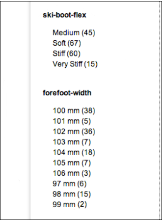
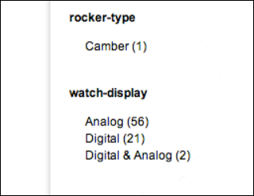
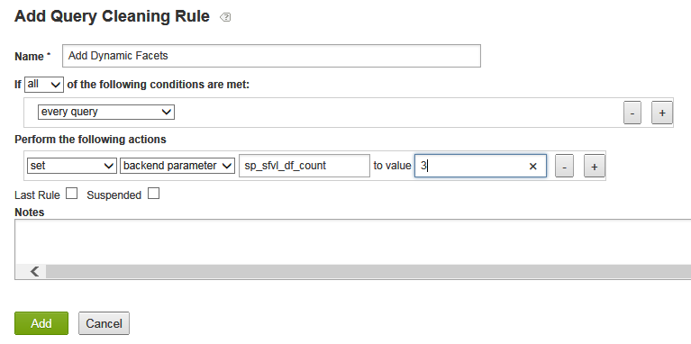
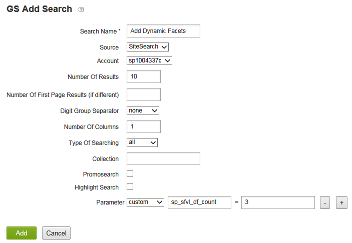
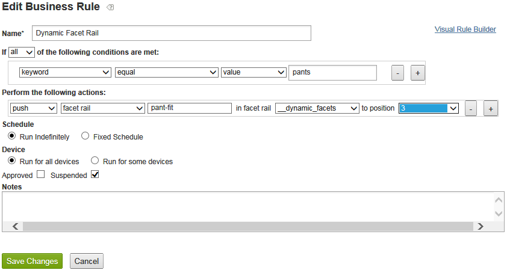

# A propos des facettes dynamiques{#about-dynamic-facets}

Utilisez les facettes dynamiques pour créer automatiquement de nouvelles sélections de plage au moment de la recherche. Vous pouvez éventuellement associer chaque champ de facette dynamique à un nom de table au maximum dans votre compte Adobe Search&amp;Promote. Vous appliquez ces relations de tableau au moment de la recherche pour tous les champs de facettes dynamiques impliqués dans la recherche.

## Utilisation de facettes dynamiques {#concept_E65A70C9C2E04804BF24FBE1B3CAD899}

>[!NOTE]
>
>Par défaut, cette fonction n’est pas activée dans [!DNL Adobe Search&Promote], par défaut. Contactez le support technique pour activer la fonction à utiliser.

Sans utiliser les facettes dynamiques, vous deviez fusionner les attributs associés dans des &quot;emplacements&quot; et afficher uniquement les emplacements homogènes pour une recherche donnée. En d&#39;autres termes, ils ne pouvaient contenir qu&#39;une seule valeur d&#39;attribut logique, telle que &quot;taille de la chaussure&quot; ou &quot;taille de l&#39;anneau&quot;. Cette méthode a fourni des performances de recherche appropriées avec un ensemble important d’attributs uniques.

Lorsque la facette dynamique est utilisée, toutefois, elle ne limite pas le nombre de facettes dont la recherche principale peut effectuer un suivi efficace. Vous pouvez définir des centaines de facettes dynamiques, à partir desquelles la recherche principale peut renvoyer les &quot;facettes `N` dynamiques principales&quot; pour une recherche donnée, `N` qui est généralement une valeur plus modeste de 10-20 ou moins. Cette méthode élimine la nécessité de positionner les attributs. Vous pouvez désormais créer une facette dynamique unique pour les attributs sur votre site Web.

## Quelles facettes devriez-vous rendre dynamiques ? {#section_254EE034BCAD4250A5D09FBF6158C4A5}

Les facettes peu renseignées sur votre site Web et qui ne s’affichent que pour un sous-ensemble de recherches sont de bons candidats pour rendre dynamique. Par exemple, une facette nommée &quot;largeur de pied de page&quot; peut uniquement être renseignée lors de la recherche de chaussures ou de bottes. Alors qu’une autre facette nommée &quot;Style numérique de visage&quot;, avec les valeurs possibles de &quot;Romain&quot; et &quot;Arabe&quot;, ne peut apparaître que lors de la recherche de montres ou d’horloges.

Si votre compte comporte un grand nombre de ces facettes, les performances de recherche sont améliorées afin d’utiliser les facettes dynamiques au lieu de toujours sélectionner l’ensemble des facettes possibles pour chaque recherche. Les facettes génériques telles que &quot;SKU&quot; ou &quot;marque&quot;, qui sont normalement appropriées pour s’afficher avec les résultats de chaque recherche, ne sont généralement pas appropriées en tant que facettes dynamiques.

## Relation des facettes aux champs de balise meta {#section_2869E5FCDA8B431A87BC6E5573F2B0A0}

Les facettes sont créées au-dessus des champs de balise meta. Un champ de balise meta est une fonction de couche de recherche principale de bas niveau de [!DNL Adobe Search&Promote]la section. Les facettes, en revanche, font partie de GS (Guided Search), la couche de présentation de haut niveau d’Adobe Search&amp;Promote. Les facettes possèdent des champs de balise meta, mais les champs de balise meta ne connaissent rien aux facettes. Lorsque vous configurez des facettes dynamiques, vous devez d’abord ajouter des facettes, puis ajouter des champs de balise meta avec l’option Facette dynamique sélectionnée pour définir la facette identifiée comme étant dynamique.

>[!NOTE]
>
>Il n’existe pas de paramètre &quot;Facette dynamique&quot; dans **[!UICONTROL Design > Navigation > Facets]**. Ce qui rend une facette &quot;dynamique&quot; est que son &quot;champ de balise meta&quot; sous-jacent est dynamique tel qu’il est défini dans **[!UICONTROL Settings > Metadata > Definitions]**.

## Exemples de facettes dynamiques en action {#section_BC699A05E2E742EF94D41679163ACE84}

Exemple de facettes dynamiques affichées après une recherche de &quot;bottes&quot; :



Autre exemple de facettes dynamiques affichées après une recherche de &quot;montres&quot; :



Voir également

* [Paramètres CGI de recherche principale](../c-appendices/c-cgiparameters.md#reference_582E85C3886740C98FE88CA9DF7918E8)
* [Balises de modèle de présentation](../c-appendices/c-templates.md#reference_F1BBF616BCEC4AD7B2548ECD3CA74C64)
* [Balises de modèle de transport](../c-appendices/c-templates.md#reference_227D199F5A7248049BE1D405C0584751)

## Configuration des facettes dynamiques {#task_D17F484130E448258100BAC1EEC53F39}

Configuration des facettes dynamiques dans Search&amp;Promote.

<!-- 

t_configuring_dynamic_facets.xml

 -->

>[!NOTE]
>
>Cette fonction n’est pas activée par défaut dans Adobe Search&amp;Promote. Contactez le support technique pour activer la fonction à utiliser.

Avant que les effets de vos facettes dynamiques ne soient visibles par les clients, vous devez recréer l’index de votre site.

Voir également

* [Paramètres CGI de recherche principale](../c-appendices/c-cgiparameters.md#reference_582E85C3886740C98FE88CA9DF7918E8)
* [Balises de modèle de présentation](../c-appendices/c-templates.md#reference_F1BBF616BCEC4AD7B2548ECD3CA74C64)
* [Balises de modèle de transport](../c-appendices/c-templates.md#reference_227D199F5A7248049BE1D405C0584751)

**Pour configurer des facettes dynamiques**

1. Vérifiez que vous avez déjà ajouté des facettes.

   Voir [Ajout d’une nouvelle facette](../c-about-design-menu/c-about-facets.md#task_FC07BFFA62CA4B718D6CBF4F2855C89B).
1. Une fois vos facettes ajoutées, assurez-vous d’avoir ajouté les facettes aux nouveaux champs de balise meta définis par l’utilisateur.

   Voir [Ajout d’un nouveau champ](../c-about-settings-menu/c-about-metadata-menu.md#task_6DF188C0FC7F4831A4444CA9AFA615E5)de balise meta.
1. Dans le menu du produit, cliquez sur **[!UICONTROL Settings]** > **[!UICONTROL Metadata]** > **[!UICONTROL Definitions.]**
1. Sur la [!DNL Definitions] page, dans le [!DNL User-defined fields] tableau, dans la [!DNL Actions] colonne, cliquez sur l’icône représentant un crayon (Modifier) dans la ligne du nom du champ de balise meta associé à la facette que vous souhaitez rendre dynamique.
1. Sur la [!DNL Edit Field] page, vérifiez **[!UICONTROL Dynamic Facet]**.

   Voir le tableau des options dans [Ajout d’un nouveau champ](../c-about-settings-menu/c-about-metadata-menu.md#task_6DF188C0FC7F4831A4444CA9AFA615E5)de balise meta.
1. Cliquez sur **[!UICONTROL Save Changes]**.
1. Cliquez sur **regénérer l’index** de votre site intermédiaire dans la zone bleue pour recréer rapidement l’index de votre site Web intermédiaire.

   Voir aussi [Régénération de l’index d’un site Web](../c-about-index-menu/c-about-regenerate-index.md#task_B28DE40C0E9A475ABCBCBC4FF993AACD)en direct ou par étape.
1. Déterminez le nombre de facettes dynamiques à sélectionner pour une recherche donnée. Pour accomplir cette , effectuez l’une des opérations suivantes :

   * Créez une règle de nettoyage  avec les conditions souhaitées, qui effectue l’action `set`, `backend parameter`à `sp_sfvl_df_count` évaluer `X`, où `X` correspond au nombre souhaité de facettes dynamiques à demander au moment de la recherche, puis cliquez sur **[!UICONTROL Add]**.
   

   Voir [Ajout d’une règle](../c-about-rules-menu/c-about-query-cleaning-rules.md#task_47F43988D3D9485F8AE1DFDA7E00BF54)de nettoyage .

   Voir aussi Paramètres [CGI de recherche](../c-appendices/c-cgiparameters.md#reference_582E85C3886740C98FE88CA9DF7918E8)principal, ligne 40 du tableau pour plus d’informations sur `sp_sfvl_df_count`les

   * Ajouter une recherche et définissez le `sp_sfvl_df_count` paramètre &quot;personnalisé&quot; sur la valeur souhaitée, puis cliquez sur **[!UICONTROL Add]**.
   

   Voir [Ajout d’une nouvelle définition](../c-about-settings-menu/c-about-searching-menu.md#task_98D3A168AB5D4F30A1ADB6E0D48AB648)de recherche.

   Voir aussi Paramètres [CGI de recherche](../c-appendices/c-cgiparameters.md#reference_582E85C3886740C98FE88CA9DF7918E8)principal, ligne 40 du tableau pour plus d’informations sur `sp_sfvl_df_count`les

1. Modifiez le modèle de transport approprié pour générer les facettes dynamiques renvoyées par la recherche principale.

   Voir [Modification d’une présentation ou d’un modèle](../c-about-design-menu/c-about-templates.md#task_800E0E2265C34C028C92FEB5A1243EC3)de transport.

   Supposons, par exemple, que votre modèle de transport soit nommé `guided.tpl`. Dans ce cas, dans le menu du produit, cliquez sur **[!UICONTROL Design > Templates]**. Sur la [!DNL Templates] page, localisez `guided.tpl` dans le tableau. puis cliquez **[!UICONTROL Edit]** à l’extrémité droite du nom. Sur la page de modification, ajoutez le bloc de code suivant à la fin de `</facets>`: Sortie JSON :

   ```
   ... 
   }<search-dynamic-facet-fields>, 
           { 
               "name" : "<search-dynamic-facet-field-name>", 
               "dynamic-facet" : 1, 
               "values" : [<search-field-value-list quotes="yes" commas="yes" data="values" sortby="values" encoding="json" />], 
               "counts" : [<search-field-value-list quotes="yes" commas="yes" data="results" sortby="values" />] 
   
           }</search-dynamic-facet-fields> 
   ...
   ```

1. Modifiez le ou les modèles de présentation appropriés pour générer les facettes dynamiques.

   Voir [Modification d’une présentation ou d’un modèle](../c-about-design-menu/c-about-templates.md#task_800E0E2265C34C028C92FEB5A1243EC3)de transport.

   Supposons, par exemple, que vous ayez un modèle nommé `sim.tmpl` qui est utilisé pour générer du contenu dans le simulateur. Pour modifier ce modèle, dans le menu du produit, cliquez sur **[!UICONTROL Design > Templates]**. Sur la [!DNL Templates] page, localisez `sim.tmpl` dans le tableau. puis cliquez **[!UICONTROL Edit]** à l’extrémité droite du nom. Sur la page de modification, ajoutez les éléments suivants dans la zone d’affichage des facettes du modèle :

   ```
   <h6>DF RAIL</h6> 
   <guided-facet-rail gsname="__dynamic_facets"> 
               <guided-facet ><!-- behavior=Normal --> 
               <div class="facet-block" id="facet"> 
               <p><b><guided-facet-display-name /></b></p> 
               <ul> 
                   <guided-facet-values> 
                       <guided-if-facet-value-equals-length-threshold> 
               </ul> 
               <ul id="brand" style="display:none"> 
                       </guided-if-facet-value-equals-length-threshold> 
                       <guided-if-facet-value-selected> 
                           <li><guided-facet-value> [<guided-lt>a href="<guided-facet-value-undo-path />"<guided-gt>X</a>]</li> 
                       <guided-else-facet-value-selected> 
                           <li><guided-facet-link><guided-facet-value></guided-facet-link> (<guided-facet-count>) </li> 
                       </guided-if-facet-value-selected> 
                   </guided-facet-values> 
               </ul> 
               <guided-if-facet-long> 
                 <br /><guided-lt />a href="#" onclick="moreless(this,'brand');return false;" <guided-gt /><button style="font-size:10px;">VIEW MORE</button></a> 
               </guided-if-facet-long> 
               </div> 
               </guided-facet> 
   </guided-facet-rail> 
   <h6>/DF RAIL</h6>
   ```

   Vous apporteriez également une modification similaire aux autres modèles de présentation, selon les besoins, comme `json.tmpl`.

   Veillez à spécifier `__dynamic_facets` le `gsname` dans la `guided-facet-rail` balise . Cette balise est un rail de facettes prédéfini réservé à la sortie des facettes dynamiques renvoyées pour une recherche donnée.

   Vous pouvez également modifier ce rail de facettes spécial au moyen de **[!UICONTROL Rules > Business Rules]**, et utiliser le **[!UICONTROL Advanced Rule Builder]** comme illustré ci-dessous.

   

   Voir aussi [Ajout d’une nouvelle règle de fonctionnement](../c-about-rules-menu/c-about-business-rules.md#task_BD3B31ED48BB4B1B8F1DCD3BFA2528E7)
