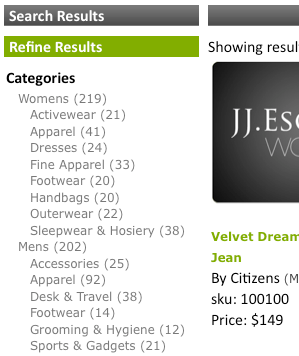

# A propos des facettes{#about-facets}

Vous pouvez utiliser Facettes pour personnaliser votre couche de présentation et fournir à vos utilisateurs une recherche guidée qui leur permet d’analyser en détail les résultats de leur recherche.

## Utilisation de facettes {#concept_FA912B3B41EE493DB2F492D188457FF5}

Supposons, par exemple, qu’un visiteur d’un site Web qui vend des outils effectue une recherche de clés. La société pourrait utiliser deux facettes : l&#39;une pour spécifier toutes les marques de clé à molette trouvées, et l&#39;autre pour spécifier toutes les tailles de clé à molette. Le client peut cliquer sur n’importe quelle marque ou taille dans la facette appropriée pour limiter les résultats et trouver rapidement la clé appropriée dont il a besoin.

Vous pouvez baser une facette sur n’importe quelle définition de métadonnées existante. Si une facette est définie comme un type de date dans les métadonnées, elle est affichée comme une facette de plage de dates.

Le tableau de la page [!DNL Staged Facets] présente un aperçu général des paramètres qui composent chaque facette ajoutée. Vous pouvez ajouter de nouvelles facettes et modifier ou supprimer des facettes existantes. Vous pouvez annuler les modifications apportées aux facettes en utilisant **[!UICONTROL History]** dans le coin supérieur droit de la page.

Les paramètres de facette sont par défaut mis en scène pour vous permettre de tester les modifications avant de les publier.

Voir [À propos de l’évaluation](../c-about-staging.md#concept_08B8F3CA1F4241108F14BA7FC7806CA7).

Vous pouvez utiliser **[!UICONTROL View Live Settings]** pour comparer vos paramètres intermédiaires au paramètre actif actuel. Utilisez **[!UICONTROL View Staged Settings]** pour revenir à la zone d’évaluation. Pour un élément qui est mis en scène, la version active des paramètres est en lecture seule. Par conséquent, vous pouvez le manipuler en repoussant les paramètres par étape en direct. Une fois que vous êtes satisfait des modifications apportées à la facette intermédiaire, cliquez sur **[!UICONTROL Push Live]** pour les diffuser.

## Facettes de plage de dates {#section_FEFFF6B5B6534456913189FEF559BA58}

Les facettes définies comme type Date dans les métadonnées sont traitées différemment des autres facettes. Au lieu d’être traités comme un ensemble de valeurs, ils sont traités comme une plage de dates, avec une date de début, une date de fin ou les deux.

Une facette de plage de dates a une valeur de date de début, suivie de &quot;BTW&quot; (pour &quot;between&quot;), suivie de la date de fin. Les dates se présentent sous les deux formats suivants :

mm-jj-aaaa

jj/mm/aaaa

Des années à quatre chiffres sont nécessaires. Il doit y avoir au moins une des dates de début ou de fin, mais les deux ne sont pas obligatoires. Par exemple, &quot;12/1/2007BTW1/4/2009&quot; signifie toutes les dates comprises entre le 1er décembre 2007 et le 4 janvier 2009. Toutefois, &quot;1-1-2005BTW&quot; signifie toutes les dates depuis le 1er janvier 2005.

Vous pouvez utiliser la balise de modèle de présentation `<guided-facet-value/>` pour obtenir la valeur d’une facette de plage de dates, comme une facette normale. Actuellement, JavaScript est requis pour permettre aux utilisateurs d’entrer des plages de dates sur lesquelles effectuer une recherche. Par exemple, vous pouvez saisir les données de deux champs d’entrée pour les dates de début et de fin. Vous pouvez ensuite valider l’entrée et ajouter la valeur de la nouvelle facette (générée à partir des deux champs d’entrée) et le nom de la facette à l’URL existante.

Voir [Balises de modèle de présentation](../c-appendices/c-templates.md#reference_F1BBF616BCEC4AD7B2548ECD3CA74C64).

L’exemple de code suivant est un exemple de présentation d’une plage de dates sur une page. Il affiche la plage de dates existante si elle est sélectionnée ; sinon, il présente un simple formulaire de saisie. Lorsque le formulaire est envoyé, il effectue une validation simple. Il envoie ensuite le navigateur à une nouvelle URL qui inclut deux nouveaux paramètres :

* `q#` - Représente la plage de dates sélectionnée assemblée à partir des deux champs d&#39;entrée.
* `x#` - Nomme la facette. Dans cet exemple, la facette de la plage de dates est nommée &quot;modifiée&quot;.

Les parties `replace(/%2F/ig, '~2F')` du code sont nécessaires, car Apache n’autorise pas `%2F` dans les chemins d’URL pour des raisons de sécurité et lorsque vous utilisez des URL SEO, la requête se trouve dans le chemin d’URL. Par conséquent, `/` est codé en tant que `~2F` au lieu de `%2F`, comme c’est généralement le cas dans une URL.

```
<div class="date_range"> 
 <p>Date Range</p> 
 <guided-if-facet-selected gsname="modified"> 
  <guided-facet-values gsname="modified"> 
   <script> 
   var modified_daterange= '<guided-facet-value />'.split(/BTW/) ; 
   if (modified_daterange[0]=='') modified_daterange[0]= '--/--/----' ; 
   if (modified_daterange[1]=='') modified_daterange[1]= '--/--/----' ; 
   document.write('From: ' + modified_daterange[0]) ; 
   document.write('<br>To: ' + modified_daterange[1]) ; 
   </script> 
  </guided-facet-values> 
 
 <guided-else-facet-selected> 
  <form action="#"> 
   From: <input name="dateFrom" size=10> 
   <br>To: <input name="dateTo" size=10> 
   <br><input type="button" value="Go" onclick="goClick(this.form)"> 
  </form> 
  <script> 
  function goClick(f) { 
   if (f.dateFrom.value=='' && f.dateTo.value=='') { 
    alert('You must enter either a From: date or a To: date.') ; 
    return ; 
   } 
   if ( f.dateFrom.value!='' && !f.dateFrom.value.match(/^\d+[\/\-]\d+[\/\-]\d\d\d\d$/) ) { 
    alert('From: date must be in "mm/dd/yyyy" or "mm-dd-yyyy" format.') ; 
    return ; 
   } 
   if ( f.dateTo.value!='' && !f.dateTo.value.match(/^\d+[\/\-]\d+[\/\-]\d\d\d\d$/) ) { 
    alert('To: date must be in "mm/dd/yyyy" or "mm-dd-yyyy" format.') ; 
    return ; 
   } 
   // Note that "/" is encoded as "~2F" instead of "%2F" to avoid Apache 404 error. 
   var new_url= '<guided-current-path />&<guided-query-param-name gsname="q#" offset="0" />=' 
    + encodeURIComponent(f.dateFrom.value).replace(/%2F/ig, '~2F') + 'BTW' 
    + encodeURIComponent(f.dateTo  .value).replace(/%2F/ig, '~2F') 
    + '&<guided-query-param-name gsname="x#" offset="0" />=modified' ; 
   location.href= new_url ; 
  } 
  </script> 
 </guided-if-facet-selected> 
</div>
```

## A propos des facettes imbriquées {#section_6BC77F38DE9F43D5B6911F8CECB15DFC}

Les facettes imbriquées sont des facettes qui affichent plusieurs niveaux de catégories, comme dans l’exemple suivant :



Les catégories Womens et Mens se trouvent dans la partie supérieure ou parente. Les sous-catégories, telles que Accessoires et Chaussures, se trouvent dans la facette inférieure ou enfant.

La profondeur de facette imbriquée actuellement prise en charge est de deux, mais elle peut être n’importe où le long de la liste d’exploration en aval.

Voici les comportements de divers types de facettes imbriquées :

<table> 
 <thead> 
  <tr> 
   <th colname="col1" class="entry"> <p>Comportement du type de facette imbriquée </p> </th> 
   <th colname="col2" class="entry"> <p>Comportement </p> </th> 
  </tr> 
 </thead>
 <tbody> 
  <tr> 
   <td colname="col1"> <p>Normal </p> </td> 
   <td colname="col2"> <p>Le comportement d’une facette imbriquée normale est qu’elle se réduit si d’autres facettes réduisent la recherche. </p> <p>Si la facette imbriquée est sélectionnée, elle se réduit en fonction de sa sélection. Si une facette parente est sélectionnée, seul ce parent apparaît avec toutes les facettes enfants restantes. Si une facette enfant est sélectionnée, la facette affiche uniquement la facette parente sélectionnée et la facette enfant sélectionnée. </p> </td> 
  </tr> 
  <tr> 
   <td colname="col1"> <p>Attractif </p> </td> 
   <td colname="col2"> <p>Le comportement d’une facette imbriquée collante est qu’elle tente de garder la facette ouverte autant que possible en fonction de l’état d’autres facettes ou de critères de recherche. Si la facette enfant est sélectionnée, elle compte vers la profondeur d’adhérence. </p> </td> 
  </tr> 
  <tr> 
   <td colname="col1"> <p>Sélection multiple </p> </td> 
   <td colname="col2"> <p>Le comportement d’une facette à sélection multiple consiste à maintenir la facette ouverte. Toute nouvelle sélection tente d’effacer toutes les autres sélections de facettes, sauf si la facette est un "parent" de la facette imbriquée de la catégorie. Dans ce cas, "parent" fait référence aux facettes de catégorie, et non aux catégories globales d’une facette imbriquée. </p> </td> 
  </tr> 
  <tr> 
   <td colname="col1"> <p>Catégorie à sélection multiple </p> </td> 
   <td colname="col2"> <p>Comme le type de facette imbriquée à sélection multiple avec les exceptions suivantes : </p> 
    <ul id="ul_D5AB6AF3169A483E8F3FC6D2A2EA3A28"> 
     <li id="li_9308156EF2FF43CE9DFB933F13786C58">Toute autre facette précédemment choisie est désélectionnée si cette facette est sélectionnée pour la première fois. </li> 
     <li id="li_DD96D6802A9C479283212A0FD68C6F85">Les autres facettes précédemment sélectionnées sont également désélectionnées si le client effectue une analyse directe vers la facette enfant sans cliquer sur la facette parente ou si un frère d’une facette parente différente est choisi. </li> 
     <li id="li_8BF58F10969B4743986D5D0E0086AD6C">Ils peuvent avoir des parents dans le sens où les facettes de la catégorie ont des parents. Ne confondez pas ce comportement avec les relations parent-enfant trouvées avec toutes les facettes imbriquées. </li> 
    </ul> </td> 
  </tr> 
 </tbody> 
</table>

Voir aussi [A propos du rail de facettes](../c-about-design-menu/c-about-facet-rails.md#concept_1FDC8BCDFFC84A0889DA670F63D5F6DB).

## Ajouter une nouvelle facette {#task_FC07BFFA62CA4B718D6CBF4F2855C89B}

Vous pouvez ajouter des facettes pour personnaliser votre couche de présentation et fournir à vos clients une recherche guidée qui leur permet d’analyser en détail les résultats de leur recherche.

<!-- 

t_adding_a_new_facet.xml

 -->

Le tableau des facettes de la page [!DNL Facets] présente un extrait des paramètres qui constituent une facette unique. Vous pouvez ajouter de nouvelles facettes et modifier ou supprimer des facettes existantes. Les modifications apportées aux facettes peuvent être annulées à l’aide de la fonction Historique.

>[!NOTE]
>
>Veillez à référencer la facette dans votre modèle de présentation afin qu’elle soit visible sur le site Web.

Voir aussi [A propos du rail de facettes](../c-about-design-menu/c-about-facet-rails.md#concept_1FDC8BCDFFC84A0889DA670F63D5F6DB).

**Pour ajouter une nouvelle facette**

1. Avant de pouvoir ajouter une nouvelle facette, assurez-vous que vous avez déjà effectué le suivi avant de passer à l’étape suivante :

   * Certains champs de balise meta ont déjà été définis.

      Voir [Ajouter un nouveau champ de balise meta](../c-about-settings-menu/c-about-metadata-menu.md#task_6DF188C0FC7F4831A4444CA9AFA615E5).
   * Injectez les métadonnées dans votre index.
Voir [Ajouter les définitions d&#39;injection de champ](../c-about-settings-menu/c-about-metadata-menu.md#task_E86566FA1FF74CF68115C0ADA05172AE).

1. Dans le menu produit, cliquez sur **[!UICONTROL Design]** > **[!UICONTROL Navigation]** > **[!UICONTROL Facets.]**
1. Sur la page [!DNL Facets], cliquez sur **[!UICONTROL Add New Facet]**.
1. Sur la page [!DNL Add Facet], définissez les options de votre choix.

   Ces paramètres affectent à la fois le comportement et la présentation par défaut d’une facette. Vous pouvez remplacer certains de ces paramètres par les paramètres du modèle de présentation.

   Si une facette est définie comme un type de date dans les métadonnées, elle s’affiche sous la forme d’une plage de dates.

   Voir [Facettes de plage de dates](../c-about-design-menu/c-about-facets.md#section_FEFFF6B5B6534456913189FEF559BA58).

   Selon les options de facette que vous sélectionnez, toutes les options ne sont pas disponibles.

   <!-- 
   r_add_facet_options.xml
   -->

   <table> 
    <thead> 
      <tr> 
      <th colname="col1" class="entry"> <p>Option </p> </th> 
      <th colname="col2" class="entry"> <p>Description </p> </th> 
      </tr> 
    </thead>
    <tbody> 
      <tr> 
      <td colname="col1"> <p>Nom de la facette </p> </td> 
      <td colname="col2"> <p>Identifie le nom d’une facette donnée. </p> <p> <p>Remarque :  Vous pouvez uniquement disposer d’une facette basée sur des métadonnées définies par l’utilisateur existantes. Si aucune facette n’est disponible dans la liste déroulante, vous devez d’abord définir certaines métadonnées. </p> </p> <p>Voir <a href="../c-about-settings-menu/c-about-metadata-menu.md#task_6DF188C0FC7F4831A4444CA9AFA615E5" type="task" format="dita" scope="local"> Ajouter un nouveau champ de balise meta </a>. </p> <p>Pour créer une facette à partir d’un tableau de champs, utilisez le nom de facette personnalisé et indiquez le nom de la table de champs. </p> </td> 
      </tr> 
      <tr> 
      <td colname="col1"> <p>Afficher le libellé </p> </td> 
      <td colname="col2"> <p>Définit l’étiquette d’une facette qui peut ensuite être utilisée dans un chemin de navigation, au lieu d’un nom de champ de métadonnées (avec la balise <span class="codeph"> &lt;guided-breadcrumb-label&gt; </span>) ou une valeur autonome (avec la balise <span class="codeph"> &lt;guided-facet-display-name&gt; </span>). </p> </td> 
      </tr> 
      <tr> 
      <td colname="col1"> <p>Comportement </p> </td> 
      <td colname="col2"> <p>Définit l’un des trois comportements de facettes. </p> <p> 
      <ul id="ul_67C19E1C16224B9990F04A0D05BD3D05"> 
      <li id="li_6B232C11A61840B68CA59E1F593405A0"> <span class="uicontrol"> Normal </span> <p>Lorsqu’un client clique sur une facette dont le comportement est défini sur <span class="uicontrol"> Normal </span>, il analyse les résultats de la recherche pour cet élément. À partir de là, le client peut affiner et réduire davantage le nombre de résultats de recherche. </p> </li> 
      <li id="li_7D7C43A7F7AB4B84A9B0FEF34627605A"> <span class="uicontrol"> Catégorie </span> <p>Les facettes de catégorie se comportent comme des éléments de navigation. Ces facettes sont des facettes de niveau supérieur que les clients explorent généralement avant de révéler des facettes avec des options d’attribut. Les facettes de catégorie ne se rétrécissent pas lorsque d’autres facettes sont sélectionnées et restent ouvertes. Le fait de cliquer sur une autre valeur dans une facette de catégorie désélectionne toutes les autres facettes de la page, à l’exception des parents de cette facette de catégorie. </p> </li> 
      <li id="li_01255993D71F40DBA8870AA3FEA7D304"> <span class="uicontrol"> Catégorie à sélection multiple  </span> <p>les facettes sont des facettes de catégorie qui prennent en charge la sélection de plusieurs éléments de la facette où les éléments sont "OR" ensemble. </p> </li> 
      </ul> 
      <ul id="ul_683F6D3FC8524E65AF303453ADDB6001"> 
        <li id="li_81F504D1D1294666BBBC5EA43B34B712"> <span class="uicontrol"> Attractif </span> <p>Lorsqu’un client clique sur une facette dont le comportement est défini sur <span class="uicontrol"> Attractif </span>, la facette avec l’option sélectionnée reste ouverte pendant l’exploration vers le bas. Cette option est utile lorsque vous souhaitez laisser un client modifier un choix précédent. </p> </li> 
      </ul> 
      <ul id="ul_8E871D63B09445268C600C8ABC20F6A4"> 
        <li id="li_F88AC5528B0C4751BC4CFE7FA9525857"> <span class="uicontrol"> Sélection multiple  </span> <p>Permet de sélectionner plusieurs éléments d’une facette, où les éléments de la facette sont "OUed" ensemble. Cette option est utile pour une facette qui peut afficher un attribut mineur, tel que les couleurs, et vous souhaitez permettre au client de construire une requête qui lui permet de "montrer des chaussures de ma taille qui sont rouges ou noires". </p> </li> 
      </ul> </p> </td> 
      </tr> 
      <tr> 
      <td colname="col1"> <p>Afficher toujours </p> </td> 
      <td colname="col2"> <p>Pour une facette normale ou collante, définit la facette pour qu’elle reste visible pour le client en tout temps. </p> <p>Cette option est disponible uniquement si vous avez sélectionné <span class="uicontrol"> Normal </span>, <span class="uicontrol"> Catégorie </span> ou <span class="uicontrol"> Attractif </span> dans la liste déroulante <span class="uicontrol"> Comportement </span>. </p> </td> 
      </tr> 
      <tr> 
      <td colname="col1"> <p>Les parents de Facet </p> </td> 
      <td colname="col2"> <p>Cette option est disponible uniquement si vous avez sélectionné <span class="uicontrol"> Catégorie </span> ou <span class="uicontrol"> Catégorie Multi-Select </span> dans la liste déroulante Comportement </span>.<span class="uicontrol"> </span></p> <p>Indique les parents de la facette de catégorie. Les éléments sélectionnés dans les facettes parentes des catégories sont utilisés pour restreindre les choix disponibles dans la facette de catégorie active. Les facettes parentes ne sont pas désélectionnées lorsqu’un client interagit avec la facette de catégorie. Vous pouvez spécifier plusieurs parents délimités par des virgules. </p> </td> 
      </tr> 
      <tr> 
      <td colname="col1"> <p>Profondeur bascule </p> </td> 
      <td colname="col2"> <p>Cette option est disponible uniquement si vous avez sélectionné <span class="uicontrol"> Attractif </span> dans la liste déroulante Comportement <span class="uicontrol"> </span>. </p> <p>Définit le nombre d’options à conserver pendant l’exploration vers le bas. </p> </td> 
      </tr> 
      <tr> 
      <td colname="col1"> <p>Seuil de longueur </p> </td> 
      <td colname="col2"> <p>Définit la longueur verticale (1-999) de la facette définie en nombre d’éléments. </p> <p>Si votre modèle de présentation est configuré de manière appropriée, vous pouvez utiliser ce paramètre pour indiquer "Afficher plus...". ou déterminer quand jeter la facette dans une balise div défilante, etc. </p> </td> 
      </tr> 
      <tr> 
      <td colname="col1"> <p>Seuil de longueur de troncature </p> </td> 
      <td colname="col2"> <p>Tronque le nombre d’éléments d’une facette après un seuil donné. </p> <p>Certaines implémentations comportent des facettes contenant des milliers d’éléments. Il peut être coûteux d'envoyer toutes les données par câble. Vous pouvez utiliser ce paramètre pour ajuster la facette à un niveau gérable. La facette sera tronquée après le tri. </p> </td> 
      </tr> 
      <tr> 
      <td colname="col1"> <p>Largeur de valeur maximale </p> </td> 
      <td colname="col2"> <p>Indique une limite de longueur de la chaîne de valeur de facette (1-999). </p> <p>Cette option est utile lorsque vous souhaitez placer une facette dans une disposition à largeur fixe et empêcher les chaînes d’encapsuler. Par défaut, la chaîne est définie sur 3 caractères de moins que le seuil, de sorte qu’une ellipse peut être ajoutée. </p> </td> 
      </tr> 
      <tr> 
      <td colname="col1"> <p>Extension de valeur </p> </td> 
      <td colname="col2"> <p>Indique la chaîne à utiliser pour indiquer que la valeur d’une facette est tronquée. Par défaut, la chaîne "..." est utilisée. </p> </td> 
      </tr> 
      <tr> 
      <td colname="col1"> <p>Délimiteur </p> </td> 
      <td colname="col2"> <p>Indique le délimiteur à utiliser pour toute liste de valeurs séparées délimitées qui s’applique à la facette. </p> <p>Le délimiteur utilisé est le même que celui défini dans les métadonnées sur lesquelles repose la facette. Le délimiteur par défaut est une virgule. Vous pouvez toutefois utiliser n’importe quelle valeur compatible XML. </p> </td> 
      </tr> 
      <tr> 
      <td colname="col1"> <p>Tri </p> </td> 
      <td colname="col2"> <p>Indique comment vous souhaitez trier les facettes sur votre site Web. Vous pouvez trier les facettes en fonction des éléments suivants. Si vous le souhaitez, vous pouvez combiner jusqu’à cinq types. </p> 
      <ul id="ul_12987F4DC7B34C63ABC906B59688A174"> 
      <li id="li_3206C96013DF431D90119F594D93D85D"> <span class="uicontrol"> alpha  </span> <p>Trie les valeurs par ordre alphabétique (0-9, A-Z), y compris les caractères de ponctuation. </p> </li> 
      <li id="li_304E4A518FBE48D18D9E9EA7339A3481"> <span class="uicontrol"> alpha (alphanumérique uniquement)  </span> <p>Trie les valeurs par ordre alphabétique (0-9, A-Z), sans tenir compte des caractères de ponctuation. </p> </li> 
      <li id="li_CADB888CC514455F9CA379C8EEE490AA"> <span class="uicontrol"> alpha (non sensible à la casse)  </span> <p>Trie les valeurs par ordre alphabétique (0-9, A-Z), sans tenir compte de la casse des caractères alphabétiques, y compris les caractères de ponctuation. </p> </li> 
      <li id="li_F61122E79AB5413792DA31F8AB1414BD"> <span class="uicontrol"> alpha (non sensible à la casse, alphanumérique uniquement)  </span> <p>Trie les valeurs par ordre alphabétique (0-9, A-Z), ignore la casse des caractères alphabétiques et ignore les caractères de ponctuation. </p> </li> 
      <li id="li_F50CC298ABF046D0A39D5AE5B1261823"> <span class="uicontrol"> count </span> <p>Trie par nombre de résultats correspondant à chaque valeur de facette du plus grand au moins. </p> </li> 
      <li id="li_32B6AF39E9534762B39B15181DC5AD01"> <span class="uicontrol"> numérique  </span> <p>Trie les valeurs par ordre numérique. Lors du tri des nombres, cette option est préférable à un tri Alpha car si vous utilisez un tri Alpha, 10 s’affiche avant 2. </p> </li> 
      <li id="li_CF8E76A7B1184E0C8DCC11B53E31A1DC"> <span class="uicontrol"> split </span> <p>Ventile la liste en deux listes distinctes par seuil de décompte. Les valeurs de facette supérieures au seuil sont déplacées vers le haut. Les valeurs de facette dont le nombre est inférieur au seuil sont déplacées vers le bas. Un seuil de fractionnement est requis lorsque vous souhaitez forcer les valeurs d’une certaine plage à toujours se trouver en haut. </p> </li> 
      <li id="li_4AB8276577384B1099CBA895898205AD"> <span class="uicontrol"> break  </span> <p>Force certaines valeurs en haut ou en bas de la liste. Par exemple, vous pouvez toujours souhaiter que le terme "Autre" s’affiche au bas de la liste. Les valeurs supérieures ou inférieures sont requises lorsque vous utilisez un tri par sauts pour identifier les valeurs explicites qui doivent se trouver en haut ou en bas du tri. </p> </li> 
      <li id="li_227E96CFED2044FCA2F10B6913B03CFB"> <span class="uicontrol"> ordonné  </span> <p>Les valeurs de facette doivent toujours être dans un ordre fixe (une liste de valeurs séparées par un délimiteur définie dans l'option <span class="uicontrol"> Ordre </span> décrite ci-dessous). </p> </li> 
      </ul> </td> 
      </tr> 
      <tr> 
      <td colname="col1"> <p>Alias de facette </p> </td> 
      <td colname="col2"> <p>Pour prendre en charge les URL de recherche existantes que vous pouvez utiliser dans la mémoire, vous pouvez utiliser un alias de facette pour mapper le nom du paramètre hérité sur modifié ou simplement créer une facette avec un autre nom. L’alias est appliqué uniquement aux requêtes entrantes et n’est pas utilisé pour créer des liens de facette. </p> </td> 
      </tr> 
      <tr> 
      <td colname="col1"> <p>Nom du rail de facettes </p> </td> 
      <td colname="col2"> <p>Nom du rail de facettes si vous décidez de trier vos facettes par ordre alphabétique, par nombre ou selon une méthode personnalisée. </p> <p>Voir <a href="../c-about-design-menu/c-about-facet-rails.md#concept_1FDC8BCDFFC84A0889DA670F63D5F6DB" format="dita" scope="local">A propos de la rampe de facettes </a>. </p> </td> 
      </tr> 
      <tr> 
      <td colname="col1"> <p>Commande </p> </td> 
      <td colname="col2"> <p>Cette option est disponible uniquement si vous avez sélectionné <span class="uicontrol"> Commandé </span> dans la liste déroulante <span class="uicontrol"> Tri </span>. </p> <p>Permet de définir une liste délimitée de valeurs qui spécifie l’ordre à utiliser. </p> </td> 
      </tr> 
      <tr> 
      <td colname="col1"> <p>Ajouter des extras </p> </td> 
      <td colname="col2"> <p>Cette option est disponible uniquement si vous avez sélectionné <span class="uicontrol"> Commandé </span> dans la liste déroulante <span class="uicontrol"> Tri </span>. </p> <p>Si les valeurs ne sont pas présentes dans la liste ordonnée, elles sont ajoutées à la fin. </p> </td> 
      </tr> 
      <tr> 
      <td colname="col1"> <p>Afficher les fantômes </p> </td> 
      <td colname="col2"> <p>Cette option est disponible uniquement si vous avez sélectionné <span class="uicontrol"> Commandé </span> dans la liste déroulante <span class="uicontrol"> Tri </span>. </p> <p>Si les valeurs spécifiées par la liste ordonnée sont manquantes, cette option marque chaque élément manquant dans la facette comme "fantôme" afin que les éléments s’affichent différemment. </p> </td> 
      </tr> 
      <tr> 
      <td colname="col1"> <p>Facette imbriquée </p> </td> 
      <td colname="col2"> <p>Une facette imbriquée affiche ses catégories et les catégories de ses enfants. Il ne peut montrer qu'une profondeur de deux catégories, mais il peut être n'importe où au cours de l'exploration vers le bas. </p> <p>Les données relatives à cette facette doivent être conformes à une convention pour décrire les deux niveaux de catégorie. Par exemple, une valeur de facette peut être "chaussures:bottes" où la catégorie parent est "chaussures" et la catégorie enfant "bottes". ":" est utilisé comme délimiteur pour les séparer. </p> <p>Voir Délimiteur imbriqué ci-dessous pour plus d’informations sur la modification du délimiteur. </p> <p>Pour générer les données dans ce format, vous pouvez utiliser un script de filtre pour combiner deux catégories existantes. Vous pouvez combiner des comportements normaux, Catégories et Attractif avec des facettes imbriquées. </p> </td> 
      </tr> 
      <tr> 
      <td colname="col1"> <p>Nom parent imbriqué </p> </td> 
      <td colname="col2"> <p>Cette liste déroulante n’est disponible que si vous avez sélectionné <span class="uicontrol"> Facette imbriquée </span>. </p> <p>Permet de choisir le champ qui représente la catégorie parent. Ce champ est utilisé pendant le temps de recherche dans les catégories parentes correspondantes. </p> </td> 
      </tr> 
      <tr> 
      <td colname="col1"> <p>Nom d’enfant imbriqué </p> </td> 
      <td colname="col2"> <p>Cette liste déroulante n’est disponible que si vous avez sélectionné <span class="uicontrol"> Facette imbriquée </span>. </p> <p>Permet de choisir le champ qui représente la catégorie enfant. Ce champ est utilisé pendant le temps de recherche dans les catégories enfants correspondantes. </p> </td> 
      </tr> 
      <tr> 
      <td colname="col1"> <p>Délimiteur de facette imbriqué </p> </td> 
      <td colname="col2"> <p>Cette option est disponible uniquement si vous avez sélectionné <span class="uicontrol"> Facette imbriquée </span>. </p> <p>Le caractère saisi ici est utilisé pour analyser les catégories parents et les catégories enfants à partir de ses données. </p> <p>Par exemple, si ':' est utilisé comme délimiteur et que le parent est 'chaussures' et que l'enfant est 'bottes', il s'attend à ce que les données soient formatées comme 'chaussures:bottes'. </p> </td> 
      </tr> 
      <tr> 
      <td colname="col1"> <p>Seuil de fractionnement </p> </td> 
      <td colname="col2"> <p>Cette option est disponible uniquement si vous avez sélectionné <span class="uicontrol"> Fractionner </span> dans la liste déroulante <span class="uicontrol"> Tri </span>. </p> <p>Lors de l’utilisation d’un tri fractionné, le seuil fractionné définit le nombre auquel la facette doit être fractionnée en deux listes distinctes. Les valeurs dont le nombre est supérieur ou égal au seuil sont conservées en haut tandis que les valeurs inférieures au seuil sont déplacées en bas. </p> </td> 
      </tr> 
      <tr> 
      <td colname="col1"> <p>Valeurs supérieures </p> </td> 
      <td colname="col2"> <p>Cette option est disponible uniquement si vous avez sélectionné <span class="uicontrol"> Saut </span> dans la liste déroulante <span class="uicontrol"> Tri </span>. </p> <p>Lors de l’utilisation d’un tri Saut, cette liste délimitée de valeurs est toujours placée en haut de la liste. L’utilisation d’expressions régulières est autorisée, mais elles doivent être placées entre accolades ou accolades, par exemple : {^Nouveau.* ?},{^Très nouveau.*} </p> </td> 
      </tr> 
      <tr> 
      <td colname="col1"> <p>Valeurs inférieures </p> </td> 
      <td colname="col2"> <p>Cette option est disponible uniquement si vous avez sélectionné <span class="uicontrol"> Saut </span> dans la liste déroulante <span class="uicontrol"> Tri </span>. </p> <p>Lors de l’utilisation d’un tri par sauts, cette liste délimitée de valeurs est toujours placée au bas de la liste. L’utilisation d’expressions régulières est autorisée, mais elles doivent être placées entre accolades ou accolades, comme dans l’exemple suivant : {^Ancien.* ?},{^Très Ancien.*} </p> </td> 
      </tr> 
    </tbody> 
    </table>

1. Cliquez sur **[!UICONTROL Add]**.
1. (Facultatif) Sur la page [!DNL Facets], effectuez l’une des opérations suivantes :

   * Cliquez sur **[!UICONTROL History]** pour annuler les modifications que vous avez apportées.

      Voir [Utilisation de l’option Historique](../t-using-the-history-option.md#task_70DD3F87A67242BBBD2CB27156F43002).

   * Cliquez sur **[!UICONTROL Live]**.

      Voir [Affichage des paramètres en direct](../c-about-staging.md#task_401A0EBDB5DB4D4CA933CBA7BECDC10F).

   * Cliquez sur **[!UICONTROL Push Live]**.

      Voir [Activation des paramètres d’étape](../c-about-staging.md#task_44306783B4C0408AAA58B471DAF2D9A4).

## Ajouter une facette imbriquée {#task_A132FA7EB7494A6B88E443F2C3FABBBA}

Vous pouvez ajouter une facette imbriquée pour afficher plusieurs niveaux de catégories.

<!-- 

t_adding_a_nested_facet.xml

 -->

Lorsque vous créez une facette imbriquée, tenez compte des points suivants :

* Chaque facette imbriquée requiert un champ de balise meta défini par l’utilisateur.
* Les facettes imbriquées sont composées de deux autres facettes, la facette parente et la facette enfant. Il peut s’agir de facettes à valeur unique ou de facettes à plusieurs valeurs. Le mélange de facettes à valeur unique et de facettes à plusieurs valeurs n’est pas autorisé.
* Vous devez déterminer si cette facette sera utilisée dans le tableau des champs de recherche. La table de champs requiert la facette imbriquée elle-même et ses facettes de composition.
* Envisagez d’utiliser JSON pour implémenter des facettes imbriquées ; c&#39;est plus facile.

* [Tâche 1 - Ajouter une balise meta](../c-about-design-menu/c-about-facets.md#task_6944558325204E749C725DCFEF17EF3D)
* [Tâche 2 - Ajouter un script de filtrage pour générer des données préformatées](../c-about-design-menu/c-about-facets.md#task_2DFED8BCB87B4067A6CE280945D7CAF4)
* [Tâche 3 - Ajouter une nouvelle facette](../c-about-design-menu/c-about-facets.md#task_3C11A4159FC44B9494D48594941AF8CF)
* [Tâche 4 - Modifier la recherche guidée](../c-about-design-menu/c-about-facets.md#task_E50EFD7BBD0F45729C15759EA4F548D8)
* [Tâche 5 - Création d&#39;un modèle de transport](../c-about-design-menu/c-about-facets.md#task_C1FEDEF11D2549DEB1A9C09BFBA64381)
* [Tâche 6 - Créer un modèle de présentation](../c-about-design-menu/c-about-facets.md#task_4B2ABB37B9CD4F3F8AF8E6874227A995)
* [Tâche 7 - Modification du chemin de navigation](../c-about-design-menu/c-about-facets.md#task_5E22409528EC4DA284821F82FDCE3438)

>[!NOTE]
>
>Cette rubrique fait référence à la facette imbriquée en tant que facette n1.

## Tâche 1 - Ajouter une balise meta {#task_6944558325204E749C725DCFEF17EF3D}

Ajoutez un nouveau champ de balise meta dédié à la conservation de la date pour la facette imbriquée. Il peut s’agir d’un champ à plusieurs valeurs ou d’un champ à une seule valeur.

1. Dans le menu produit, cliquez sur **[!UICONTROL Settings]** > **[!UICONTROL Metadata]** > **[!UICONTROL Definitions]**.
1. Sur la page [!DNL Definitions], cliquez sur **[!UICONTROL Add New Field]**.
1. Sur la page [!DNL Add Field], définissez les options de votre choix.

   Voir [Ajouter un nouveau champ de balise meta](../c-about-settings-menu/c-about-metadata-menu.md#task_6DF188C0FC7F4831A4444CA9AFA615E5).
1. Cliquez sur **[!UICONTROL Add]**.
1. (Facultatif) Recréez l’index de votre site d’évaluation si vous souhaitez prévisualisation les résultats.

   Voir [Configuration d’un index incrémentiel d’un site Web intermédiaire](../c-about-index-menu/c-about-incremental-index.md#task_46A367B0786C4C90BFFA5D3F95FD86C0).

   Les autres tâches font référence à ce champ de balise meta sous la forme **n1**.

## Tâche 2 - Ajouter un script de filtrage pour générer des données préformatées {#task_2DFED8BCB87B4067A6CE280945D7CAF4}

1. Ajoutez un script de filtrage pour combiner les facettes d’origine dans le format suivant : `<parent_value><nested_delimiter><child_value>`.

   Voir [Ajouter un script de filtrage](../c-about-settings-menu/c-about-filtering-menu.md#task_0AB84FD1133F47F9AA069A79BEA13A22).

   Voici des exemples de valeurs pour le champ n1 de balise meta, en utilisant le format ci-dessus.

   `Womens:Handbags`

   `Womens:Dresses`

   `Mens:Accessories`

   `Mens:Footwear`
1. Après avoir créé ou modifié le script de filtrage, testez-le. Si cela semble correct, réindexez votre compte, le cas échéant. Vous pouvez vérifier l&#39;index à l&#39;aide de [!DNL Index Overview].

   Les exemples suivants supposent que certaines bibliothèques de conseil standard sont incluses dans l’initialisation du script de filtrage. N’oubliez pas que chaque compte est différent, de sorte que votre script de filtrage doit refléter les exigences nécessaires pour votre propre compte.

   **Exemple de script de filtrage à plusieurs valeurs**

   ```
   my $doc; 
   { 
   # Slurp all the data into $doc 
   local $/; 
   undef $/; 
   $doc = <>; 
   } 
    # Create n1 field 
    if ( $doc =~ m{<meta\s+name="t1"\s+content="([^\"]*)"}is ) 
    { 
     my @t1arr = split(/\|/, $1); 
     if (scalar @t1arr > 0) 
     { 
      if ( $doc =~ m{<meta\s+name="t2"\s+content="([^\"]*)"}is ) 
      { 
       my @t2arr = split(/\|/, $1); 
   
       if ( scalar @t2arr > 0 ) 
       { 
        my $max = ((scalar @t1arr) < (scalar @t2arr)) ? (scalar @t1arr) : (scalar @t2arr); 
        for (my $i = 0; $i < $max; $i++) 
        { 
         $t1arr[$i] .= ":" . $t2arr[$i]; 
        } 
       } 
      } 
      my $output = join( '|', @t1arr ); 
      $doc =~ s{</head>}{<meta name="n1" content="$output" />\b</head>}is; 
     } 
    } 
    # END: n1 field
   ```

   **Exemple de script de filtrage d’une seule valeur**

   ```
   # This is a complete example. 
   # This script is designed for index connector where each record 
   # in the XML file is converted into a fake HTML page filled with 
   # meta data tags.  
   my $doc; 
   { 
   # Slurp all the data 
   local $/; 
   undef $/; 
   $doc = <>; 
   } 
   # All legitimate index connector data has key in its URL. 
   # Process the page if and only if it is coming from index connector and 
   # it is not the first entry point page.  Entry point pages don't have key 
   # in the URL. 
   if ($main::search_url =~ /\?key=/) { 
    my $meta = {}; 
    # Mine and scrape the meta fields from the page 
    my @lines = split(/\n/,$doc); 
    foreach my $line (@lines) 
    { 
     if ($line =~ m{<meta name="(.*?)" content="(.*?)" />}) 
     { 
      $meta->{lc($1)} = $2; 
     } 
    } 
    # Combined t1,t2 and t2,t3, and t3,t4 together. 
    # Assign them respectively to n1, n2, and n3. 
    my ($t1, $t2, $t3, $t4); 
    my %meta2; 
    $t1 = $meta->{'t1'}; 
    $t2 = $meta->{'t2'}; 
    $t3 = $meta->{'t3'}; 
    $t4 = $meta->{'t4'}; 
    if (defined $t1 && $t1) { 
     $meta2{'n1'} = $t1; 
     if (defined $t2 && $t2) { 
      $meta2{'n1'} .= ":" . $t2; 
      $meta2{'n2'} = $t2; 
      if (defined $t3 && $t3) { 
      $meta2{'n2'} .= ":" . $t3; 
       $meta2{'n3'} = $t3; 
       if (defined $t4 && $t4) { 
        $meta2{'n3'} .= ":" . $t4; 
       } 
      } 
     } 
    } 
    foreach my $stuff ( keys %meta2 ) 
    { 
     my $v = $meta2{$stuff}; 
     $doc =~ s{</head>}{<meta name="$stuff" content="$v" />\n</head>}; 
    } 
   } 
   
   # Do some ranking stuff here 
   ws_insert_static_rank_meta_tag(\$doc, "RANK"); 
   
   # Prints the entire page back out. 
   print $doc;
   ```

## Tâche 3 - Ajouter une nouvelle facette {#task_3C11A4159FC44B9494D48594941AF8CF}

1. Dans le menu produit, cliquez sur **[!UICONTROL Design]** > **[!UICONTROL Navigation]** > **[!UICONTROL Facets]**.
1. Sur la page [!DNL Facets], cliquez sur **[!UICONTROL Add New Facet]**.
1. Sur la page [!DNL Add Facet], définissez les options suivantes :

   * Dans la liste déroulante [!DNL Facet Name], sélectionnez le champ de balise meta que vous avez défini dans la Tâche 1. Si vous utilisez des tableaux de champs de recherche, sélectionnez **[!UICONTROL custom]** dans la liste déroulante, puis saisissez le nom personnalisé de la facette.

   * Cochez **[!UICONTROL Nested Facet]** pour &quot;activer&quot; les facettes imbriquées.
   * Dans les listes déroulantes [!DNL Nested Parent Name] et [!DNL Nested Child Name], choisissez les champs de balise meta que vous pouvez utiliser. Si vous utilisez des tableaux de champs de recherche, sélectionnez **[!UICONTROL custom]** et saisissez le nom personnalisé de la facette.

   * Dans le champ [!DNL Nested Facet Delimiter], spécifiez le délimiteur à utiliser, par exemple un &quot;:&quot; (deux-points). Ne confondez pas ceci avec le délimiteur à plusieurs valeurs. Les deux délimiteurs doivent être différents les uns des autres.
   * Si vous définissez le comportement de la facette **[!UICONTROL Category]**, vous pouvez spécifier ses parents (ne confondez pas le parent avec les parents de facettes imbriquées). En général, n’utilisez jamais le nom d’une autre facette imbriquée en tant que parent de Catégorie. Utilisez plutôt les facettes individuelles composées de cette facette imbriquée.
   * Définissez les autres options de facette de votre choix.

   Voir [Ajouter une nouvelle facette](../c-about-design-menu/c-about-facets.md#task_FC07BFFA62CA4B718D6CBF4F2855C89B).
1. Cliquez sur **[!UICONTROL Add]**.

## Tâche 4 - Modifier la recherche guidée {#task_E50EFD7BBD0F45729C15759EA4F548D8}

1. Dans le menu produit, cliquez sur **[!UICONTROL Settings]** > **[!UICONTROL Searching]** > **[!UICONTROL Searches]**.
1. Sur les pages [!DNL Searches], cliquez sur **[!UICONTROL Edit]** dans le nom du type de recherche que vous souhaitez mettre à jour.
1. `sp_field_table` a besoin des champs n1, t1 et t2.

   Si des tables de champs sont utilisées, vous devez modifier le paramètre `sp_field_table`. Vous pouvez également effectuer cette opération ailleurs en utilisant des règles de nettoyage de requête ou des règles de pré-recherche.

   Voir [Ajouter une règle de nettoyage de requête](../c-about-rules-menu/c-about-query-cleaning-rules.md#task_47F43988D3D9485F8AE1DFDA7E00BF54).

   Voir [Ajouter une nouvelle règle de pré-recherche](../c-about-rules-menu/c-about-pre-search-rules.md#task_182B95918462490D8BDA7F16A81CAC11).
1. Cliquez sur **[!UICONTROL Save Changes]**.

## Tâche 5 - Créer un modèle de transport {#task_C1FEDEF11D2549DEB1A9C09BFBA64381}

1. Dans le menu produit, cliquez sur **[!UICONTROL Design]** > **[!UICONTROL Templates]**.
1. Sur les pages [!DNL Templates], cliquez sur **[!UICONTROL Add New Template]**.
1. Dans la boîte de dialogue [!DNL Add Template], indiquez le nom du fichier de modèle de transport.
1. Dans la liste déroulante [!DNL New Template Type], sélectionnez **[!UICONTROL Transport]**.
1. Cliquez sur **[!UICONTROL Add]**.
1. Sur la page [!DNL Templates], cliquez sur le nom du fichier de modèle de transport que vous venez d&#39;ajouter.
1. Sur la page [!DNL Template Editor] de votre modèle de transport, incluez les données provenant du champ n1. Consultez les exemples suivants.

   **Exemple XML de renvoi de** données de facette imbriquéesL’exemple XML doit spécifier le caractère utilisé comme délimiteur entre les valeurs de facette. Dans ce cas, il s’agit d’une barre verticale (|).

   ```
   <facet name="n1"> 
     <values delimiter="|"><search-field-value-list name="n1" quotes="no" separator="|" sortby="values" data="values" /></values> 
     <counts><search-field-value-list name="n1" quotes="no" sortby="values" data="results" /></counts> 
   </facet>
   ```

   **Exemple JSON de renvoi de données de facette imbriquées**

   ```
   { 
      "name" : "n1", 
      "values" : [ <search-field-value-list name="n1" quotes="yes" sortby="values" data="values" encoding="json"/>], 
      "counts" : [<search-field-value-list name="n1" quotes="no" sortby="values" data="results" />] 
   },
   ```

## Tâche 6 - Créer un modèle de présentation {#task_4B2ABB37B9CD4F3F8AF8E6874227A995}

1. Dans le menu produit, cliquez sur **[!UICONTROL Design]** > **[!UICONTROL Templates]**.
1. Sur les pages [!DNL Templates], cliquez sur **[!UICONTROL Add New Template]**.
1. Dans la boîte de dialogue [!DNL Add Template], indiquez le nom du fichier de modèle de présentation.
1. Dans la liste déroulante [!DNL New Template Type], sélectionnez **[!UICONTROL Presentation]**.
1. Cliquez sur **[!UICONTROL Add]**.
1. Sur la page [!DNL Templates], cliquez sur le nom du fichier de modèle de présentation que vous venez d’ajouter.
1. Sur la page [!DNL Template Editor] de votre modèle de présentation, ajoutez un balisage HTML qui s’intègre à votre sortie attendue.

   Vous pouvez utiliser les balises suivantes pour afficher les balises enfants :

* **Si des balises enfant existent** `<guided-if-facet-value-has-children><guided-else-facet-value-selected></guided-if-facet-value-has-children>`

* **Balises Valeur enfant** `<guided-facet-value-children></guided-facet-value-children>`

   Les balises Valeur enfant ne se comportent pas comme des balises de facettes guidées normales. Les balises wrapper sont obligeant toutes les balises `<guided-facet-value>` englobantes à itérer à travers les valeurs de facettes enfants au lieu des valeurs de facettes parentes. De même, d’autres balises de facettes guidées, comme les balises d’annulation, suivent la même chose. Ils sont mieux utilisés dans les balises `<guided-if-facet-value-has-children>`.

   Voici un exemple de modèle de présentation avec balisage HTML.

   ```
   <guided-facet gsname="n1"> 
   <guided-if-facet-selected> 
    <guided-facet-values> 
    <guided-if-facet-value-selected> 
     <li><span class="selected"><guided-facet-value /></span><guided-facet-value-undo-link gsname="n1">X</guided-facet-value-undo-link></li> 
     <guided-if-facet-value-has-children> 
      <ul> 
      <guided-facet-value-children> 
      <guided-if-facet-value-selected> 
       <li><span class="selected"><guided-facet-value /></span><guided-facet-value-undo-link gsname="n1">X</guided-facet-value-undo-link></li> 
      <guided-else-facet-value-selected> 
       <li><guided-facet-link title='<guided-facet-value />'><guided-facet-value /> (<guided-facet-count />)</guided-facet-link> </li> 
      </guided-if-facet-value-selected> 
      </guided-facet-value-children> 
      </ul> 
     </guided-if-facet-value-has-children> 
    <guided-else-facet-value-selected> 
     <li><guided-facet-link title='<guided-facet-value />'><guided-facet-value /> (<guided-facet-count />)</guided-facet-link> </li> 
     <guided-if-facet-value-has-children> 
      <ul> 
      <guided-facet-value-children> 
       <li><guided-facet-link title='<guided-facet-value />'><guided-facet-value /> (<guided-facet-count />)</guided-facet-link> </li> 
      </guided-facet-value-children> 
      </ul> 
     </guided-if-facet-value-has-children> 
    </guided-if-facet-value-selected> 
    </guided-facet-values> 
   <guided-else-facet-selected>  
    <guided-facet-values> 
    <guided-if-facet-value-selected> 
     <li><span class="selected"><guided-facet-value /></span><guided-facet-value-undo-link gsname="n1">X</guided-facet-value-undo-link></li> 
     <guided-if-facet-value-has-children> 
      <ul> 
      <guided-facet-value-children> 
       <li><guided-facet-link title='<guided-facet-value />'><guided-facet-value /> (<guided-facet-count />)</guided-facet-link> </li> 
      </guided-facet-value-children> 
      </ul> 
     </guided-if-facet-value-has-children> 
    <guided-else-facet-value-selected> 
     <li><guided-facet-link title='<guided-facet-value />'><guided-facet-value /> (<guided-facet-count />)</guided-facet-link> </li> 
     <guided-if-facet-value-has-children> 
      <ul> 
      <guided-facet-value-children> 
       <li><guided-facet-link title='<guided-facet-value />'><guided-facet-value /> (<guided-facet-count />)</guided-facet-link> </li> 
      </guided-facet-value-children> 
      </ul> 
     </guided-if-facet-value-has-children> 
    </guided-if-facet-value-selected> 
    </guided-facet-values> 
   </guided-if-facet-selected> 
   </guided-facet>
   ```

## Tâche 7 - Modifier le chemin de navigation {#task_5E22409528EC4DA284821F82FDCE3438}

Si vous utilisez des chemins de navigation dans votre recherche, vous devez définir le comportement sur **Atteindre**.

1. Dans le menu produit, cliquez sur **[!UICONTROL Design]** > **[!UICONTROL Navigation]** > **[!UICONTROL Breadcrumbs]**.
1. Sur les pages [!DNL Breadcrumbs], cliquez sur **[!UICONTROL Edit]** dans le nom du chemin de navigation dont vous souhaitez mettre à jour le comportement.
1. Sur la page [!DNL Edit Breadcrumb], dans la liste déroulante [!DNL Behavior], sélectionnez **Atteindre**.
1. Cliquez sur **[!UICONTROL Save Changes]**.

## Modification d’une facette {#task_457EDC49983F4F7781873703AF574DA5}

Vous pouvez modifier les paramètres de toute facette que vous avez ajoutée.

<!-- 

t_editing_a_facet.xml

 -->

>[!NOTE]
>
>Veillez à référencer la facette dans votre modèle de présentation afin qu’elle soit visible sur le site Web.

**Pour modifier une facette**

1. Dans le menu produit, cliquez sur **[!UICONTROL Design]** > **[!UICONTROL Navigation]** > **[!UICONTROL Facets.]**
1. Sur la page [!DNL Facets], cliquez sur **[!UICONTROL Edit]** à l’extrémité droite du nom d’une facette.
1. Sur la page [!DNL Edit Facet], définissez les options de votre choix.

   Consultez le tableau des options sous [Ajouter une nouvelle facette](../c-about-design-menu/c-about-facets.md#task_FC07BFFA62CA4B718D6CBF4F2855C89B).
1. Cliquez sur **[!UICONTROL Save Changes]**.
1. (Facultatif) Sur la page [!DNL Facets],

   * Cliquez sur **[!UICONTROL History]** pour annuler les modifications que vous avez apportées.

      Voir [Utilisation de l’option Historique](../t-using-the-history-option.md#task_70DD3F87A67242BBBD2CB27156F43002).

   * Cliquez sur **[!UICONTROL Live]**.

      Voir [Affichage des paramètres en direct](../c-about-staging.md#task_401A0EBDB5DB4D4CA933CBA7BECDC10F).

   * Cliquez sur **[!UICONTROL Push Live]**.

      Voir [Activation des paramètres d’étape](../c-about-staging.md#task_44306783B4C0408AAA58B471DAF2D9A4).

## Suppression d’une facette {#task_17756FD66BCC49629325B2217F821BDD}

Vous pouvez supprimer toute facette que vous avez ajoutée.

<!-- 

t_deleting_a_facet.xml

 -->

**Pour supprimer une facette**

1. Dans le menu produit, cliquez sur **[!UICONTROL Design]** > **[!UICONTROL Navigation]** > **[!UICONTROL Facets]**.
1. Sur la page [!DNL Facets], cliquez sur **[!UICONTROL Delete]** à l’extrémité droite du nom d’une facette.
1. Dans la boîte de dialogue [!DNL Confirmation], cliquez sur **[!UICONTROL OK]**.
1. Effectuez l’une des opérations suivantes :

   * Cliquez sur **[!UICONTROL History]** pour annuler les modifications que vous avez apportées.

      Voir [Utilisation de l’option Historique](../t-using-the-history-option.md#task_70DD3F87A67242BBBD2CB27156F43002).

   * Cliquez sur **[!UICONTROL Live]**.

      Voir [Affichage des paramètres en direct](../c-about-staging.md#task_401A0EBDB5DB4D4CA933CBA7BECDC10F).

   * Cliquez sur **[!UICONTROL Push Live]**.

      Voir [Activation des paramètres d’étape](../c-about-staging.md#task_44306783B4C0408AAA58B471DAF2D9A4).

