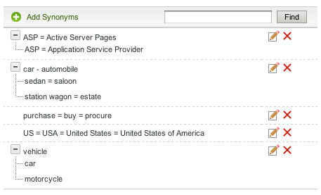

# A propos des dictionnaires{#about-dictionaries}

Vous pouvez utiliser les dictionnaires pour gérer une collection de dictionnaires et leurs synonymes et hyponymes associés.

## Utilisation des dictionnaires {#concept_B8028B71EC8144669614C64578EDB034}

Les synonymes sont des mots ayant la même signification ou une signification similaire, tels que pantalon, jeans, pantalon et pantalon, ou encore acheter, acheter, acquérir et commander.

Les algorithmes sont des synonymes unidirectionnels et fournissent une solution lorsque les synonymes ne sont pas appropriés. Par exemple, le terme de recherche le plus recherché sur un site de vente au détail de vêtements est &quot;pantalon&quot;. Toutefois, les jeans n’apparaissent pas dans les résultats de la recherche. Dans ce cas, vous pouvez utiliser un hyponyme pour associer des jeans à des pantalons, mais pour permettre à une recherche de jeans de ne retourner que des jeans. Utilisez les hypertermes pour fournir également une correspondance pour les produits interrompus ou les termes concurrentiels. Cette stratégie garantit un impact minimal sur les autres résultats de recherche. Par exemple, si le produit &quot;S2000&quot; est arrêté et que le produit &quot;S3000&quot; est son successeur, utilisez un hyponyme au lieu d’un synonyme pour vous assurer que les résultats de recherche de &quot;S3000&quot; n’incluent aucun résultat &quot;S2000&quot; erroné.

Les synonymes et les algorithmes aident les clients à trouver des résultats de recherche pertinents lorsqu’ils saisissent des termes de correspondance non exacts qui n’existent pas dans les pages Web. Par exemple, si le mot &quot;pantalon&quot; est utilisé sur votre site Web, vous pouvez créer un synonyme qui lie &quot;pantalon&quot; et &quot;pantalon&quot; ensemble. En retour, lorsque les clients recherchent &quot;pantalon&quot;, les résultats de la recherche sont renvoyés et sont liés au pantalon.

Les synonymes et les hyponymes sont regroupés sous la forme de dictionnaires de domaine. Il s’agit de dictionnaires spéciaux que vous créez pour un thème ou un objectif spécifique.

La page du menu Dictionnaire répertorie tous les dictionnaires de domaine définis par votre compte. A partir de cette page principale, vous pouvez renommer, modifier, supprimer ou activer et désactiver les dictionnaires de domaine.

## Compréhension du synonyme et de la notation hyponyme {#section_B459CCB850974F4FB16A14E489BBBEC0}

L’image suivante illustre un groupe de termes associés à des relations synonymes et hyponymes.

Six principales relations de synonyme sont explicitement définies. Chaque terme est séparé par des signes égaux (=).

* &quot;Voiture&quot; est un synonyme d&#39;automobile.
* &quot;Sedan&quot; est un synonyme de saloon.
* &quot;Station wagon&quot; est synonyme de propriété.
* &quot;ASP&quot; est un synonyme des pages de serveur actif et du fournisseur de services d’applications.
* &quot;Achat&quot;, &quot;Acheter&quot; et &quot;Se procurer&quot; sont des synonymes les uns des autres.
* &quot;US&quot;, &quot;USA&quot; et &quot;Etats-Unis d&#39;Amérique&quot; sont des synonymes les uns des autres.

Les lignes contenant un seul mot sont des synonymes simples. Les rangées avec des arbres extensibles forment des relations hyponymes. Dans l&#39;exemple, le second arbre définit la berline, le saloon, le wagon et l&#39;espace comme des hyponymes de voiture et d&#39;automobile. Inversement, la voiture et l&#39;automobile sont des termes hypertextes du reste de l&#39;arbre.

Le troisième arbre définit la voiture et la moto comme des hyponymes du véhicule.

Vous pouvez inclure plusieurs acronymes et/ou extensions de plusieurs mots dans chaque synonyme, comme le montre l’exemple de synonyme &quot;Etats-Unis&quot; ci-dessus. Lorsqu’un mot ou un acronyme a plusieurs significations, créez un synonyme pour chaque signification, comme dans l’exemple &quot;ASP&quot; ci-dessus. En ajoutant plusieurs synonymes, vous vous assurez qu’une recherche sur &quot;Fournisseur de services d’applications&quot;, par exemple, ne renvoie pas de résultats de recherche pour &quot;Pages de serveur actives&quot;.

Les hyponymes ne se développent pas avec d&#39;autres hyponymes. Les hyponymes s’étendent, au maximum, à un niveau avec leurs synonymes. Par exemple, une recherche de &quot;véhicule&quot; renvoie les résultats pour &quot;voiture&quot; et &quot;automobile&quot;, mais elle ne renvoie pas les résultats pour &quot;berline&quot; et &quot;wagon de gare&quot;.

## A propos de la recherche de termes dans les dictionnaires {#section_28E7F80CE68D4481BBF4F51EED237C67}

Vous pouvez rechercher des hyponymes et des synonymes dans tous les dictionnaires que vous ajoutez. Cette fonctionnalité est utile si vous souhaitez modifier ou supprimer un terme spécifique qui peut exister dans plusieurs dictionnaires. Chaque dictionnaire avec les résultats correspondants s’affiche avec les jeux de mots correspondants. Si la requête renvoie plus de 1 000 jeux, ou arbres, seuls les 1 000 premiers sont présentés.

Voir [Recherche dans les dictionnaires](../c-about-linguistics-menu/c-about-dictionaries.md#task_8D2BACC6F9B4487FA82367CBEDEE306F).

Voir [Modification d’un dictionnaire](../c-about-linguistics-menu/c-about-dictionaries.md#task_7B349B2D385048D7A06E754FAB75316A).

## A propos de la configuration d’un dictionnaire en tant que dictionnaire de radical {#section_B859E2E957674F558AC6F8D05A0ED190}

Le bourrage, qui permet de rechercher à la racine d’un mot qui peut avoir plusieurs terminaisons, peut fonctionner dans l’un des trois modes suivants : Dictionnaires de domaine, Formulaires Word de remplacement par défaut et Aucun.

Voir [A propos des mots et de la langue](../c-about-linguistics-menu/c-about-words-and-language.md#concept_CEB4B9576F3C4E2EB87B352EEC738D79).

Les informations suivantes supposent que votre compte est **[!UICONTROL Alternative Word Forms]** défini sur **[!UICONTROL Domain Dictionaries]**, de sorte que vous puissiez configurer des dictionnaires de domaine spécifiques comme source de problèmes.

Vous pouvez transformer n’importe quel dictionnaire de domaine en &quot;dictionnaire de radical&quot;. Ses synonymes et ses hyponymes continuent de s’étendre comme prévu, mais avec des effets secondaires supplémentaires. Avec tous les termes en commun trouvés dans un autre dictionnaire, ou même lui-même, il fusionne son groupe de mots avec ces synonymes ou hyponymes. Vous pouvez voir ça comme un autre niveau d&#39;expansion des mots.

Sans enracinement, les synonymes et les hyponymes doivent être verbaux et complets, répertoriant chaque mot pertinent en tant que membre.

Voici un exemple de synonymes et d’absence de radical :

* Synonymes : jog = exécution
* Une requête pour &quot;jog&quot; donne des documents avec les mots &quot;running&quot; et &quot;jog&quot;.
* Une requête pour &quot;exécution&quot; génère les mêmes documents que &quot;jog&quot;.
* Les pages Web sans &quot;jog&quot; et &quot;running&quot;, mais avec d&#39;autres formulaires de type &quot;run&quot; et &quot;run&quot;, sont absentes du résultat de la requête.

Dans cet exemple, un mot de requête ne s’étend pas, sauf s’il est membre d’un synonyme ou d’un hyponyme spécifique.

Voici un exemple de synonymes et de radical :

* Synonymes : jog = exécution
* Entrée Synonyme d’un dictionnaire de radical : running = run
* Une requête pour &quot;jog&quot; ou &quot;running&quot; renvoie toutes les pages Web avec les mots &quot;run&quot;, &quot;running&quot;, &quot;run&quot; et &quot;jog&quot;.
* Une requête pour &quot;run&quot; et &quot;run&quot; renvoie les mêmes résultats, ou des résultats similaires.

Dans cet exemple, un synonyme d’un dictionnaire de radical peut fusionner son groupe de mots équivalents avec tout autre synonyme ou hyponyme dans tout autre dictionnaire ayant au moins un terme en commun.

La désignation d’un trop grand nombre de dictionnaires avec trop de mots peut avoir des conséquences sur les performances. Vous devez désigner les dictionnaires de domaine comme dictionnaires de recherche de radical. Le blocage peut également créer des extensions de mot imprévues pendant le temps de recherche et compliquer le processus de débogage et de suivi des extensions de mot.

Voir [Configuration d’un dictionnaire en tant que dictionnaire](../c-about-linguistics-menu/c-about-dictionaries.md#task_541E8453A12F4A8E89CF6F595469F074)de radical.

## Adding a new dictionary {#task_F31AC6723E894C4F91D12AB2A4CEE9FB}

Vous pouvez ajouter un nouveau dictionnaire de synonymes et d’hyponymes pour aider vos clients à trouver les résultats de recherche appropriés. Cette fonctionnalité est particulièrement utile lorsque les clients saisissent des termes de correspondance non exacts qui peuvent ne pas exister sur vos pages Web.

Voir aussi [Ajout d’une nouvelle règle](../c-about-rules-menu/c-about-business-rules.md#task_BD3B31ED48BB4B1B8F1DCD3BFA2528E7)de fonctionnement.

**Pour ajouter un nouveau dictionnaire**

1. Dans le menu du produit, cliquez sur **[!UICONTROL Linguistics]** > **[!UICONTROL Dictionaries]**.
1. Sur la **[!UICONTROL Dictionary Menu]** page, cliquez sur **[!UICONTROL Add New Dictionary]**.
1. Sur la **[!UICONTROL Dictionary]** page, dans le **[!UICONTROL Name]** champ, saisissez le nom du nouveau dictionnaire.
1. Cliquez sur **[!UICONTROL Add Synonyms]**.
1. Dans la **[!UICONTROL Add Terms]** boîte de dialogue, effectuez l’une des opérations suivantes :

   * Pour ajouter des synonymes, saisissez plusieurs termes dans le champ de texte principal, en séparant chaque mot ou expression par un signe égal (=). Par exemple, pantalon = pantalon = pantalon.
   * Pour ajouter des hyponymes, saisissez un terme hypertexte dans le champ de texte principal. Cliquez sur **[!UICONTROL Add Hyponym]**, puis saisissez un hyponyme associé à l’hypermétisme que vous avez entré. Par exemple, &quot;berline&quot;, &quot;saloon&quot;, &quot;wagon de gare&quot; et &quot;domaine&quot; peuvent être des hyponymes de &quot;voiture&quot; et &quot;automobile&quot; (tous deux hypertextes) comme illustré ci-dessous.

      

      Les entrées Hyponym peuvent également former des synonymes tels que &quot;berline&quot; et &quot;saloon&quot;.

1. Cliquez sur **[!UICONTROL Save]**.
1. Effectuez l’une des opérations suivantes :

   * Répétez les étapes 4 à 6 pour ajouter d’autres synonymes et des hyponymes.
   * Passez à l’étape suivante.

1. Pour prévisualiser les résultats de vos modifications, cliquez sur **[!UICONTROL regenerate your staged site index]** pour recréer l’index de votre site Web intermédiaire.

   Voir [Exécution d’un index complet d’un site Web en direct ou par étape...](../c-about-index-menu/c-about-full-index.md#task_F7FE04D8A1654A7787FCCA31B45EB42D).

   Voir [Exécution d’un index incrémentiel d’un site Web en direct ou d’un site Web intermédiaire...](../c-about-index-menu/c-about-incremental-index.md#task_9BFB6157F3884B2FAECB7E0E9CA318CB).
1. (Facultatif) Dans le menu du produit, cliquez sur **[!UICONTROL Linguistics]** > **[!UICONTROL Dictionaries]**, puis effectuez l’une des opérations suivantes :

   * Cliquez sur **[!UICONTROL History]** pour annuler les modifications que vous avez apportées.

      Voir [Utilisation de l’option](../t-using-the-history-option.md#task_70DD3F87A67242BBBD2CB27156F43002)Historique.

   * Cliquez sur **[!UICONTROL Live]**.

      Voir [Affichage des paramètres](../c-about-staging.md#task_401A0EBDB5DB4D4CA933CBA7BECDC10F)en direct.

   * Cliquez sur **[!UICONTROL Push Live]**.

      Voir [Pousser les paramètres d’étape en direct](../c-about-staging.md#task_44306783B4C0408AAA58B471DAF2D9A4).

## Activation ou désactivation d’un dictionnaire {#task_EC282EA0846942F6913918EA8218220B}

Les relations de chaque mot sont générées au moment où vous indexez votre site Web. Avant la prochaine opération d’indexation, vous pouvez activer ou désactiver tout dictionnaire que vous avez ajouté.

**Pour activer ou désactiver un dictionnaire**

1. Dans le menu du produit, cliquez sur **[!UICONTROL Linguistics]** > **[!UICONTROL Dictionaries]**.
1. Sur la **[!UICONTROL Dictionary Menu]** page, sous la **[!UICONTROL Enabled]** colonne du tableau, effectuez l’une des opérations suivantes :

   * Cochez la case d’un dictionnaire que vous souhaitez activer et que vous avez indexé.
   * Décochez la case d’un dictionnaire que vous souhaitez désactiver et que vous ne souhaitez pas indexer.

1. Cliquez sur **[!UICONTROL Save Changes]**.
1. Pour prévisualiser les résultats de vos modifications, cliquez sur **[!UICONTROL regenerate your staged site index]** pour recréer l’index de votre site Web intermédiaire.

   Voir [Exécution d’un index complet d’un site Web en direct ou par étape...](../c-about-index-menu/c-about-full-index.md#task_F7FE04D8A1654A7787FCCA31B45EB42D).

   Voir [Exécution d’un index incrémentiel d’un site Web en direct ou d’un site Web intermédiaire...](../c-about-index-menu/c-about-incremental-index.md#task_9BFB6157F3884B2FAECB7E0E9CA318CB).
1. (Facultatif) Dans le menu du produit, cliquez sur **[!UICONTROL Linguistics]** > **[!UICONTROL Dictionaries]**, puis effectuez l’une des opérations suivantes :

   * Cliquez sur **[!UICONTROL History]** pour annuler les modifications que vous avez apportées.

      Voir [Utilisation de l’option](../t-using-the-history-option.md#task_70DD3F87A67242BBBD2CB27156F43002)Historique.

   * Cliquez sur **[!UICONTROL Live]**.

      Voir [Affichage des paramètres](../c-about-staging.md#task_401A0EBDB5DB4D4CA933CBA7BECDC10F)en direct.

   * Cliquez sur **[!UICONTROL Push Live]**.

      Voir [Pousser les paramètres d’étape en direct](../c-about-staging.md#task_44306783B4C0408AAA58B471DAF2D9A4).

## Modification d’un dictionnaire {#task_7B349B2D385048D7A06E754FAB75316A}

Vous pouvez modifier ou supprimer des groupes de synonymes et d’hyponymes qui constituent un dictionnaire spécifique.

<!-- 

t_editing_a_dictionary.xml

 -->

Vous pouvez également localiser **[!UICONTROL Find]** des synonymes et des hyponymes spécifiques que vous souhaitez modifier ou supprimer dans tous vos dictionnaires.

**Pour modifier un dictionnaire**

1. Dans le menu du produit, cliquez sur **[!UICONTROL Linguistics]** > **[!UICONTROL Dictionaries]**.
1. Effectuez l’une des opérations suivantes :

   * Sur la [!DNL Dictionary Menu] page, dans le tableau, cliquez sur le nom d’hyperlien d’un dictionnaire unique dont vous souhaitez modifier ou supprimer les termes.
   * Sur la [!DNL Dictionary Menu] page, dans le champ de **[!UICONTROL Find]** texte, saisissez un terme à rechercher dans tous les dictionnaires, puis cliquez sur **[!UICONTROL Find]**.

      Sur la [!DNL Find in Dictionaries] page, utilisez les listes déroulantes qui l’accompagnent pour définir les options d’affinage de votre choix.

      <table> 
      <thead> 
        <tr> 
        <th colname="col1" class="entry"> 
Option 
 </th> 
        <th colname="col2" class="entry"> 
Description 
 </th> 
        </tr> 
      </thead>
      <tbody> 
        <tr> 
        <td colname="col1"> 
Rechercher 
 </td> 
        <td colname="col2"> 
Permet d’entrer le terme que vous souhaitez rechercher dans tous les dictionnaires. 
 </td> 
        </tr> 
        <tr> 
        <td colname="col1"> 
Liste déroulante Correspondance 
 </td> 
        <td colname="col2"> 
Permet de sélectionner l’un des quatre types de correspondance suivants : 
        <ul id="ul_D656F159677946938050115F610EEF4B"> 
        <li id="li_2D6B302E021A4CE7A47F028812633EDC">  Correspondance exacte  
La requête doit avoir une correspondance exacte avec un hyponyme ou un synonyme. 
 </li> 
        <li id="li_30AD5976E43041E98190F4757E821092">  Contient du texte  
La requête ne nécessite qu'une correspondance de sous-chaîne ; une correspondance à l’intérieur d’un hyponyme ou d’un synonyme. 
 </li> 
        <li id="li_9BF911EFB54345BB82679BDE51DDF8AF">  Commence par  
La requête ne correspond qu'au début de chaque hyponyme et synonyme. 
 </li> 
        <li id="li_CB791C7F5B5A4496B329ED505E7D97BC">  Correspondance de mot  
La requête est comparée à chaque mot d’un synonyme ou d’un hyponyme, mais le mot doit correspondre exactement. 
 </li> 
        </ul> 
 </td> 
        </tr> 
        <tr> 
        <td colname="col1"> 
Liste déroulante Dictionnaire activé/désactivé 
 </td> 
        <td colname="col2"> 
Permet de sélectionner l’une des options suivantes : 
        <ul id="ul_EBBD3F3A2D854952A35CBDDBECB40958"> 
        <li id="li_7F5654C284BE485EAC9B000A663C6C60">  Dictionnaires activés et désactivés  
Recherchez le terme spécifié dans les dictionnaires activés et désactivés. 
 </li> 
        <li id="li_4A83EECF38044287A923EC0AAF639079">  Dictionnaires activés uniquement  
La recherche de dictionnaires activés uniquement s’avère utile pour déboguer l’index actuel. 
 </li> 
        </ul> 
 
Voir <a href="../c-about-linguistics-menu/c-about-dictionaries.md#task_EC282EA0846942F6913918EA8218220B" type="task" format="dita" scope="local"> Activation ou désactivation d’un dictionnaire </a>. 
 </td> 
        </tr> 
        <tr> 
        <td colname="col1"> 
Liste déroulante Mises en scène/En direct 
 </td> 
        <td colname="col2"> 
Permet de sélectionner l’une des options suivantes : 
        <ul id="ul_BD0733A30E6B470E942B21F499A4373B"> 
        <li id="li_F9A8C39C22EA4FBF86536F5924ED973C">  Dictionnaires en direct/par étapes  
Recherche le terme spécifié dans les dictionnaires en direct et par étapes. Cependant, il ne recherche la version intermédiaire du dictionnaire que si elle existe. Si la version intermédiaire n’existe pas, elle effectue une recherche dans la version en direct du dictionnaire. 
 </li> 
        <li id="li_DB0944DB18564269AA10676BDFDB0460">  Dictionnaires dynamiques  
Recherchez le terme spécifié dans les dictionnaires en direct uniquement. 
 </li> 
        </ul> 
 </td> 
        </tr> 
      </tbody> 
      </table>

1. Dans le tableau, effectuez l’une des opérations suivantes :

   * Cliquez sur  qui est associé au terme à mettre à jour. Dans la **[!UICONTROL Edit Terms]** boîte de dialogue, modifiez les termes de votre choix. Lorsque vous avez terminé, cliquez sur **[!UICONTROL Save]**.

   * Cliquez sur  qui est associé au terme à supprimer. Dans la **[!UICONTROL Delete Terms]** boîte de dialogue, cliquez sur **[!UICONTROL Delete]**. Veillez à supprimer le terme correct ; il n&#39;existe pas de boîte de dialogue de confirmation de suppression.

1. Pour prévisualiser les résultats de vos modifications, cliquez sur **[!UICONTROL regenerate your staged site index]** pour recréer l’index de votre site Web intermédiaire.

   Voir [Exécution d’un index complet d’un site Web en direct ou par étape...](../c-about-index-menu/c-about-full-index.md#task_F7FE04D8A1654A7787FCCA31B45EB42D).

   Voir [Exécution d’un index incrémentiel d’un site Web en direct ou d’un site Web intermédiaire...](../c-about-index-menu/c-about-incremental-index.md#task_9BFB6157F3884B2FAECB7E0E9CA318CB).
1. (Facultatif) Dans le menu du produit, cliquez sur **[!UICONTROL Linguistics]** > **[!UICONTROL Dictionaries]**, puis effectuez l’une des opérations suivantes :

   * Cliquez sur **[!UICONTROL History]** pour annuler les modifications que vous avez apportées.

      Voir [Utilisation de l’option](../t-using-the-history-option.md#task_70DD3F87A67242BBBD2CB27156F43002)Historique.

   * Cliquez sur **[!UICONTROL Live]**.

      Voir [Affichage des paramètres](../c-about-staging.md#task_401A0EBDB5DB4D4CA933CBA7BECDC10F)en direct.

   * Cliquez sur **[!UICONTROL Push Live]**.

      Voir [Pousser les paramètres d’étape en direct](../c-about-staging.md#task_44306783B4C0408AAA58B471DAF2D9A4).

## Attribution d’un nouveau nom à un dictionnaire {#task_7F1F372B337B4853BFA2A60AD267B092}

Vous pouvez modifier le nom d’un dictionnaire que vous avez ajouté.

<!-- 

t_renaming_a_dictionary.xml

 -->

Si vous définissez l’ **[!UICONTROL Alternate Word Forms]** option sur **[!UICONTROL Domain Dictionaries]** dans **[!UICONTROL Words & Language]**, l’option **[!UICONTROL Configure]** est utilisée à la place de **[!UICONTROL Rename]**.

Voir [A propos des mots et de la langue](../c-about-linguistics-menu/c-about-words-and-language.md#concept_CEB4B9576F3C4E2EB87B352EEC738D79).

**Pour renommer un dictionnaire**

1. Dans le menu du produit, cliquez sur **[!UICONTROL Linguistics]** > **[!UICONTROL Dictionaries]**.
1. Sur la **[!UICONTROL Dictionary Menu]** page, sous la **[!UICONTROL Actions]** colonne du tableau, effectuez l’une des opérations suivantes :

   * Cliquez sur **[!UICONTROL Rename]** pour le dictionnaire associé dont vous souhaitez modifier le nom.

      Dans la **[!UICONTROL Rename Dictionary]** boîte de dialogue. dans le **[!UICONTROL Name]** champ, saisissez le nouveau nom du dictionnaire.

      Cliquez sur **[!UICONTROL Rename File]**.

   * Cliquez sur **[!UICONTROL Configure]** pour le dictionnaire associé dont vous souhaitez modifier le nom.

      Dans la **[!UICONTROL Configure Dictionary]** boîte de dialogue. dans le **[!UICONTROL Name]** champ, saisissez le nouveau nom du dictionnaire.

      Cliquez sur **[!UICONTROL Save Configuration]**.

1. (Facultatif) Effectuez l’une des opérations suivantes :

   * Cliquez sur **[!UICONTROL History]** pour annuler les modifications que vous avez apportées.

      Voir [Utilisation de l’option](../t-using-the-history-option.md#task_70DD3F87A67242BBBD2CB27156F43002)Historique.

   * Cliquez sur **[!UICONTROL Live]**.

      Voir [Affichage des paramètres](../c-about-staging.md#task_401A0EBDB5DB4D4CA933CBA7BECDC10F)en direct.

   * Cliquez sur **[!UICONTROL Push Live]**.

      Voir [Pousser les paramètres d’étape en direct](../c-about-staging.md#task_44306783B4C0408AAA58B471DAF2D9A4).

## Configuration d’un dictionnaire en tant que dictionnaire de radical {#task_541E8453A12F4A8E89CF6F595469F074}

Vous pouvez définir un dictionnaire sur le mode de radical avancé afin de tirer parti du mot qui apparaît dans les recherches.

<!-- 

t_configuring_a_dictionary_as_a_stemming_dictionary.xml

 -->

Un tel mode renvoie des pages Web qui correspondent à des variantes de ce que vos clients recherchent.

Voir [A propos des dictionnaires](../c-about-linguistics-menu/c-about-dictionaries.md#concept_B8028B71EC8144669614C64578EDB034).

Voir [A propos des mots et de la langue](../c-about-linguistics-menu/c-about-words-and-language.md#concept_CEB4B9576F3C4E2EB87B352EEC738D79).

**Pour configurer un dictionnaire en tant que dictionnaire de radical**

1. Dans le menu du produit, cliquez sur **[!UICONTROL Linguistics]** > **[!UICONTROL Words & Language]**.
1. Sur la [!DNL Words & Languages] page, dans la liste **[!UICONTROL Alternate Words Forms]** déroulante, sélectionnez **[!UICONTROL Domain Dictionaries]**.

   Tout dictionnaire de domaine défini en tant que dictionnaire de radical (voir étape 7 ci-dessous) est utilisé comme source d’autres formulaires de mots.

1. Cliquez sur **[!UICONTROL Save Changes]**.
1. Dans le menu du produit, cliquez sur **[!UICONTROL Linguistics]** > **[!UICONTROL Dictionaries]**.
1. Sur la [!DNL Dictionaries Menu] page, sous la **[!UICONTROL Actions]** colonne du tableau, cliquez **[!UICONTROL Configure]** pour un dictionnaire associé que vous souhaitez définir comme dictionnaire de radical.
1. Dans la **[!UICONTROL Configure Dictionary]** boîte de dialogue, dans la liste **[!UICONTROL Advanced Stemming Mode]** déroulante, sélectionnez **[!UICONTROL Yes]**.
1. Cliquez sur **[!UICONTROL Save Configuration]**.
1. Cliquez sur **[!UICONTROL regenerate your staged site index]** pour recréer votre index de site Web intermédiaire.

   Voir [Exécution d’un index complet d’un site Web en direct ou par étape...](../c-about-index-menu/c-about-full-index.md#task_F7FE04D8A1654A7787FCCA31B45EB42D).

   Voir [Exécution d’un index incrémentiel d’un site Web en direct ou d’un site Web intermédiaire...](../c-about-index-menu/c-about-incremental-index.md#task_9BFB6157F3884B2FAECB7E0E9CA318CB).
1. (Facultatif) Dans le menu du produit, cliquez sur **[!UICONTROL Linguistics]** > **[!UICONTROL Dictionaries]**, puis effectuez l’une des opérations suivantes :

   * Cliquez sur **[!UICONTROL History]** pour annuler les modifications que vous avez apportées.

      Voir [Utilisation de l’option](../t-using-the-history-option.md#task_70DD3F87A67242BBBD2CB27156F43002)Historique.

   * Cliquez sur **[!UICONTROL Live]**.

      Voir [Affichage des paramètres](../c-about-staging.md#task_401A0EBDB5DB4D4CA933CBA7BECDC10F)en direct.

   * Cliquez sur **[!UICONTROL Push Live]**.

      Voir [Pousser les paramètres d’étape en direct](../c-about-staging.md#task_44306783B4C0408AAA58B471DAF2D9A4).

## Recherche dans les dictionnaires {#task_8D2BACC6F9B4487FA82367CBEDEE306F}

Vous pouvez rechercher des hypernoms et des synonymes dans tous les dictionnaires ajoutés à la recherche et au marchandisage sur le site.

<!-- 

t_searching_across_dictionaries.xml

 -->

Cette fonctionnalité est utile si vous souhaitez modifier ou supprimer un terme spécifique qui peut exister dans plusieurs dictionnaires. Chaque dictionnaire avec les résultats correspondants s’affiche avec les jeux de mots correspondants. Si la requête renvoie plus de 1 000 jeux, ou arbres, seuls les 1 000 premiers sont présentés.

Voir [Modification d’un dictionnaire](../c-about-linguistics-menu/c-about-dictionaries.md#task_7B349B2D385048D7A06E754FAB75316A).

**Pour effectuer une recherche dans les dictionnaires**

1. Dans le menu du produit, cliquez sur **[!UICONTROL Linguistics]** > **[!UICONTROL Dictionaries]**.
1. Sur la [!DNL Dictionary Menu] page, dans le champ de **[!UICONTROL Find]** texte, saisissez un terme à rechercher dans tous les dictionnaires, puis cliquez sur **[!UICONTROL Find]**.
1. Sur la [!DNL Find in Dictionaries] page, utilisez les listes déroulantes qui l’accompagnent pour définir les options d’affinage de votre choix.

   Voir [Modification d’un dictionnaire](../c-about-linguistics-menu/c-about-dictionaries.md#task_7B349B2D385048D7A06E754FAB75316A).
1. (Facultatif) Utilisez la **[!UICONTROL Show]** liste déroulante pour spécifier le nombre maximal de résultats à afficher par page.

## Suppression d’un dictionnaire {#task_DBAAEE624BC14D2590444B0B7869ECCA}

Vous pouvez supprimer des dictionnaires dont vous n’avez plus besoin ou que vous n’utilisez plus.

<!-- 

t_deleting_a_dictionary.xml

 -->

Si vous supprimez un dictionnaire actif, il est mis en scène pour suppression. Si vous supprimez un dictionnaire qui est mis en scène, il est immédiatement supprimé.

Assurez-vous de supprimer un dictionnaire dont vous savez qu’il est plus nécessaire ; aucune fonctionnalité d’historique n’est disponible pour annuler la suppression.

**Pour supprimer un dictionnaire**

1. Dans le menu du produit, cliquez sur **[!UICONTROL Linguistics]** > **[!UICONTROL Dictionaries]**.
1. Sur la [!DNL Dictionary Menu] page, sous la **[!UICONTROL Actions]** colonne du tableau, cliquez **[!UICONTROL Delete]** pour le dictionnaire associé à supprimer.
1. Dans la **[!UICONTROL Delete Dictionary]** boîte de dialogue. click **[!UICONTROL Yes]** to confirm the deletion.
1. (Facultatif) Si vous avez supprimé un dictionnaire dynamique, effectuez l’une des opérations suivantes :

   * Cliquez sur **[!UICONTROL Live]**.

      Voir [Affichage des paramètres](../c-about-staging.md#task_401A0EBDB5DB4D4CA933CBA7BECDC10F)en direct.

   * Cliquez sur **[!UICONTROL Push Live]**.

      Voir [Pousser les paramètres d’étape en direct](../c-about-staging.md#task_44306783B4C0408AAA58B471DAF2D9A4).

