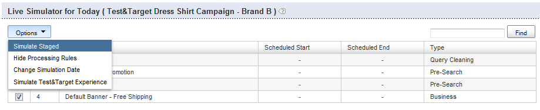

# A propos des règles de fonctionnement{#about-business-rules}

Vous pouvez utiliser des règles de fonctionnement pour marchandiser votre recherche.

## Utilisation des règles de fonctionnement {#concept_2A93D76216754D3D8412CDEA00BD26BD}

Vous pouvez, par exemple, configurer le moment où apparaissent les bannières ou les résultats qui s’affichent et dans quel ordre. Vous pouvez également configurer la position d’un élément dans votre facette et le modèle utilisé pour une recherche donnée. Les règles s&#39;exécutent dans l&#39;ordre dans lequel elles ont été définies ; plus le numéro d’ordre d’une règle est élevé, plus le processus est long, ce qui l’emporte sur les règles antérieures. Vous pouvez faire glisser et déposer les règles pour modifier leur ordre ou les réorganiser en saisissant un nouveau numéro dans la zone de texte Ordre des règles.

Chaque règle de fonctionnement est composée de déclencheurs et d’actions.

Le déclencheur définit le moment où la règle s’exécute. Par exemple, lorsque le terme  est &quot;hommes&quot; ou lorsque les résultats sont principalement des chapeaux. Le déclencheur est constitué de plusieurs conditions qui doivent être toutes, ou l’une d’elles doit être vraie pour que le déclencheur global soit vrai. Vous pouvez spécifier la priorité en modifiant l’opérateur de déclenchement.

L’action définit ce qui se produit lorsque la condition de déclenchement est remplie. Par exemple, la définition de la bannière pour afficher ou déplacer un résultat donné vers la position 1. Le tableau des règles affiche des informations récapitulatives sur la règle. Vous pouvez cliquer sur le nom d’une règle pour l’ouvrir et afficher des informations supplémentaires.

Le tableau des règles présente un  de toutes vos règles de fonctionnement. Par défaut, le tableau affiche les dix dernières règles qui ont été ajoutées, dans l’ordre décroissant. Vous pouvez cliquer sur les en-têtes de colonne dans le tableau pour trier les règles par ordre croissant ou décroissant.

Les règles de fonctionnement peuvent avoir l’un des trois états suivants : Approuvé, Suspendu ou En cours (travail en cours)

<table> 
 <thead> 
  <tr> 
   <th colname="col1" class="entry"> 
État de la règle de fonctionnement 
 </th> 
   <th colname="col2" class="entry"> 
Description 
 </th> 
  </tr> 
 </thead>
 <tbody> 
  <tr> 
   <td colname="col1"> 
Approuvés 
 </td> 
   <td colname="col2"> 
Les règles de fonctionnement approuvées s’exécutent dans votre  de  en direct et dans votre de  en direct. Vous approuvez une règle de fonctionnement dans le Créateur de règles avancé. 
 </td> 
  </tr> 
  <tr> 
   <td colname="col1"> 
Suspendu 
 </td> 
   <td colname="col2"> 
Les règles de fonctionnement suspendues ne s’exécutent jamais dans votre   de mise en scène ou votre de  de vie. 
 </td> 
  </tr> 
  <tr> 
   <td colname="col1"> 
WIP 
 </td> 
   <td colname="col2"> 
WIP (Work In Progress) sont des règles de fonctionnement qui ne sont ni approuvées ni suspendues. C'est-à-dire que vous travaillez toujours sur eux ou que vous voudrez peut-être d'abord les tester avant de les approuver. Les règles de fonctionnement dans un état de travaux en cours ne s'exécutent que dans votre   intermédiaire. 
 </td> 
  </tr> 
 </tbody> 
</table>

Vous approuvez les règles de fonctionnement et les poussez en direct pour qu’elles s’exécutent dans votre  de vie . Actuellement, vous ne pouvez publier que *toutes les* règles. Cependant, vous pouvez modifier l’état d’une règle afin de contrôler quelles règles s’exécutent et ne s’exécutent pas dans votre  de  en direct.

Par défaut, les règles s’exécutent chaque fois que leurs déclencheurs associés sont satisfaits. Cependant, vous pouvez éventuellement planifier l’exécution d’une règle pour une période et une date spécifiques.

Par défaut, les règles s’exécutent également chaque fois que leurs déclencheurs associés sont satisfaits pour tous les magasins. Si vous souhaitez que la règle s’applique uniquement à certains magasins, vous pouvez utiliser le panneau Magasins pour sélectionner un ou plusieurs magasins auxquels la règle s’applique.

## Ajout d’une nouvelle règle de fonctionnement {#task_BD3B31ED48BB4B1B8F1DCD3BFA2528E7}

Vous pouvez utiliser [!DNL Visual Rule Builder] ou [!DNL Advanced Rule Builder] ajouter des règles de fonctionnement qui adaptent l’expérience de recherche de votre client.

**Pour ajouter une nouvelle règle de fonctionnement**

Les étapes suivantes supposent que vous utilisez le Créateur de règles visuel.

1. Effectuez l’une des opérations suivantes :

   * Dans le menu du produit, cliquez sur **[!UICONTROL Rules]** > **[!UICONTROL Business Rules]**. Sur la [!DNL Business Rules] page, cliquez sur **[!UICONTROL Add New Rule]**.

   * Dans le menu du produit, cliquez sur **[!UICONTROL Simulator]**. Sur la **[!UICONTROL Simulator for Today]** page, cliquez **[!UICONTROL Add New Rule]** à droite du menu **[!UICONTROL Options]** déroulant.

      Si l’ **[!UICONTROL Add New Rule]** option n’est pas visible sur la page, dans le menu **[!UICONTROL Options]** déroulant, cliquez sur **[!UICONTROL Simulate Staged]**.

      

1. Dans le champ **[!UICONTROL Name]** de texte, saisissez le nouveau nom de la règle de fonctionnement.

   Ne cliquez pas **[!UICONTROL Save Rule]** encore.
1. (Facultatif) Si vous gérez un grand nombre de règles de fonctionnement, vous pouvez baliser les règles de fonctionnement avec des étiquettes spécifiques. Dans le **[!UICONTROL Tags]** champ, saisissez un ou plusieurs libellés de balise, utilisez une virgule, une tabulation ou saisissez comme délimiteur.

   Sur la [!DNL Business Rules] page, utilisez la **[!UICONTROL Filter by tag]** fonction pour filtrer les règles qui correspondent à une étiquette donnée. 1. Sur la [!DNL Business Rule Builder] page, définissez les déclencheurs et les actions à utiliser.

   **Options de déclenchement**

   Les déclencheurs sont les conditions qui doivent être remplies pour qu’une règle métier s’exécute. Lorsqu’une règle de fonctionnement comporte plusieurs déclencheurs, vous pouvez configurer la manière dont les déclencheurs répondent à l’aide de l’une des trois méthodes suivantes :

   * Réponse dans laquelle tous les déclencheurs doivent être vrais (paramètre par défaut), comme dans l’exemple suivant :

      `if a AND b AND c then ...`

   * Réponse où l’un des déclencheurs doit être vrai, comme dans l’exemple suivant :

      `if a OR b OR c then ...`

   * Réponse dans laquelle une combinaison personnalisée de déclencheurs est spécifiée. Autrement dit, vous combinez des déclencheurs individuels ou des &quot;conditions&quot; avec `AND` des opérateurs et `OR` des opérateurs.

      Vous pouvez également modifier la priorité d’évaluation en ajoutant des combinaisons entre parenthèses gauche et droite, comme dans l’exemple suivant :

      `if (a OR b) AND c then ...`

      >[!NOTE]
      >
      >Si vous combinez `AND` des opérateurs avec `OR` des opérateurs dans un jeu de règles de fonctionnement personnalisé, veillez à spécifier des parenthèses appropriées pour vous assurer que les déclencheurs sont évalués dans le bon ordre.

      Cette fonction particulière de personnalisation d’une combinaison de déclencheurs n’est pas activée par défaut. Contactez le support technique pour activer cette fonctionnalité.
   <table> 
      <thead> 
      <tr> 
      <th colname="col1" class="entry"> 
Option Déclencheurs 
 </th> 
      <th colname="col2" class="entry"> 
Description 
 </th> 
      </tr> 
    </thead>
    <tbody> 
      <tr> 
      <td colname="col1"> 
Correspondances de mots-clés 
 </td> 
      <td colname="col2"> 
Le déclencheur est true lorsque le terme de recherche correspond au mot-clé sensible à la casse donné. Le déclencheur est true pour le mot-clé et tous ses synonymes, comme défini dans le dictionnaire linguistique. 
 </td> 
      </tr> 
      <tr> 
      <td colname="col1"> 
 Correspondance  
 </td> 
      <td colname="col2"> 
 Le déclencheur est true lorsque tous les paramètres de recherche correspondent. 
 </td> 
      </tr> 
      <tr> 
      <td colname="col1"> 
 Le groupe de résultats est dominant 
 </td> 
      <td colname="col2"> 
 Déclencheur est true lorsque le groupe de résultats défini par la recherche donnée domine le jeu de résultats. 
 
Par défaut, la dominance est définie à 50 %. Ce paramètre est une préférence de marchandisage que vous pouvez définir. 
 
 
        <!--See <xref href="t_Configuring_Merchandising_preferences.xml#task_7AC7B9F5D9F44E10AB5BC0B8CB31C37A" type="task" format="dita" scope="local">Configuring Merchandising preferences</xref>. --> 
 
Le groupe entier doit être présent dans le jeu de résultats pour que ce déclencheur soit vrai. Le groupe de résultats est dynamique. Ils peuvent changer après les opérations d’index, selon les résultats qui correspondent aux critères de recherche d’origine. 
 </td> 
      </tr> 
      <tr> 
      <td colname="col1"> 
Groupe de résultats présent 
 </td> 
      <td colname="col2"> 
 Le déclencheur est true lorsque le groupe de résultats défini par la recherche donnée est présent dans le jeu de résultats. Le groupe entier doit être présent dans le jeu de résultats pour que ce déclencheur soit atteint (les résultats peuvent apparaître sur n’importe quelle page). Le groupe de résultats est dynamique et peut changer après les opérations d’index en fonction des résultats qui correspondent aux critères de recherche d’origine. 
 </td> 
      </tr> 
      <tr> 
      <td colname="col1"> 
 Résultat présent 
 </td> 
      <td colname="col2"> 
 Le déclencheur est true lorsque le résultat individuel est trouvé dans le jeu de résultats. Le résultat peut se trouver n’importe où dans le jeu de résultats, il n’est pas nécessaire qu’il se trouve sur la page que l’utilisateur consulte actuellement. 
 </td> 
      </tr> 
    </tbody> 
    </table>

   **Options d’action**

   Lorsque les déclencheurs d’une règle métier sont satisfaits, les actions associées à la règle sont exécutées. Bien que le Créateur de règles visuel vous permette de créer les actions suivantes, vous pouvez utiliser le Créateur de règles avancé pour créer des types d’actions supplémentaires.

   Les actions Supprimer un élément de facette, Afficher un élément de facette, Afficher une facette, Supprimer une facette, Envoyer un élément de facette dans le tableau suivant nécessitent une facette. L’interface de sélection d’une facette dépend de la configuration de votre compte. Par exemple, un compte normal utilise un déroulant pour choisir des facettes. Toutefois, si votre compte comporte des facettes en pointillés, une zone de texte de saisie automatique s’affiche, dans laquelle vous pouvez saisir le nom de n’importe quelle facette. La saisie automatique suggère des facettes dans un déroulant lorsque vous saisissez le nom de la facette. Les suggestions incluent des facettes actuellement définies. Si votre compte dispose d’une carte d’emplacements, il suggère également des facettes en pointillés.

   <table> 
    <thead> 
      <tr> 
      <th colname="col1" class="entry"> 
Option Actions 
 </th> 
      <th colname="col2" class="entry"> 
Description 
 </th> 
      </tr> 
    </thead>
    <tbody> 
      <tr> 
      <td colname="col1"> 
Groupe Push 
 </td> 
      <td colname="col2"> 
 Place le groupe de résultats de recherche tel que défini par les critères de recherche spécifiés à une position spécifique. 
 
La publication d’un groupe de résultats de recherche n’ajoute pas implicitement le groupe. 
 </td> 
      </tr> 
      <tr> 
      <td colname="col1"> 
Groupe Ajouter 
 </td> 
      <td colname="col2"> 
 Ajouter le groupe de résultats de recherche tel que défini par les critères de recherche spécifiés. 
 </td> 
      </tr> 
      <tr> 
      <td colname="col1"> 
Supprimer un groupe 
 </td> 
      <td colname="col2"> 
 Supprimez le groupe de résultats de recherche défini par les critères de recherche spécifiés. 
 </td> 
      </tr> 
      <tr> 
      <td colname="col1"> 
Push Single 
 </td> 
      <td colname="col2"> 
 Place le résultat de recherche individuel à la position sélectionnée. 
 </td> 
      </tr> 
      <tr> 
      <td colname="col1"> 
Ajouter unique 
 </td> 
      <td colname="col2"> 
 Ajoute un résultat de recherche individuel à la position sélectionnée. 
 </td> 
      </tr> 
      <tr> 
      <td colname="col1"> 
Supprimer un seul 
 </td> 
      <td colname="col2"> 
 Supprime un résultat de recherche individuel du jeu de résultats de recherche. 
 </td> 
      </tr> 
      <tr> 
      <td colname="col1"> 
Supprimer tous les résultats 
 </td> 
      <td colname="col2"> 
Supprime tous les résultats du jeu de résultats de recherche. 
 
 
        <!-- Bug #3331637 The option is meant to be used in conjunction with other rule actions in order to create "canned landing pages" where we want to create a page's content solely by rule actions, and need to completely discard the "natural" results of the search. Given that the other options don't have any kind of "here's how/why you might use this", I don't see much point in breaking that precedent here.--> 
 </td> 
      </tr> 
      <tr> 
      <td colname="col1"> 
Sélectionner une bannière différente 
 </td> 
      <td colname="col2"> 
 Modifie la bannière dans la zone de bannière sélectionnée. 
 
Cette option est disponible lorsque vous cliquez avec le bouton droit sur une bannière dans la zone d’affichage de la page Web. 
 </td> 
      </tr> 
      <tr> 
      <td colname="col1"> 
Ajouter des commandes de bannière 
 </td> 
      <td colname="col2"> 
S’applique uniquement aux modèles Adobe Dynamic Media Classic. 
 
Permet de modifier les paramètres par défaut utilisés dans le modèle de bannière. 
 
Voir le tableau des options dans <a scope="local" href="../c-about-design-menu/c-about-banners.md#task_AD1E0C00A9E04B1FA819EB93288786B3" type="reference" format="dita"> Ajout d’une bannière à l’aide d’Adobe Dynamic Media Classic </a>. 
 
Voir aussi <a href="../c-about-design-menu/c-about-banners.md#task_C3E782477FBF428ABEA220751781ACA9" type="task" format="dita" scope="local"> Modification d’une bannière à l’aide d’Adobe Dynamic Media Classic </a>. 
 </td> 
      </tr> 
      <tr> 
      <td colname="col1"> 
Supprimer la bannière 
 </td> 
      <td colname="col2"> 
 Supprime la bannière de la zone de bannière sélectionnée ; aucune bannière n’est affichée, sauf si une autre règle qui définit une bannière remplace cette règle. 
 
Cette option est disponible lorsque vous cliquez avec le bouton droit sur une bannière dans la zone d’affichage de la page Web. 
 </td> 
      </tr> 
      <tr> 
      <td colname="col1"> 
Elément de facette push 
 </td> 
      <td colname="col2"> 
 Place un élément d’une facette à la position sélectionnée. 
 </td> 
      </tr> 
      <tr> 
      <td colname="col1"> 
Supprimer une zone 
 </td> 
      <td colname="col2"> 
 Supprime une zone de la page des résultats de la recherche. 
 
Voir aussi l’action Supprimer une facette ci-dessous. 
 </td> 
      </tr> 
      <tr> 
      <td colname="col1"> 
Afficher la zone 
 </td> 
      <td colname="col2"> 
 Affiche une zone dans la page des résultats de la recherche. 
 
Voir aussi l’action Afficher la facette ci-dessous. 
 </td> 
      </tr> 
      <tr> 
      <td colname="col1"> 
Supprimer un élément de facette 
 </td> 
      <td colname="col2"> 
 Supprime un élément de facette d’une facette. 
 </td> 
      </tr> 
      <tr> 
      <td colname="col1"> 
Afficher l’élément de facette 
 </td> 
      <td colname="col2"> 
 Affiche un élément de facette spécifique. 
 </td> 
      </tr> 
      <tr> 
      <td colname="col1"> 
Afficher la facette 
 </td> 
      <td colname="col2"> 
 Affiche une facette spécifique. Cette action est préférable à l’action Zone d’affichage. 
 </td> 
      </tr> 
      <tr> 
      <td colname="col1"> 
Supprimer la facette 
 </td> 
      <td colname="col2"> 
 Supprime une facette spécifique. Cette action est préférable à l’action Supprimer une zone. 
 </td> 
      </tr> 
    </tbody> 
    </table>

   Selon le panneau du créateur de règles actif (déplié), vous pouvez également effectuer les opérations suivantes pour définir des déclencheurs et des actions.

   * Lorsque le **[!UICONTROL Triggers]** panneau est déplié : dans la zone du modèle de présentation de la page Créateur de règles de fonctionnement, cliquez avec le bouton droit sur un résultat de recherche ou une facette de recherche, puis cliquez **[!UICONTROL Add "result present" trigger]**.

      Dans le panneau Déclencheurs, cliquez sur le X à gauche d’un déclencheur pour le supprimer du  des déclencheurs.

   * Lorsque le **[!UICONTROL Actions]** panneau est déplié : dans la zone du modèle de présentation de la page Créateur de règles de fonctionnement, cliquez avec le bouton droit sur un résultat de recherche. Cliquez sur **[!UICONTROL Add Result]**, **[!UICONTROL Remove Result]**, **[!UICONTROL Push to bottom]** ou **[!UICONTROL Push to #`<n>`]** (où `<n>` est un nombre).

1. (Facultatif) Dans tout panneau Créateur de règles de fonctionnement ( [!DNL Triggers], [!DNL Actions]ou [!DNL Schedule]), effectuez l’une des opérations suivantes :

   * Dans la zone du modèle de présentation de la page Créateur de règles de fonctionnement, cliquez avec le bouton droit de la souris sur une bannière, puis cliquez sur **[!UICONTROL Select different banner]**. Sur la **[!UICONTROL Pick Banner]** page, cliquez **[!UICONTROL Pick this banner]** sous la miniature de la bannière pour l’ajouter à votre modèle de présentation. Seules les bannières qui correspondent à la taille et à la zone de la bannière d’origine sur le modèle de présentation peuvent être sélectionnées.

      L’action Ajouter une bannière est ajoutée au [!DNL Actions] panneau.

   * Dans la zone Modèle de présentation de la [!DNL Business Rule Builder] page, cliquez avec le bouton droit sur une bannière de modèle Adobe Dynamic Media Classic dont vous souhaitez modifier les paramètres, puis cliquez sur **[!UICONTROL Add banner commands]**. Dans la [!DNL Change Parameters] boîte de dialogue, définissez les options de paramètre de votre choix.

      Voir le tableau des options dans [Ajout d’une bannière à l’aide d’Adobe Dynamic Media Classic](../c-about-design-menu/c-about-banners.md#task_AD1E0C00A9E04B1FA819EB93288786B3).

      Cliquez sur **[!UICONTROL Save]**.

      Les modifications de paramètre sont ajoutées au [!DNL Actions] panneau.

      Voir aussi [Modification d’une bannière à l’aide d’Adobe Dynamic Media Classic](../c-about-design-menu/c-about-banners.md#task_C3E782477FBF428ABEA220751781ACA9).

   * Dans la zone du modèle de présentation de la page Créateur de règles de fonctionnement, cliquez avec le bouton droit sur une bannière à supprimer de la page, puis cliquez sur **[!UICONTROL Remove banner]**. L’action de suppression de bannière est ajoutée au panneau Actions.

1. (Facultatif) Dans le **[!UICONTROL Schedule]** panneau, effectuez l’une des opérations suivantes :

   * Cliquez sur **[!UICONTROL Run Indefinitely]** pour que la règle s’exécute chaque fois que les déclencheurs associés sont satisfaits. Il s’agit de l’option par défaut.
   * Cliquez sur **[!UICONTROL Fixed Schedule]**, puis spécifiez la date et l’heure de  du, ainsi que la date et l’heure de fin de l’exécution de la règle chaque fois que le déclencheur associé est satisfait.

1. Cliquez sur **[!UICONTROL Save Rule]**.
1. (Facultatif) Sur la [!DNL Business Rules] page, effectuez l’une des opérations suivantes :

   * Cliquez sur **[!UICONTROL History]** pour annuler les modifications que vous avez apportées.

      Voir [Utilisation de l’option](../t-using-the-history-option.md#task_70DD3F87A67242BBBD2CB27156F43002)Historique.

   * Cliquez sur **[!UICONTROL Live]**.

      Voir [Affichage des paramètres](../c-about-staging.md#task_401A0EBDB5DB4D4CA933CBA7BECDC10F)en direct.

   * Cliquez sur **[!UICONTROL Push Live]**.

      Voir [Pousser les paramètres d’étape en direct](../c-about-staging.md#task_44306783B4C0408AAA58B471DAF2D9A4).

## Modification d’une règle de fonctionnement {#task_375CFA75D1D94D9E92A35DE1228E5087}

Vous pouvez utiliser Visual Rule Builder ou Advanced Rule Builder pour modifier les règles de fonctionnement que vous avez ajoutées.

**Pour modifier une nouvelle règle de fonctionnement**

1. Dans le menu du produit, cliquez sur **[!UICONTROL Rules]** > **[!UICONTROL Business Rules]**.
1. Sur la [!DNL Business Rules] page, effectuez l’une des opérations suivantes :

   * Sous la [!DNL Name] colonne, cliquez sur le nom d’une règle de fonctionnement que vous souhaitez modifier.

      La règle de fonctionnement s’ouvre dans l’interface par défaut spécifiée dans **[!UICONTROL Settings]** > **[!UICONTROL My Profile]** > **[!UICONTROL My Preferences]**.

   * Dans le  déroulant, en regard du nom d’une règle de fonctionnement à modifier, cliquez sur **[!UICONTROL Edit in advanced mode]** ou **[!UICONTROL Edit in visual mode]**.

1. Dans le champ [!DNL Name] de texte, saisissez le nouveau nom de la règle de fonctionnement.

   Ne cliquez pas **[!UICONTROL Save Rule]** encore. 1. Sur la [!DNL Business Rule Builder] page, définissez les déclencheurs et les actions à utiliser.

   Voir le tableau des options sous [Ajout d’une nouvelle règle](../c-about-rules-menu/c-about-business-rules.md#task_BD3B31ED48BB4B1B8F1DCD3BFA2528E7)de fonctionnement.
1. (Facultatif) Dans n’importe quel **[!UICONTROL Business Rule Builder]** panneau ( [!DNL Triggers], [!DNL Actions]ou [!DNL Schedule], effectuez l’une des opérations suivantes :

   * Dans la zone du modèle de présentation de la [!DNL Business Rule Builder] page, cliquez avec le bouton droit de la souris sur une bannière, puis cliquez sur **[!UICONTROL Select different banner]**. Sur la [!DNL Pick Banner page]page, cliquez **[!UICONTROL Pick this banner]** sous la miniature de la bannière pour l’ajouter à votre modèle de présentation. Seules les bannières qui correspondent à la taille et à la zone de la bannière d’origine sur le modèle de présentation peuvent être sélectionnées.

      L’action Ajouter une bannière est ajoutée au [!DNL Actions] panneau.

   * Dans la zone Modèle de présentation de la [!DNL Business Rule Builder] page, cliquez avec le bouton droit sur une bannière de modèle Adobe Dynamic Media Classic dont vous souhaitez modifier les paramètres, puis cliquez sur **[!UICONTROL Add banner commands]**. Dans la [!DNL Change Parameters] boîte de dialogue, définissez les options de paramètre de votre choix.

      Voir le tableau des options dans [Ajout d’une bannière à l’aide d’Adobe Dynamic Media Classic](../c-about-design-menu/c-about-banners.md#task_AD1E0C00A9E04B1FA819EB93288786B3).

      Cliquez sur **[!UICONTROL Save]**.

      Les modifications de paramètre sont ajoutées au [!DNL Actions] panneau.

      Voir aussi [Modification d’une bannière à l’aide d’Adobe Dynamic Media Classic](../c-about-design-menu/c-about-banners.md#task_C3E782477FBF428ABEA220751781ACA9).

   * Dans la zone du modèle de présentation de la [!DNL Business Rule Builder] page, cliquez avec le bouton droit de la souris sur une bannière à supprimer de la page, puis cliquez sur **[!UICONTROL Remove banner]**. L’action de suppression de bannière est ajoutée au [!DNL Actions] panneau.

1. (Facultatif) Dans le [!DNL Schedule] panneau, effectuez l’une des opérations suivantes :

   * Cliquez sur **[!UICONTROL Run Indefinitely]** pour que la règle s’exécute chaque fois que les déclencheurs associés sont satisfaits. Il s’agit de l’option par défaut.
   * Cliquez sur **[!UICONTROL Fixed Schedule]**, puis spécifiez la date et l’heure de  du, ainsi que la date et l’heure de fin de l’exécution de la règle chaque fois que le déclencheur associé est satisfait.

1. Cliquez sur **[!UICONTROL Save Rule]**.

   La [!DNL Business Rule Builder] page se ferme et vous revenez à la **[!UICONTROL Business Rule]** page. Vos règles apparaissent dans le tableau. Cliquez sur l’en-tête de **[!UICONTROL Modified]** colonne pour trier les règles par date de modification. 1. (Facultatif) Effectuez l’une des opérations suivantes :

   * Cliquez sur **[!UICONTROL History]** pour annuler les modifications que vous avez apportées.

      Voir [Utilisation de l’option](../t-using-the-history-option.md#task_70DD3F87A67242BBBD2CB27156F43002)Historique.

   * Cliquez sur **[!UICONTROL Live]**.

      Voir [Affichage des paramètres](../c-about-staging.md#task_401A0EBDB5DB4D4CA933CBA7BECDC10F)en direct.

   * Cliquez sur **[!UICONTROL Push Live]**.

      Voir [Pousser les paramètres d’étape en direct](../c-about-staging.md#task_44306783B4C0408AAA58B471DAF2D9A4).

## Copie d’une règle de fonctionnement {#task_89F1879C71A54EE9B7454439302C03EC}

Vous pouvez copier une règle de fonctionnement existante pour l’utiliser comme base pour une nouvelle règle de fonctionnement que vous souhaitez créer.

**Pour copier une règle de fonctionnement**

1. Dans le menu du produit, cliquez sur **[!UICONTROL Rules]** > **[!UICONTROL Business Rules]**.
1. Sur la **[!UICONTROL Business Rules]** page, dans le déroulant  en regard du nom d’une règle de fonctionnement à copier, cliquez sur **[!UICONTROL Copy rule]**.
1. Modifiez la règle de fonctionnement copiée comme d’habitude.

   See [Editing a business rule](../c-about-rules-menu/c-about-business-rules.md#task_375CFA75D1D94D9E92A35DE1228E5087).

## Approbation des règles de fonctionnement {#task_BD569D18BF664272B8692294C162E2C1}

Vous pouvez activer des règles de fonctionnement dont l&#39;état est En cours ou suspendu.

**Pour approuver les règles de fonctionnement**

1. Dans le menu du produit, cliquez sur **[!UICONTROL Rule]** > **[!UICONTROL Business Rules]**.
1. Sur la [!DNL Business Rules] page, à l’aide de l’en-tête de colonne d’état dans la [!DNL Status] colonne du tableau des règles de fonctionnement, triez les règles dont l’état est **[!UICONTROL WIP]** ou **[!UICONTROL suspended]**.

   Utilisez l’en-tête de colonne de la case à cocher située sur le côté gauche du tableau pour vérifier toutes les règles actuellement affichées sur la page ou uniquement celles dont l’état est **[!UICONTROL WIP]** ou **[!UICONTROL suspended]**. 1. Dans la barre de menus située en haut de la page, cliquez sur **[!UICONTROL Approve]**.
1. Dans la **[!UICONTROL Confirm Action]** boîte de dialogue, cliquez sur **[!UICONTROL OK]**.
1. (Facultatif) Effectuez l’une des opérations suivantes :

   * Cliquez sur **[!UICONTROL History]** pour annuler les modifications que vous avez apportées.

      Voir [Utilisation de l’option](../t-using-the-history-option.md#task_70DD3F87A67242BBBD2CB27156F43002)Historique.

   * Cliquez sur **[!UICONTROL Live]**.

      Voir [Affichage des paramètres](../c-about-staging.md#task_401A0EBDB5DB4D4CA933CBA7BECDC10F)en direct.

   * Cliquez sur **[!UICONTROL Push Live]**.

      Voir [Pousser les paramètres d’étape en direct](../c-about-staging.md#task_44306783B4C0408AAA58B471DAF2D9A4).

## Suspension des règles de fonctionnement {#task_364E1FFB905141C08E306C8F1794A20E}

Vous pouvez suspendre les règles de fonctionnement dont l&#39;état de travaux en cours (en cours) ou l&#39;état a été approuvé.

Lorsque vous suspendez une règle, vous indiquez dans l’interface utilisateur que vous l’avez temporairement rendue inactive et que vous remettez tout travail sur celle-ci à plus tard. Vous pouvez toutefois toujours modifier une règle suspendue.

**Pour suspendre les règles de fonctionnement**

1. Dans le menu du produit, cliquez sur **[!UICONTROL Rule]** > **[!UICONTROL Business Rules]**.
1. Sur la [!DNL Business Rules] page, à l’aide de l’état de la colonne État du tableau des règles de fonctionnement, dans la colonne à gauche du tableau, vérifiez les règles dont l’état est **[!UICONTROL WIP]** ou **[!UICONTROL approved]**.
1. Dans la barre de menus située en haut de la page, cliquez sur **[!UICONTROL Suspend]**.
1. Dans la **[!UICONTROL Confirm Action]** boîte de dialogue, cliquez sur **[!UICONTROL OK]**.
1. (Facultatif) Effectuez l’une des opérations suivantes :

   * Cliquez sur **[!UICONTROL History]** pour annuler les modifications que vous avez apportées.

      Voir [Utilisation de l’option](../t-using-the-history-option.md#task_70DD3F87A67242BBBD2CB27156F43002)Historique.

   * Cliquez sur **[!UICONTROL Live]**.

      Voir [Affichage des paramètres](../c-about-staging.md#task_401A0EBDB5DB4D4CA933CBA7BECDC10F)en direct.

   * Cliquez sur **[!UICONTROL Push Live]**.

      Voir [Pousser les paramètres d’étape en direct](../c-about-staging.md#task_44306783B4C0408AAA58B471DAF2D9A4).

## Reprendre les règles de fonctionnement {#task_E67D678C765B436EA2A3D6ADD7A49ABA}

Vous pouvez reprendre les règles de fonctionnement pour réactiver une règle suspendue. Une fois la règle de fonctionnement rétablie, son état est défini sur En cours (travail en cours).

**Pour reprendre les règles de fonctionnement**

1. Dans le menu du produit, cliquez sur **[!UICONTROL Rule]** > **[!UICONTROL Business Rules]**.
1. Sur la [!DNL Business Rules] page, en utilisant l’état dans la colonne État du tableau des règles de fonctionnement, dans la colonne à gauche du tableau, vérifiez les règles dont l’état est **[!UICONTROL suspended]**.
1. Dans la barre de menus située en haut de la page, cliquez sur **[!UICONTROL Resume]**.
1. Dans la [!DNL Confirm Action] boîte de dialogue, cliquez sur **[!UICONTROL OK]**.
1. (Facultatif) Effectuez l’une des opérations suivantes :

   * Cliquez sur **[!UICONTROL History]** pour annuler les modifications que vous avez apportées.

      Voir [Utilisation de l’option](../t-using-the-history-option.md#task_70DD3F87A67242BBBD2CB27156F43002)Historique.

   * Cliquez sur **[!UICONTROL Live]**.

      Voir [Affichage des paramètres](../c-about-staging.md#task_401A0EBDB5DB4D4CA933CBA7BECDC10F)en direct.

   * Cliquez sur **[!UICONTROL Push Live]**.

      Voir [Pousser les paramètres d’étape en direct](../c-about-staging.md#task_44306783B4C0408AAA58B471DAF2D9A4).

## Modification de l’ordre d’exécution des règles de fonctionnement {#task_FE3B1C17307F49B49050C2EC5A063991}

Vous pouvez réorganiser les règles de fonctionnement afin de modifier l’ordre dans lequel elles s’exécutent sur les modèles de présentation.

Les règles de fonctionnement s&#39;exécutent dans l&#39;ordre dans lequel elles ont été définies; plus le numéro d’ordre d’une règle est élevé, plus le processus est long, ce qui l’emporte sur les règles antérieures. Vous réorganisez les règles en entrant un nouveau numéro dans la colonne Ordre du tableau de la [!DNL Business Rules] page. Vous pouvez également faire glisser des règles pour modifier leur ordre d’exécution.

**Pour modifier l’ordre d’exécution des règles de fonctionnement**

1. Dans le menu du produit, cliquez sur **[!UICONTROL Rule]** > **[!UICONTROL Business Rules]**.
1. Sur la [!DNL Business Rules] page, dans le tableau, effectuez l’une des opérations suivantes :

   * Cliquez sur l’en-tête de **[!UICONTROL Order]** colonne pour trier les règles par ordre croissant ou décroissant.
   * Dans la **[!UICONTROL Order]** colonne, dans le champ de texte à gauche du nom d&#39;une règle de fonctionnement, saisissez le numéro de commande à exécuter.
   * Faites glisser une rangée de tableau à l’emplacement où vous souhaitez que la règle s’exécute. Tous les numéros de commande sont mis à jour pour refléter le nouvel ordre dans lequel les règles s’exécutent.

1. Cliquez sur **[!UICONTROL Save Changes]**.

   Vos règles de fonctionnement s’exécuteront désormais dans l’ordre indiqué. L’exception est qu’une règle métier de redirection est spécifiée. Si la règle métier de redirection est déclenchée ou atteinte, le traitement des règles métier s’arrête pour autoriser la redirection.
1. (Facultatif) Effectuez l’une des opérations suivantes :

   * Cliquez sur **[!UICONTROL History]** pour annuler les modifications que vous avez apportées.

      Voir [Utilisation de l’option](../t-using-the-history-option.md#task_70DD3F87A67242BBBD2CB27156F43002)Historique.

   * Cliquez sur **[!UICONTROL Live]**.

      Voir [Affichage des paramètres](../c-about-staging.md#task_401A0EBDB5DB4D4CA933CBA7BECDC10F)en direct.

   * Cliquez sur **[!UICONTROL Push Live]**.

      Voir [Pousser les paramètres d’étape en direct](../c-about-staging.md#task_44306783B4C0408AAA58B471DAF2D9A4).

## Suppression de règles de fonctionnement {#task_AE37B42412044541BCC6D46CF8793DFF}

Vous pouvez supprimer des règles de fonctionnement dont l&#39;état est En cours, Suspendu ou Approuvé, à l&#39;aide du menu déroulant Actions en masse.

**Pour supprimer des règles de fonctionnement**

1. Dans le menu du produit, cliquez sur **[!UICONTROL Rules]** > **[!UICONTROL Business Rules]**.
1. Sur la [!DNL Business Rules] page, effectuez l’une des opérations suivantes :

   * Utilisez l’en-tête de colonne de la case à cocher pour vérifier toutes les règles actuellement affichées sur la page.
   * Vérifiez uniquement les règles de fonctionnement que vous souhaitez supprimer, en fonction de l’état dans la colonne État du tableau.

1. Dans le  [!DNL Bulk Actions] déroulant, cliquez sur **[!UICONTROL Delete]**.
1. Dans la [!DNL Confirm Action] boîte de dialogue, cliquez sur **[!UICONTROL OK]**.
1. (Facultatif) Effectuez l’une des opérations suivantes :

   * Cliquez sur **[!UICONTROL History]** pour annuler les modifications que vous avez apportées.

      Voir [Utilisation de l’option](../t-using-the-history-option.md#task_70DD3F87A67242BBBD2CB27156F43002)Historique.

   * Cliquez sur **[!UICONTROL Live]**.

      Voir [Affichage des paramètres](../c-about-staging.md#task_401A0EBDB5DB4D4CA933CBA7BECDC10F)en direct.

   * Cliquez sur **[!UICONTROL Push Live]**.

      Voir [Pousser les paramètres d’étape en direct](../c-about-staging.md#task_44306783B4C0408AAA58B471DAF2D9A4).
