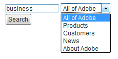
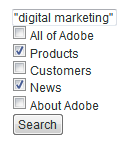
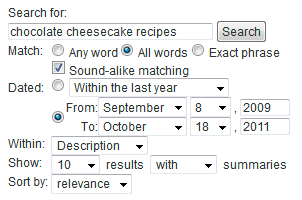

# Formulaires de recherche{#search-forms}

## Utilisation des collections dans les formulaires de recherche {#reference_5A079AEEEFB84457892EF0870D0605C3}

Les collections permettent à vos clients de rechercher des zones spécifiques de votre site Web. Selon que vous mettez en oeuvre un  déroulant ou un de cases à cocher, vous pouvez permettre à vos clients de rechercher une ou plusieurs collections.

Voir aussi [A propos des collections](../c-about-settings-menu/c-about-searching-menu.md#concept_62E42ACE53D54EEE9273433B86259127).

L’exemple suivant montre quatre noms de collection différents et les zones associées du site Web qu’ils couvrent :

<table> 
 <thead> 
  <tr> 
   <th colname="col1" class="entry"> <p>Nom de la collection </p> </th> 
   <th colname="col2" class="entry"> <p> </p> </th> 
  </tr> 
 </thead>
 <tbody> 
  <tr> 
   <td colname="col1"> <p>Variable  </p> </td> 
   <td colname="col2"> <p> 
     <ul id="ul_7AE70789C0914EBFBCCC7695C6F53B9E"> 
      <li id="li_72525BAA34E2442D86152F2FD8CA83D5"> https://www.mycompany.com/products.htm </li> 
      <li id="li_5CA4152239124BDBB251E6C94B15D45B"> https://www.mycompany.com/publish/ </li> 
      <li id="li_6E266736B3494696A3AFD841C4AFEC57"> https://www.mycompany.com/search/ </li> 
     </ul> </p> </td> 
  </tr> 
  <tr> 
   <td colname="col1"> <p>Clients </p> </td> 
   <td colname="col2"> <p>https://www.mycompany.com/customers/ </p> </td> 
  </tr> 
  <tr> 
   <td colname="col1"> <p>News </p> </td> 
   <td colname="col2"> <p>https://www.mycompany.com/news/ </p> </td> 
  </tr> 
  <tr> 
   <td colname="col1"> <p>À propos d’Adobe </p> </td> 
   <td colname="col2"> <p>https://www.mycompany.com/company/ </p> </td> 
  </tr> 
 </tbody> 
</table>

L’interface de formulaire de recherche déroulante permet aux utilisateurs de sélectionner une collection et se présente comme suit :



Le formulaire de recherche déroulante est généré avec le code HTML suivant :

```
<select name="sp_k"> 
<option value="">All of Adobe</option> 
<option value="Products">Products</option> 
<option value="Customers">Customers</option> 
<option value="News">News</option> 
<option value="About Adobe">About Adobe</option> 
</select>
```

Vous pouvez également utiliser un groupe de cases à cocher dans votre formulaire de recherche afin que les puissent sélectionner plusieurs collections :



Le formulaire de recherche de case à cocher est généré avec le code HTML suivant :

```
<input type="checkbox" name="sp_k" value="">All of Adobe<br> 
<input type="checkbox" name="sp_k" value="Products">Products<br> 
<input type="checkbox" name="sp_k" value="Customers">Customers<br> 
<input type="checkbox" name="sp_k" value="News">News<br> 
<input type="checkbox" name="sp_k" value="About Adobe">About Adobe<br>
```

## Search results {#section_BBDD5B44E2B349BC88D937F44583D350}

La balise de modèle de recherche `<search-input-collections>` génère le code HTML de la zone de de la collection dans les résultats de la recherche et sélectionne automatiquement la collection spécifiée dans la recherche. Si vous souhaitez plutôt générer des cases à cocher, utilisez la `<search-input>` balise au lieu de la `<input>` balise comme suit :

```
<search-input type="checkbox" name="sp_k" value="">All of Adobe<br> 
<search-input type="checkbox" name="sp_k" value="Products">Products<br> 
<search-input type="checkbox" name="sp_k" value="Customers">Customers<br> 
<search-input type="checkbox" name="sp_k" value="News">News<br> 
<search-input type="checkbox" name="sp_k" value="About Adobe">About Adobe<br>
```

La `<search-input>` balise génère une `<input>` balise et inclut l’ `checked` attribut si la collection a été spécifiée dans la recherche.

## Utilisation de cadres avec des formulaires {#reference_82CDDDA1E37042E4849EBF7EA05407C5}

Vous pouvez configurer vos jeux de cadres pour qu’ils fonctionnent avec la recherche/le marchandisage sur le site.

Pour en savoir plus sur les cadres HTML et l’élément de jeu de cadres HTML, voir l’URL suivante :

[https://www.w3schools.com/html/html_frames.asp](https://www.w3schools.com/html/html_frames.asp)

Si votre site utilise des cadres, vous pouvez spécifier un cadre de  pour les liens de résultats de recherche. Le par défaut est _self, ce qui ouvre les liens dans le cadre actuel ou dans la fenêtre du navigateur. Vous pouvez, à la place, spécifier des  spécifiques au site ou réservées au navigateur :

* _top (réservé au navigateur) s’ouvre dans la fenêtre active du navigateur et remplace tous les cadres actuels.
* _blank (réservé au navigateur) s’ouvre dans une nouvelle fenêtre du navigateur.
* _parent (réservé au navigateur) s’ouvre dans le cadre parent du cadre actuel.
* frame2 (spécifique au site) s’ouvre dans un cadre nommé &quot;frame2&quot;. Vous pouvez spécifier le nom d’un cadre comme valeur (par exemple, main ou contenu).

Si votre site n’utilise pas de cadres, il est probable que vous ne souhaitiez pas modifier le nom du  par défaut.

Si vous créez un modèle de résultats de recherche personnalisé pour votre site Web, vous pouvez remplacer le paramètre spécifié à l’aide de l’ `target` attribut de la `<search-link>` balise .

Le processus de configuration des jeux de cadres est le suivant :

<table> 
 <thead> 
  <tr> 
   <th colname="col1" class="entry"> <p>Étape du processus </p> </th> 
   <th colname="col02" class="entry"> <p>Description du processus </p> </th> 
   <th colname="col2" class="entry"> <p>Lien </p> </th> 
  </tr> 
 </thead>
 <tbody> 
  <tr> 
   <td colname="col1"> <p>1 </p> </td> 
   <td colname="col02"> <p>Ajouter le formulaire au cadre souhaité dans votre page Web. </p> </td> 
   <td colname="col2"> <p> <a href="#section_BAA8A502BB2243F8B5FF9783CDF2BFFD" type="section" format="dita" scope="local"> Ajout du code du formulaire de recherche à un cadre dans votre... </a> </p> </td> 
  </tr> 
  <tr> 
   <td colname="col1"> <p>2 </p> </td> 
   <td colname="col02"> <p>Définissez le cadre de  de la page des résultats de la recherche. </p> </td> 
   <td colname="col2"> <p> <a scope="local" href="#section_532CACB90888467093D95EACB64FDFA1" type="section" format="dita"> Définition du cadre de  du pour la page des résultats de la recherche </a> </p> </td> 
  </tr> 
  <tr> 
   <td colname="col1"> <p>3 </p> </td> 
   <td colname="col02"> <p>Définissez le  des liens créés à partir de la page des résultats de la recherche. </p> </td> 
   <td colname="col2"> <p> <a scope="local" href="#section_523248C5AC424D878321C21A23A5CD66" type="section" format="dita"> Définition du  des liens créés à partir des résultats de la recherche... </a> </p> </td> 
  </tr> 
  <tr> 
   <td colname="col1"> <p>4 </p> </td> 
   <td colname="col02"> <p>Modifiez les pages des cadres de navigation pour les empêcher d’être indexées. </p> </td> 
   <td colname="col2"> <p> <a scope="local" href="#section_C62E5F0EE1294D5EBD97E123E54433FC" type="section" format="dita"> Modification des pages du cadre de navigation pour les empêcher d’être... </a> </p> </td> 
  </tr> 
  <tr> 
   <td colname="col1"> <p>5 </p> </td> 
   <td colname="col02"> <p>Testez le formulaire de recherche. </p> </td> 
   <td colname="col2"> <p> <a scope="local" href="../c-appendices/c-searchforms.md#section_43D8D4A7BF524DC480DFE5442F6A2E3C" type="section" format="dita"> Test du formulaire de recherche </a> </p> </td> 
  </tr> 
 </tbody> 
</table>

## Ajout du code du formulaire de recherche à un cadre dans votre page Web {#section_BAA8A502BB2243F8B5FF9783CDF2BFFD}

1. Dans le menu du produit, cliquez sur **[!UICONTROL Design]** > **[!UICONTROL Auto-Complete]** > **[!UICONTROL Form Source]**.

   Le code du formulaire de recherche HTML se présente comme suit :

   ```
   <!-- Adobe Target HTML for [your customer name] --> 
   <form method="get" action="https://search.atomz.com/search/"> 
   <input size=15 name="sp_q"><br> 
   <input type=submit value="Search"> 
   <input type=hidden name="sp_a" value="[your account number]"> 
   </form>
   ```

1. Sur la [!DNL Standard Form Source] page, sélectionnez et copiez le code du formulaire de recherche HTML qui apparaît dans le champ de texte.
1. Collez le code du formulaire de recherche dans le cadre souhaité dans votre jeu de cadres.

   Dans l’exemple ci-dessous, le code du formulaire de recherche est collé dans le cadre de navigation, c’est-à-dire le cadre vertical étroit sur le côté gauche de l’écran.

   

## Définition du cadre de  du pour la page des résultats de la recherche {#section_532CACB90888467093D95EACB64FDFA1}

Si vous avez placé le code du formulaire de recherche dans le cadre de navigation vertical comme ci-dessus, vous pouvez afficher les résultats de la recherche dans le cadre principal plus grand. Dans cet exemple, vous appelez le cadre principal &quot;body&quot; et le définissez comme cadre de .


1. Pour spécifier le cadre de  du pour la page de résultats, ajoutez un et une valeur au formulaire en modifiant la ligne suivante du code du formulaire de recherche à partir de ce qui suit :

   `<form method="get" action="https://search.atomz.com/search/">`

   à ce qui suit :

   `<form target="body" method="get" action="https://search.atomz.com/search/">`

   Veillez à placer des guillemets autour de la valeur du de formulaire.

Lorsqu’un client effectue une recherche sur votre site Web, les résultats de la recherche apparaissent dans le cadre &quot;body&quot; de la page Web.

## Définition du  des liens créés à partir de la page des résultats de la recherche {#section_523248C5AC424D878321C21A23A5CD66}

Vous pouvez définir le cadre de destination en modifiant directement votre modèle.

Si vos résultats de recherche apparaissent dans le cadre &quot;body&quot;, vous souhaitez probablement que les liens s’ouvrent également dans le cadre &quot;body&quot;. Puisqu’il s’agit du même cadre, la valeur  `"_self"` qui est le paramètre par défaut, vous n’avez pas besoin d’effectuer de modifications.

Vous pouvez également définir le cadre de destination pour les liens de résultats. Voici quelques exemples de ce que vous pouvez faire :

* Spécifiez des cadres différents pour les résultats de la recherche et leurs liens afin que les résultats de la recherche restent actifs dans leur propre cadre pendant que chaque résultat sur lequel l’utilisateur clique s’ouvre dans un cadre distinct.
* Indiquez que les résultats de la recherche s’ouvrent dans une nouvelle fenêtre vierge, de sorte que votre ancienne fenêtre reste active avec son contenu d’origine, ce qui préserve également les résultats de la recherche.

Le nom de l’ du peut être soit le nom d’un cadre spécifié dans votre code HTML, soit l’un des paramètres HTML par défaut suivants :

* `target="_blank"` Ouvrez les liens dans une nouvelle fenêtre vierge sans nom.

* `target="_self"` Par défaut. Ouvrez les liens dans la fenêtre où résident les résultats de la recherche. Dans ce cas, la fenêtre des résultats de la recherche d’origine. Utilisez cette option pour remplacer un  de base affecté globalement.

* `target="_parent"` Ouvrez les liens dans le jeu de cadres parent de la page de liens. Si le n’a pas de parent, cela fonctionne comme `"_self"` par défaut.

* `target="_top"` Ouvrez les liens dans la fenêtre complète. Si le se trouve déjà en haut de la page, cela fonctionne comme `"_self"` par défaut. Utilisez cette option pour rompre l’imbrication arbitraire d’images profondes.

Par exemple, pour définir le cadre de destination du `_blank` , vous pouvez modifier le modèle de la manière suivante :

1. Dans le menu du produit, cliquez sur **[!UICONTROL Design]** > **[!UICONTROL Templates]**.

1. Sur la [!DNL Staged Templates] page, dans le tableau, cliquez sur le nom du modèle avec le cadre de destination ciblé.
1. Recherchez la `<search-link>` balise . Your default `<search-link>` tag should look similar to the following:

   `<search-link><search-title length=100></search-link>`

1. Ajouter le du cadre à la `<search-link>` balise . Dans l’exemple ci-dessus, saisissez `target="_blank"`. Veillez à inclure le trait de soulignement et les guillemets autour de la valeur  du.

   La `<search-link>` balise s’affiche désormais comme suit :

   `<search-link target="_blank"><search-title length=100></search-link>`

Lorsqu&#39;un de site choisit un lien de résultats de recherche, la page liée s&#39;ouvre désormais dans une nouvelle fenêtre vide.

## Modification des pages du cadre de navigation pour les empêcher d’être indexées {#section_C62E5F0EE1294D5EBD97E123E54433FC}

En règle générale, vous souhaitez exclure vos cadres de navigation de l’indexation des résultats de recherche. Pour accomplir cette fonctionnalité, vous pouvez ajouter `noindex` une balise meta à ces pages.

1. Ouvrez la source de la page HTML pour votre cadre de navigation.
1. Ajouter la balise meta suivante dans la `<head>` section de votre code HTML :

   `<meta name="robots" content="noindex">`

   Par exemple :

   ```
   <html> 
   <head> 
   <title>This page is a frameset that I do not want indexed</title> 
   <meta http-equiv="Content-Type" content="text/html; charset=iso-8859-1"> 
   <meta name="robots" content="noindex"> 
   </head>
   ```

## Test du formulaire de recherche {#section_43D8D4A7BF524DC480DFE5442F6A2E3C}

1. Accédez à votre site Web et à un formulaire.
1. Dans le champ de recherche, saisissez quelques termes de recherche, puis cliquez sur **[!UICONTROL Search]**.

   Ce qui suit est vrai :

   * La page des résultats de la recherche s’affiche dans le cadre de  de spécifié.
   * Les liens provenant des résultats de votre recherche se trouvent dans le cadre de  de spécifié.
   * Les résultats du cadre de navigation n’apparaissent pas.
   Si vous rencontrez des problèmes avec les cadres après avoir testé le formulaire de recherche, contactez le service clientèle.

## Exemple de formulaire de recherche avancée {#reference_82E1051918744EBA88A01E9E6AE42C4A}

Vous pouvez modifier le code de formulaire avancé en fonction de vos besoins en matière de conception et de contenu, ou ajouter ou supprimer des paramètres de recherche supplémentaires.

Votre est un bon endroit pour insérer un formulaire de recherche avancée car de nombreux clients espèrent y trouver une fonctionnalité de recherche. Vous pouvez également créer une page HTML qui comprend le formulaire de recherche et d’autres informations utiles, puis créer un lien vers cette page dans votre site Web.

Si vous indexez du contenu sécurisé, vous pouvez obtenir les résultats de la recherche à partir de serveurs Web de recherche sécurisés. Modifiez l’URL de l’attribut d’action du formulaire de recherche en : action=&quot;https://search.atomz.com/search/&quot; pour ce faire.

>[!NOTE]
>
>Certains éditeurs HTML ont du mal à coller le code HTML d&#39;autres applications. Si le code HTML apparaît sur votre page Web sous forme de texte, copiez et collez le code de recherche dans un éditeur de texte simple, tel que le Bloc-notes sous Windows ou le texte simple sous Mac, puis copiez et collez à nouveau du simple éditeur de texte dans votre éditeur HTML.

Les paramètres de recherche sont utilisés dans le code de formulaire de recherche avancée pour créer des boutons radio, des cases à cocher et des  que les clients peuvent utiliser pour personnaliser des recherches individuelles. Les clients peuvent indiquer le nombre de résultats de recherche affichés, par exemple, ou une plage de dates, ou si les résumés s&#39;affichent avec les résultats de recherche, toutes les options apparaissant dans les formulaires de recherche avancée.

En utilisant l’exemple de formulaire de recherche avancée suivant, le reste de cette rubrique vous montre comment chaque option du formulaire est créée à l’aide des paramètres de recherche.



Vous pouvez  le code HTML du formulaire de recherche avancée entier de l&#39;exemple ci-dessus.

Voir Code [HTML de formulaire de recherche](../c-appendices/c-searchforms.md#reference_9AAD4A46B68D4D48865508982CB86DB9)avancée.

Voir [Configuration d’une page CSS](../c-about-auto-complete.md#task_EECE35DEB6C94F4A8A5B42B4DED76D96)à remplissage automatique.

Voir [Copie du code HTML du formulaire de recherche dans le...](../c-about-auto-complete.md#task_A3A01EA800F24C0AA33902387E0362C7).

<table> 
 <thead> 
  <tr> 
   <th colname="col2" class="entry"> <p>Emplacement du formulaire </p> </th> 
   <th colname="col1" class="entry"> <p>Paramètre </p> </th> 
   <th colname="col3" class="entry"> <p>Code HTML </p> </th> 
   <th colname="col4" class="entry"> <p>Description </p> </th> 
  </tr> 
 </thead>
 <tbody> 
  <tr> 
   <td colname="col2"> <p>Activer les options de formulaire de recherche avancée (champ masqué) </p> </td> 
   <td colname="col1"> <p> <span class="codeph"> sp_advanced </span> </p> </td> 
   <td colname="col3"> <p> <span class="syntax html codeph"> &lt;input type=hidden name="sp_advanced" value=1&gt; </span> </p> </td> 
   <td colname="col4"> <p>Activez ou désactivez les options de recherche avancée. Par exemple, vous pouvez placer un formulaire de recherche standard sur votre  avec un lien vers une deuxième page qui contient un formulaire avancé. Dans ce cas, vous devez placer une copie de votre formulaire standard dans <span class="codeph"> &lt;search-if-not-advanced&gt;...Balises de modèle &lt;/search-if-not-advanced&gt; </span> . </p> <p>Un client qui effectue une recherche à partir du formulaire standard voit un formulaire de recherche standard lorsque les résultats de la recherche sont affichés. Dans l’écran du formulaire de recherche avancée, vous incluez la balise <span class="codeph"> &lt;input type=hidden name="sp_advanced" value=1&gt; </span> avec les autres options de formulaire avancées. </p> <p>Vous incluez également une copie du formulaire de recherche avancée dans le formulaire &lt;search-if-advanced&gt;... Balises de modèle &lt;/search-if-advanced&gt;. Un client qui effectue une recherche à partir de votre formulaire de recherche avancée voit un formulaire de recherche avancée lorsque les résultats de la recherche sont affichés. </p> </td> 
  </tr> 
  <tr> 
   <td colname="col2"> <p> Correspondance avec n’importe quelle expression, tout ou phrase </p> </td> 
   <td colname="col1"> <p> <span class="codeph"> sp_p </span> </p> <p> </p> </td> 
   <td colname="col3"> <p> <code class="syntax html"> &lt;!--&nbsp;Allow&nbsp;"any,"&nbsp;"all,"&nbsp;or&nbsp;"phrase"&nbsp;--&gt; 
      &lt;input&nbsp;type=radio&nbsp;name="sp_p"&nbsp;value="any"&gt;Any&nbsp;word 
      &lt;input&nbsp;type=radio&nbsp;name="sp_p"&nbsp;value="all"&nbsp;checked&gt;All&nbsp;words 
      &lt;input&nbsp;type=radio&nbsp;name="sp_p"&nbsp;value="phrase"&gt;Exact&nbsp;phrase </code> </p> </td> 
   <td colname="col4"> <p>Autorisez votre client à indiquer que "n’importe quel mot", "tous les mots" ou "l’expression exacte" doit être présent pour qu’un puisse correspondre. Lorsque le paramètre <span class="codeph"> sp_p </span> est spécifié, les clients n'ont pas besoin d'utiliser "+" ou "-", ou les deux dans le de recherche. </p> <p> Si le paramètre <span class="codeph"> sp_p </span> est omis ou s’il est défini sur "" ou "any", les clients peuvent toujours utiliser les spécificateurs "+" et "-". Si le paramètre <span class="codeph"> sp_p </span> est défini sur "all" ou "phrase", les valeurs "+" et "-" spécifiées sont ignorées. </p> <p>Vous pouvez en savoir plus sur l’utilisation de "+" et "-" dans une recherche. </p> <p>Voir <a href="../c-about-settings-menu/c-about-searching-menu.md#concept_207105CF26B1448F8A3D223787C56AB8" type="concept" format="dita" scope="local">A propos des recherches </a>. </p> </td> 
  </tr> 
  <tr> 
   <td colname="col2"> <p> Correspondance sonore </p> </td> 
   <td colname="col1"> <p> <span class="codeph"> sp_w </span> </p> <p>et </p> <p> <span class="codeph"> sp_w_control </span> </p> <p> </p> </td> 
   <td colname="col3"> <p> <code class="syntax html"> &lt;!--&nbsp;Checkbox&nbsp;enables&nbsp;sound-alike&nbsp;matching&nbsp;--&gt; 
      &lt;input&nbsp;type=hidden&nbsp;name="sp_w_control"&nbsp;value=1&gt; 
      &lt;input&nbsp;type=checkbox&nbsp;name="sp_w"&nbsp;value="alike"&gt;&nbsp;Sound-alike&nbsp;matching </code> </p> </td> 
   <td colname="col4"> <p>Permet aux clients d’activer ou de désactiver la correspondance audio-similaire. La correspondance son-sosie permet aux de recherche mal orthographiés de faire correspondre des mots qui "se ressemblent" dans votre  de. </p> <p>Lorsque le paramètre <span class="codeph"> sp_w_control </span> est défini sur 1 et que le <span class="codeph"> paramètre </span> sp_w est défini sur "same", la case à cocher générée est activée, ce qui permet la correspondance du son par défaut. </p> <p>Si le paramètre <span class="codeph"> sp_w </span> est défini sur "", la case à cocher n’est pas sélectionnée. </p> <p>Si vous n’avez pas activé la correspondance son/son pendant votre dernière opération d’indexation, la correspondance son/son n’est pas possible et le paramètre <span class="codeph"> sp_w </span> est ignoré. Pour activer l’association du son identique, dans le menu du produit, cliquez sur <span class="uicontrol"> Linguistique </span> &gt; <span class="uicontrol"> Mots et langue </span> &gt; <span class="uicontrol"> Correspondance de l’analogie sonore </span>. </p> <p>Vous pouvez également affecter les paramètres <span class="codeph"> sp_w </span> et <span class="codeph"> sp_w_control </span> de la manière suivante : </p> <p> <code class="syntax html"> &lt;!--&nbsp;Checkbox&nbsp;disables&nbsp;sound-alike&nbsp;matching&nbsp;--&gt; 
      &lt;input&nbsp;type=hidden&nbsp;name="sp_w_control"&nbsp;value=0&gt; 
      &lt;input&nbsp;type=checkbox&nbsp;name="sp_w"&nbsp;value="exact"&gt; 
      No&nbsp;sound-alike&nbsp;matching </code> </p> <p>Dans ce cas, lorsque le paramètre <span class="codeph"> sp_w_control </span> est défini sur 0 et que le paramètre <span class="codeph"> sp_w </span> est défini sur "exact", la correspondance de type son est désactivée par défaut. Si le paramètre <span class="codeph"> sp_w </span> est défini sur "", la correspondance du son est activée. </p> </td> 
  </tr> 
  <tr> 
   <td colname="col2"> <p>Correspondance de plage de dates </p> </td> 
   <td colname="col1"> <p> <span class="codeph"> sp_d </span> </p> <p> </p> </td> 
   <td colname="col3"> <p> <code class="syntax html"> &lt;!--Specifies&nbsp;type&nbsp;of&nbsp;date&nbsp;range&nbsp;searching&nbsp;to&nbsp;perform.--&gt; 
      &lt;input&nbsp;type=radio&nbsp;name="sp_d"&nbsp;value="custom"&nbsp;checked&gt; 
      &lt;input&nbsp;type=radio&nbsp;name="sp_d"&nbsp;value="specific"&gt; </code> </p> </td> 
   <td colname="col4"> <p>Le paramètre <span class="codeph"> sp_d </span> spécifie une plage de données personnalisée à exécuter ou une plage de dates spécifique à exécuter. </p> <p>Dans le formulaire de recherche avancée par défaut, cette option est présentée sous la forme d’un groupe de boutons radio avec un déroulant de plages de dates "personnalisées" tel qu’il est généré avec un <span class="codeph"> paramètre </span> sp_date_range. Il inclut également un groupe de dates de  et de fin "spécifiques" qui sont générées avec les paramètres <span class="codeph"> sp___day </span>, <span class="codeph"> sp_ </span>_ <span class="codeph"> __month </span>, <span class="codeph"> sp___year_year, sp_end_day, sp_end_month et sp_end_year_year.</span><span class="codeph"></span><span class="codeph"></span> </p> <p>Une plage de dates "personnalisée" est une plage de dates nommée à rechercher. Par exemple, "N’importe quand", "Aujourd’hui", "Au cours de l’année écoulée", etc. </p> <p>Une plage de dates "spécifique" se compose d’une date de  et d’une date de fin. Par exemple, de "8 septembre 2009 au 18 octobre 2011". </p> </td> 
  </tr> 
  <tr> 
   <td colname="col2"> <p>Correspondance de plage de dates : plage de dates personnalisée </p> </td> 
   <td colname="col1"> <p> <span class="codeph"> sp_date_range </span> </p> <p> </p> </td> 
   <td colname="col3"> <p> <code class="syntax html"> &lt;!--Selection&nbsp;list&nbsp;for&nbsp;custom&nbsp;date&nbsp;range.--&gt; 
      &lt;select&nbsp;name="sp_date_range"&nbsp;size=1&gt; 
      &lt;option&nbsp;value=-1&nbsp;selected&gt;Anytime&lt;/option&gt; 
      &lt;option&nbsp;value=7&gt;Within&nbsp;the&nbsp;last&nbsp;week&lt;/option&gt; 
      &lt;option&nbsp;value=14&gt;Within&nbsp;the&nbsp;last&nbsp;2&nbsp;weeks&lt;/option&gt; 
      &lt;option&nbsp;value=30&gt;Within&nbsp;the&nbsp;last&nbsp;30&nbsp;days&lt;/option&gt; 
      &lt;option&nbsp;value=60&gt;Within&nbsp;the&nbsp;last&nbsp;60&nbsp;days&lt;/option&gt; 
      &lt;option&nbsp;value=90&gt;Within&nbsp;the&nbsp;last&nbsp;90&nbsp;days&lt;/option&gt; 
      &lt;option&nbsp;value=180&gt;Within&nbsp;the&nbsp;last&nbsp;180&nbsp;days&lt;/option&gt; 
      &lt;option&nbsp;value=365&gt;Within&nbsp;the&nbsp;last&nbsp;year&lt;/option&gt; 
      &lt;option&nbsp;value=730&gt;Within&nbsp;the&nbsp;last&nbsp;two&nbsp;years&lt;/option&gt; 
      &lt;/select&gt; </code> </p> </td> 
   <td colname="col4"> <p>Le paramètre <span class="codeph"> sp_date_range </span> est utilisé pour créer une plage de dates "personnalisée". Par exemple, "N’importe quand", "Aujourd’hui", "Au cours de l’année écoulée", etc. </p> <p>Les valeurs supérieures ou égales à zéro indiquent le nombre de jours avant la date d’aujourd’hui. Par exemple, une valeur de 0 indique "Aujourd’hui", une valeur de "1" indique "Aujourd’hui et hier", une valeur de "30" indique "Au cours des 30 derniers jours", etc. Les valeurs inférieures à zéro définissent une plage personnalisée comme suit : </p> <p> 
     <ul id="ul_E65DDE33883F441F9730F315E485AD98"> 
      <li id="li_83E9466AB9D7438A8544001F6B007186"> <p>-1 = "En tout temps", la même chose que de ne spécifier aucune plage de dates. </p> </li> 
      <li id="li_38AB8D97179A47F9B860A96EA09119BB"> <p>-2 = "Cette semaine", qui effectue une recherche du dimanche au samedi de la semaine en cours. </p> </li> 
      <li id="li_F4C3A8658428418A8A06FBAAB4733C68"> <p>-3 = "Semaine dernière", qui effectue une recherche du dimanche au samedi de la semaine précédant la semaine en cours. </p> </li> 
      <li id="li_DF2D0B043A4E4DE9BE8D82E69A76E793"> <p>-4 = "Ce mois-ci", qui recherche les dates du mois en cours. </p> </li> 
      <li id="li_76BC4C2CED574E2A81448158828BFF1B"> <p>-5 = "Mois dernier", qui recherche les dates du mois précédant le mois en cours. </p> </li> 
      <li id="li_17FF849384FB46D58AF6FF1D3BC408C8"> <p>-6 = "Cette année", qui recherche les dates de l’année en cours. </p> </li> 
      <li id="li_E2B8B4DFF3914BBDB86D0EB77F52B305"> <p>-7 = "L’année dernière", qui recherche les dates dans l’année précédant l’année en cours. </p> </li> 
     </ul> </p> </td> 
  </tr> 
  <tr> 
   <td colname="col2"> <p>Correspondance de plage de dates : Dates  </p> </td> 
   <td colname="col1"> <p> <span class="codeph"> sp__day, sp__month, sp___année_ </span> </p> <p> </p> </td> 
   <td colname="col3"> </td> 
   <td colname="col4"> <p>Ce triplet de valeurs numériques spécifie la date de  du d’une plage de dates spécifique à rechercher. Veillez à spécifier les trois valeurs, car une date partiellement spécifiée est ignorée. </p> <p>Il est légal de spécifier uniquement la date de  du, la date de fin ou la date  du et la date de fin. Si seule la date de  du est spécifiée, la recherche inclut des  de correspondantes datées le ou après la date de l' de l'. Si seule la date de fin est spécifiée, la recherche inclut les  correspondantes au plus tard à la date de fin. Si la date de  du et la date de fin sont spécifiées, la recherche inclut des  de correspondant de la date de la  au jour de fin. </p> <p>Toutes les dates sont recherchées par rapport à l’heure de Greenwich. </p> </td> 
  </tr> 
  <tr> 
   <td colname="col2"> <p> Correspondance de plage de dates : dates de fin </p> </td> 
   <td colname="col1"> <p> <span class="codeph"> sp_end_day, sp_end_month, sp_end_year </span> </p> <p> </p> </td> 
   <td colname="col3"> </td> 
   <td colname="col4"> <p>Ce triplet de valeurs numériques spécifie la date de fin de la plage de dates spécifique à rechercher. Veillez à spécifier les trois valeurs, car une date partiellement spécifiée est ignorée. </p> <p>Il est légal de spécifier uniquement la date de  du, la date de fin ou la date de  et la date de fin. Si seule la date de  du est spécifiée, la recherche inclut des  de correspondantes datées le ou après la date de l' de l'. Si seule la date de fin est spécifiée, la recherche inclut les  correspondantes au plus tard à la date de fin. Si le  et la date de fin sont tous deux spécifiés, la recherche inclut des  de correspondant de la date de l' de la fin à la date de fin. </p> <p>Toutes les dates sont recherchées par rapport à l’heure de Greenwich. </p> </td> 
  </tr> 
  <tr> 
   <td colname="col2"> <p>Dans le champ de recherche </p> </td> 
   <td colname="col1"> <p> <span class="codeph"> sp_x </span> </p> </td> 
   <td colname="col3"> <p> <code class="syntax html"> &lt;!--&nbsp;List&nbsp;box&nbsp;selects&nbsp;the&nbsp;search&nbsp;field&nbsp;--&gt; 
      Within&nbsp;&lt;select&nbsp;name="sp_x"&nbsp;size=1&gt; 
      &lt;option&nbsp;value="any"&nbsp;selected&gt;Anywhere&lt;/option&gt; 
      &lt;option&nbsp;value="title"&gt;Title&lt;/option&gt; 
      &lt;option&nbsp;value="desc"&gt;Description&lt;/option&gt; 
      &lt;option&nbsp;value="keys"&gt;Keywords&lt;/option&gt; 
      &lt;option&nbsp;value="body"&gt;Body&lt;/option&gt; 
      &lt;option&nbsp;value="alt"&gt;Alternate&nbsp;text&lt;/option&gt; 
      &lt;option&nbsp;value="url"&gt;URL&lt;/option&gt; 
      &lt;option&nbsp;value="target"&gt;Target&lt;/option&gt; 
      &lt;option&nbsp;value="date"&gt;Date&lt;/option&gt;* 
      &lt;/select&gt; </code> </p> </td> 
   <td colname="col4"> <p>La zone <span class="codeph"> sp_x </span> permet aux clients de spécifier le champ dans lequel rechercher les  de. </p> <p>Les clients peuvent choisir entre tous les champs, le titre, la description de l', les mots-clés de l', le corps, le texte de remplacement, l'URL de l'URL, la date ou les mots-clés de l'. </p> <p>Lorsque le paramètre <span class="codeph"> sp_x </span> est utilisé, les clients n’ont pas besoin de spécifier "title:", "desc:", "keys:", "body:", "alt:", "url:" et ":" dans les chaînes de  de recherche. </p> <p>Si le paramètre <span class="codeph"> sp_x </span> est omis ou s’il est défini sur "" ou "any", les clients peuvent toujours utiliser les chaînes de spécificateur de champ. Si le paramètre <span class="codeph"> sp_x </span> est défini sur un champ spécifique, toutes les autres chaînes de spécificateur de champ sont ignorées. </p> <p>Voir <a href="../c-about-settings-menu/c-about-searching-menu.md#concept_207105CF26B1448F8A3D223787C56AB8" type="concept" format="dita" scope="local">A propos des recherches </a>. </p> </td> 
  </tr> 
  <tr> 
   <td colname="col2"> <p>Afficher le nombre de résultats </p> </td> 
   <td colname="col1"> <p> <span class="codeph"> sp_c </span> </p> </td> 
   <td colname="col3"> <p> <code class="syntax html"> &lt;!--&nbsp;List&nbsp;box&nbsp;selects&nbsp;number&nbsp;of&nbsp;results&nbsp;to&nbsp;show&nbsp;per&nbsp;page&nbsp;--&gt; 
      Show&nbsp;&lt;select&nbsp;name="sp_c"&nbsp;size=1&gt; 
      &lt;option&nbsp;value=5&gt;5&lt;/option&gt; 
      &lt;option&nbsp;value=10&nbsp;selected&gt;10&lt;/option&gt; 
      &lt;option&nbsp;value=25&gt;25&lt;/option&gt; 
      &lt;option&nbsp;value=50&gt;50&lt;/option&gt; 
      &lt;option&nbsp;value=100&gt;100&lt;/option&gt; 
      &lt;/select&gt;&nbsp;results </code> </p> </td> 
   <td colname="col4"> <p>Permet aux clients de choisir le nombre de résultats de recherche affichés sur chaque page de résultats de recherche. </p> <p>Vous pouvez avoir autant de choix dans le formulaire que vous le souhaitez. Assurez-vous que la valeur "value=" correspond à la valeur affichée. </p> </td> 
  </tr> 
  <tr> 
   <td colname="col2"> <p>Affichage ou masquage des résumés </p> </td> 
   <td colname="col1"> <p> <span class="codeph"> sp_m </span> </p> </td> 
   <td colname="col3"> <p> <code class="syntax html"> &lt;!--&nbsp;Show&nbsp;or&nbsp;hide&nbsp;summaries&nbsp;in&nbsp;search&nbsp;results&nbsp;--&gt; 
      &lt;select&nbsp;name="sp_m"&nbsp;size=1&gt; 
      &lt;option&nbsp;value=1&nbsp;selected&gt;with&lt;/option&gt; 
      &lt;option&nbsp;value=0&gt;without&lt;/option&gt; 
      &lt;/select&gt;&nbsp;summaries&nbsp; </code> </p> </td> 
   <td colname="col4"> <p>Permet aux clients de choisir si le texte de synthèse s’affiche pour chaque correspondance. </p> <p>Définissez la valeur sur 1 si vous souhaitez afficher des résumés. Définissez la valeur sur 0 si vous souhaitez masquer les résumés. Vous pouvez également utiliser le paramètre avec un ensemble de boutons radio, comme dans l’exemple suivant : </p> <p> <code class="syntax html"> &lt;!--&nbsp;Show&nbsp;or&nbsp;hide&nbsp;summaries&nbsp;in&nbsp;search&nbsp;results&nbsp;--&gt; 
      &lt;input&nbsp;type=radio&nbsp;name="sp_m"&nbsp;value=1&nbsp;selected&gt;Show&nbsp;summaries 
      &lt;input&nbsp;type=radio&nbsp;name="sp_m"&nbsp;value=0&gt;Hide&nbsp;summaries </code> </p> </td> 
  </tr> 
  <tr> 
   <td colname="col2"> <p>Trier par résultats </p> </td> 
   <td colname="col1"> <p> <span class="codeph"> sp_s </span> </p> </td> 
   <td colname="col3"> <p> <code class="syntax html"> &lt;!--&nbsp;Sort&nbsp;results&nbsp;by&nbsp;relevance&nbsp;or&nbsp;by&nbsp;date&nbsp;--&gt; 
      Sort&nbsp;by&nbsp;&lt;select&nbsp;name="sp_s"&nbsp;size=1&gt; 
      &lt;option&nbsp;value=0&nbsp;selected&gt;relevance&lt;/option&gt; 
      &lt;option&nbsp;value=1&gt;date&lt;/option&gt; 
      &lt;/select&gt; </code> </p> </td> 
   <td colname="col4"> <p>Permet aux clients de choisir si les résultats sont répertoriés par ordre de pertinence ou par date. </p> <p>Lorsque la valeur est définie sur 1, les résultats sont répertoriés depuis le plus récent  modifié vers le le moins récemment modifié. Lorsque la valeur est définie sur 0, les résultats sont répertoriés du plus pertinent au moins pertinent. Vous pouvez également utiliser ce paramètre avec des boutons radio, comme dans l’exemple suivant : </p> <p> <code class="syntax html"> &lt;!--&nbsp;Sort&nbsp;results&nbsp;by&nbsp;relevance&nbsp;or&nbsp;by&nbsp;date&nbsp;--&gt; 
      &lt;input&nbsp;type=radio&nbsp;name="sp_s"&nbsp;value=0&nbsp;selected&gt;Sort&nbsp;by&nbsp;relevance 
      &lt;input&nbsp;type=radio&nbsp;name="sp_s"&nbsp;value=1&gt;Sort&nbsp;by&nbsp;date </code> </p> </td> 
  </tr> 
 </tbody> 
</table>

## Code HTML du formulaire de recherche avancée {#reference_9AAD4A46B68D4D48865508982CB86DB9}

Code de formulaire HTML utilisé pour produire le formulaire de recherche avancée qui s’affiche en haut de la rubrique Exemple de formulaire de recherche avancée.

Voir [Exemple de formulaire](../c-appendices/c-searchforms.md#reference_82E1051918744EBA88A01E9E6AE42C4A)de recherche avancée.

Si vous utilisez ce code, n’oubliez pas de remplacer la `sp_a` valeur de `sp99999999` par votre numéro de compte réel.

Pour trouver votre numéro de compte, dans le menu produit, cliquez sur **[!UICONTROL Settings]** > **[!UICONTROL Account Options]** > **[!UICONTROL Account Settings]**.

```
<form method="get" action="https://search.atomz.com/search/"> 
<table cellspacing=0 cellpadding=0 border=0> 
<tr><td colspan=4> 
<b>Search For:</b><br> 
<input size=35 name="sp_q"> 
<!-- The "Search" button --> 
<input type=submit value="Search"> 
<input type=hidden name="sp_a" value="sp99999999"> 
<input type=hidden name="sp_f" value="ISO-8859-1"> 
</td></tr> 
<input type=hidden name="sp_advanced" value=1> 
<!-- Allow "any," "all," or "phrase" --> 
<tr><td valign=top> 
<b>Match: </b> 
</td><td colspan=4> 
<input type=radio name="sp_p" value="any">Any word 
<input type=radio name="sp_p" value="all" checked>All words 
<input type=radio name="sp_p" value="phrase">Exact phrase<br> 
<!-- Checkbox enables sound-alike matching --> 
<input type=hidden name="sp_w_control" value=1> 
<input type=checkbox name="sp_w" value="alike" checked> 
Sound-alike matching 
</td></tr> 
<!-- Date range criteria --> 
<tr><td><b>Dated:</b></td><td colspan=4> 
<input type=radio name="sp_d" value="custom" checked> 
<select name="sp_date_range" size=1> 
<option value=-1 selected>Anytime</option> 
<option value=7>Within the last week</option> 
<option value=14>Within the last 2 weeks</option> 
<option value=30>Within the last 30 days</option> 
<option value=60>Within the last 60 days</option> 
<option value=90>Within the last 90 days</option> 
<option value=180>Within the last 180 days</option> 
<option value=365>Within the last year</option> 
<option value=730>Within the last two years</option> 
</select> 
</td></tr> 
<tr><td></td><td rowspan=2> 
<input type=radio name="sp_d" value=specific> 
</td><td align=right>From:</td><td> 
<select name="sp_start_month" size=1> 
<option value=0 selected></option> 
<option value=1>January</option> 
<option value=2>February</option> 
<option value=3>March</option> 
<option value=4>April</option> 
<option value=5>May</option> 
<option value=6>June</option> 
<option value=7>July</option> 
<option value=8>August</option> 
<option value=9>September</option> 
<option value=10>October</option> 
<option value=11>November</option> 
<option value=12>December</option> 
</select> 
<select name="sp_start_day" size=1> 
<option value=0 selected></option> 
<option value=1>1</option> 
<option value=2>2</option> 
<option value=3>3</option> 
<option value=4>4</option> 
<option value=5>5</option> 
<option value=6>6</option> 
<option value=7>7</option> 
<option value=8>8</option> 
<option value=9>9</option> 
<option value=10>10</option> 
<option value=11>11</option> 
<option value=12>12</option> 
<option value=13>13</option> 
<option value=14>14</option> 
<option value=15>15</option> 
<option value=16>16</option> 
<option value=17>17</option> 
<option value=18>18</option> 
<option value=19>19</option> 
<option value=20>20</option> 
<option value=21>21</option> 
<option value=22>22</option> 
<option value=23>23</option> 
<option value=24>24</option> 
<option value=25>25</option> 
<option value=26>26</option> 
<option value=27>27</option> 
<option value=28>28</option> 
<option value=29>29</option> 
<option value=30>30</option> 
<option value=31>31</option> 
</select> 
<!--comma-->, 
<input size=4 name="sp_start_year"> 
</td></tr> 
<tr><td></td> 
<td align=right>To:</td><td> 
<select name="sp_end_month" size=1> 
<option value=0 selected></option> 
<option value=1>January</option> 
<option value=2>February</option> 
<option value=3>March</option> 
<option value=4>April</option> 
<option value=5>May</option> 
<option value=6>June</option> 
<option value=7>July</option> 
<option value=8>August</option> 
<option value=9>September</option> 
<option value=10>October</option> 
<option value=11>November</option> 
<option value=12>December</option> 
</select> 
<select name="sp_end_day" size=1> 
<option value=0 selected></option> 
<option value=1>1</option> 
<option value=2>2</option> 
<option value=3>3</option> 
<option value=4>4</option> 
<option value=5>5</option> 
<option value=6>6</option> 
<option value=7>7</option> 
<option value=8>8</option> 
<option value=9>9</option> 
<option value=10>10</option> 
<option value=11>11</option> 
<option value=12>12</option> 
<option value=13>13</option> 
<option value=14>14</option> 
<option value=15>15</option> 
<option value=16>16</option> 
<option value=17>17</option> 
<option value=18>18</option> 
<option value=19>19</option> 
<option value=20>20</option> 
<option value=21>21</option> 
<option value=22>22</option> 
<option value=23>23</option> 
<option value=24>24</option> 
<option value=25>25</option> 
<option value=26>26</option> 
<option value=27>27</option> 
<option value=28>28</option> 
<option value=29>29</option> 
<option value=30>30</option> 
<option value=31>31</option> 
</select> 
<!--comma-->, 
<input size=4 name="sp_end_year"> 
</td></tr> 
<!-- List box selects the search field --> 
<tr><td valign=top> 
<b>Within: </b> 
</td><td colspan=4><select name="sp_x" size=1> 
<option value="any" selected>Anywhere</option> 
<option value="title">Title</option> 
<option value="desc">Description</option> 
<option value="keys">Keywords</option> 
<option value="body">Body</option> 
<option value="alt">Alternate text</option> 
<option value="url">URL</option> 
<option value="target">Target</option> 
</select> 
</td></tr> 
<!-- List box selects number of results to show per page --> 
<tr><td valign=top> 
<b>Show: </b> 
</td><td colspan=4><select name="sp_c" size=1> 
<option value=5>5</option> 
<option value=10 selected>10</option> 
<option value=25>25</option> 
<option value=50>50</option> 
<option value=100>100</option> 
</select> results  
<!-- Show or hide summaries in search results --> 
<select name="sp_m" size=1> 
<option value=1 selected>with</option> 
<option value=0>without</option> 
</select> summaries<br> 
</td></tr> 
<!-- Sort results by relevance or by date --> 
<tr><td valign=top> 
<b>Sort by: </b> 
</td><td colspan=4><select name="sp_s" size=1> 
<option value=0 selected>relevance</option> 
<option value=1>date</option> 
</select> 
</td></tr> 
</table> 
</form>
```

## Code de modèle de formulaire de recherche avancée {#reference_D762C22E754E462DBEECD88D2C3FA579}

Vous pouvez ajouter le code HTML du formulaire de recherche avancée à votre modèle de manière à ce que le choix par défaut de tout paramètre soit le même que celui de la recherche précédente.

En d’autres termes, si un client clique sur le bouton **[!UICONTROL Exact phrase]** radio, vous pouvez vous assurer que le bouton radio est sélectionné par défaut lors de l’affichage des résultats de la recherche.

Pour ce faire, supprimez tous les spécificateurs &quot;cochés&quot; ou &quot;sélectionnés&quot; des balises HTML standard, puis remplacez les balises HTML suivantes :

* `<input>`
* `<select>`
* `<option>`
* `</option>`
* `</select>`

avec les balises de modèle correspondantes suivantes :

* `<search-input>`
* `<search-select>`
* `<search-option>`
* `</search-option>`
* `</search-select>`

Pour ce faire, vous utilisez le code suivant comme `<form>` balise sur votre modèle de recherche.

```
<!-- Adobe Target results section.--> 
 
<!-- Show heading and logo graphic. --> 
<SEARCH-IF-RESULTS> 
<b>SEARCH RESULTS <SEARCH-LOWER> - <SEARCH-UPPER></b> 
of <SEARCH-TOTAL> total results for <b><SEARCH-QUERY></b><br> 
</SEARCH-IF-RESULTS> 
<SEARCH-IF-NOT-RESULTS> 
<b>SEARCH RESULTS</b> for <b><SEARCH-QUERY></b><br> 
</SEARCH-IF-NOT-RESULTS> 
<SEARCH-LOGO><br> 
 
<!-- Display Results. --> 
<SEARCH-RESULTS LENGTH=160> 
<p><b><SEARCH-LINK><SEARCH-TITLE LENGTH=160></SEARCH-LINK></b><br> 
<SEARCH-IF-SHOW-SUMMARIES> 
<SEARCH-IF-CONTEXT LENGTH=240><SEARCH-CONTEXT><br></SEARCH-IF-CONTEXT> 
<font size="-1"><SEARCH-URL LENGTH=60></font><br> 
</SEARCH-IF-SHOW-SUMMARIES> 
</SEARCH-RESULTS> 
 
<!-- If no results, show a message. --> 
<SEARCH-IF-NOT-RESULTS><p> 
Sorry, no matches were found containing <b><SEARCH-QUERY>.</b> 
</SEARCH-IF-NOT-RESULTS> 
<!-- Show By Relevance, By Date links, Show/Hide Summaries links. --> 
<SEARCH-IF-RESULTS><p> 
<SEARCH-IF-SORT-BY-DATE> 
<b><SEARCH-SORT-BY-SCORE COUNT=10>Sort By Relevance</SEARCH-SORT-BY-SCORE></b> 
</SEARCH-IF-SORT-BY-DATE> 
<SEARCH-IF-SORT-BY-SCORE> 
<b><SEARCH-SORT-BY-DATE COUNT=10>Sort By Date</SEARCH-SORT-BY-DATE></b> 
</SEARCH-IF-SORT-BY-SCORE> 
| <b> 
<SEARCH-IF-SHOW-SUMMARIES> 
<SEARCH-HIDE-SUMMARIES COUNT=20>Hide Summaries</SEARCH-HIDE-SUMMARIES> 
</SEARCH-IF-SHOW-SUMMARIES> 
<SEARCH-IF-HIDE-SUMMARIES> 
<SEARCH-SHOW-SUMMARIES COUNT=10>Show Summaries</SEARCH-SHOW-SUMMARIES> 
</SEARCH-IF-HIDE-SUMMARIES> 
</b><br> 
</SEARCH-IF-RESULTS> 
 
<!-- Display Prev & Next links. --> 
<SEARCH-IF-RESULTS> 
<SEARCH-IF-PREV-COUNT> 
<b><SEARCH-PREV>Prev <SEARCH-PREV-COUNT></SEARCH-PREV></b> 
<SEARCH-IF-NEXT-COUNT> | </SEARCH-IF-NEXT-COUNT> 
</SEARCH-IF-PREV-COUNT> 
<SEARCH-IF-NEXT-COUNT> 
<b><SEARCH-NEXT>Next <SEARCH-NEXT-COUNT></SEARCH-NEXT></b><br> 
</SEARCH-IF-NEXT-COUNT><p> 
</SEARCH-IF-RESULTS> 
 
<!-- Put up the next form. --> 
<form method="get" action="https://search.atomz.com/search/"> 
<SEARCH-IF-NOT-ADVANCED> 
<SEARCH-INPUT-ACCOUNT> 
<SEARCH-INPUT-GALLERY> 
<SEARCH-INPUT-QUERY SIZE=25> 
<SEARCH-INPUT type=hidden name=sp_p> 
<input type=submit value="New Search"> 
<SEARCH-IF-INPUT-COLLECTIONS> 
<br><SEARCH-INPUT-COLLECTIONS> 
</SEARCH-IF-INPUT-COLLECTIONS> 
</SEARCH-IF-NOT-ADVANCED> 
<SEARCH-IF-ADVANCED> 
<table cellspacing=0 cellpadding=0 border=0> 
<tr><td colspan=4> 
<b>Search For:</b><br> 
<SEARCH-INPUT-QUERY SIZE=35> 
 
<!-- The "Search" button --> 
<input type=submit value="New Search"> 
<SEARCH-INPUT-ACCOUNT> 
<SEARCH-INPUT-GALLERY> 
</td></tr> 
<SEARCH-IF-INPUT-COLLECTIONS> 
<!-- Collections --> 
<tr><td> 
<b>In: </b> 
</td><td colspan=4> 
<SEARCH-INPUT-COLLECTIONS> 
</td></tr> 
</SEARCH-IF-INPUT-COLLECTIONS> 
<input type=hidden name="sp_advanced" value=1> 
 
<!-- Allow "any," "all," or "phrase" --> 
<tr><td valign=top> 
<b>Match: </b> 
</td><td colspan=4> 
<SEARCH-INPUT type=radio name="sp_p" value="any">Any word 
<SEARCH-INPUT type=radio name="sp_p" value="all">All words 
<SEARCH-INPUT type=radio name="sp_p" value="phrase">Exact phrase<br> 
<!-- Checkbox enables sound-alike matching --> 
<input type=hidden name="sp_w_control" value=1> 
<SEARCH-INPUT type=checkbox name="sp_w" value="alike">Sound-alike matching 
</td></tr> 
 
<!-- Date range section --> 
<tr> 
<td><b>Dated:</b></td> 
<td colspan=3> 
<SEARCH-INPUT type=radio name="sp_d" value="custom"> 
<SEARCH-SELECT name="sp_date_range" size=1> 
<SEARCH-OPTION value=-1>Anytime</SEARCH-OPTION> 
<SEARCH-OPTION value=7>Within the last week</SEARCH-OPTION> 
<SEARCH-OPTION value=14>Within the last 2 weeks</SEARCH-OPTION> 
<SEARCH-OPTION value=30>Within the last 30 days</SEARCH-OPTION> 
<SEARCH-OPTION value=60>Within the last 60 days</SEARCH-OPTION> 
<SEARCH-OPTION value=90>Within the last 90 days</SEARCH-OPTION> 
<SEARCH-OPTION value=180>Within the last 180 days</SEARCH-OPTION> 
<SEARCH-OPTION value=365>Within the last year</SEARCH-OPTION> 
<SEARCH-OPTION value=730>Within the last two years</SEARCH-OPTION> 
</SEARCH-SELECT> 
</td></tr> 
<tr><td></td><td rowspan=2> 
<SEARCH-INPUT type=radio name="sp_d" value=specific></td> 
<td align=right>From:</td><td> 
<SEARCH-SELECT name="sp_start_month" size=1> 
<SEARCH-OPTION value=0></SEARCH-OPTION> 
<SEARCH-OPTION value=1>January</SEARCH-OPTION> 
<SEARCH-OPTION value=2>February</SEARCH-OPTION> 
<SEARCH-OPTION value=3>March</SEARCH-OPTION> 
<SEARCH-OPTION value=4>April</SEARCH-OPTION> 
<SEARCH-OPTION value=5>May</SEARCH-OPTION> 
<SEARCH-OPTION value=6>June</SEARCH-OPTION> 
<SEARCH-OPTION value=7>July</SEARCH-OPTION> 
<SEARCH-OPTION value=8>August</SEARCH-OPTION> 
<SEARCH-OPTION value=9>September</SEARCH-OPTION> 
<SEARCH-OPTION value=10>October</SEARCH-OPTION> 
<SEARCH-OPTION value=11>November</SEARCH-OPTION> 
<SEARCH-OPTION value=12>December</SEARCH-OPTION> 
</SEARCH-SELECT> 
<SEARCH-SELECT name="sp_start_day" size=1> 
<SEARCH-OPTION value=0></SEARCH-OPTION> 
<SEARCH-OPTION value=1>1</SEARCH-OPTION> 
<SEARCH-OPTION value=2>2</SEARCH-OPTION> 
<SEARCH-OPTION value=3>3</SEARCH-OPTION> 
<SEARCH-OPTION value=4>4</SEARCH-OPTION> 
<SEARCH-OPTION value=5>5</SEARCH-OPTION> 
<SEARCH-OPTION value=6>6</SEARCH-OPTION> 
<SEARCH-OPTION value=7>7</SEARCH-OPTION> 
<SEARCH-OPTION value=8>8</SEARCH-OPTION> 
<SEARCH-OPTION value=9>9</SEARCH-OPTION> 
<SEARCH-OPTION value=10>10</SEARCH-OPTION> 
<SEARCH-OPTION value=11>11</SEARCH-OPTION> 
<SEARCH-OPTION value=12>12</SEARCH-OPTION> 
<SEARCH-OPTION value=13>13</SEARCH-OPTION> 
<SEARCH-OPTION value=14>14</SEARCH-OPTION> 
<SEARCH-OPTION value=15>15</SEARCH-OPTION> 
<SEARCH-OPTION value=16>16</SEARCH-OPTION> 
<SEARCH-OPTION value=17>17</SEARCH-OPTION> 
<SEARCH-OPTION value=18>18</SEARCH-OPTION> 
<SEARCH-OPTION value=19>19</SEARCH-OPTION> 
<SEARCH-OPTION value=20>20</SEARCH-OPTION> 
<SEARCH-OPTION value=21>21</SEARCH-OPTION> 
<SEARCH-OPTION value=22>22</SEARCH-OPTION> 
<SEARCH-OPTION value=23>23</SEARCH-OPTION> 
<SEARCH-OPTION value=24>24</SEARCH-OPTION> 
<SEARCH-OPTION value=25>25</SEARCH-OPTION> 
<SEARCH-OPTION value=26>26</SEARCH-OPTION> 
<SEARCH-OPTION value=27>27</SEARCH-OPTION> 
<SEARCH-OPTION value=28>28</SEARCH-OPTION> 
<SEARCH-OPTION value=29>29</SEARCH-OPTION> 
<SEARCH-OPTION value=30>30</SEARCH-OPTION> 
<SEARCH-OPTION value=31>31</SEARCH-OPTION> 
</SEARCH-SELECT><!--comma-->, 
<SEARCH-INPUT size=4 name="sp_start_year"> 
</td></tr> 
<tr><td></td> 
<td align=right>To:</td><td> 
<SEARCH-SELECT name="sp_end_month" size=1> 
<SEARCH-OPTION value=0></SEARCH-OPTION> 
<SEARCH-OPTION value=1>January</SEARCH-OPTION> 
<SEARCH-OPTION value=2>February</SEARCH-OPTION> 
<SEARCH-OPTION value=3>March</SEARCH-OPTION> 
<SEARCH-OPTION value=4>April</SEARCH-OPTION> 
<SEARCH-OPTION value=5>May</SEARCH-OPTION> 
<SEARCH-OPTION value=6>June</SEARCH-OPTION> 
<SEARCH-OPTION value=7>July</SEARCH-OPTION> 
<SEARCH-OPTION value=8>August</SEARCH-OPTION> 
<SEARCH-OPTION value=9>September</SEARCH-OPTION> 
<SEARCH-OPTION value=10>October</SEARCH-OPTION> 
<SEARCH-OPTION value=11>November</SEARCH-OPTION> 
<SEARCH-OPTION value=12>December</SEARCH-OPTION> 
</SEARCH-SELECT> 
<SEARCH-SELECT name="sp_end_day" size=1> 
<SEARCH-OPTION value=0></SEARCH-OPTION> 
<SEARCH-OPTION value=1>1</SEARCH-OPTION> 
<SEARCH-OPTION value=2>2</SEARCH-OPTION> 
<SEARCH-OPTION value=3>3</SEARCH-OPTION> 
<SEARCH-OPTION value=4>4</SEARCH-OPTION> 
<SEARCH-OPTION value=5>5</SEARCH-OPTION> 
<SEARCH-OPTION value=6>6</SEARCH-OPTION> 
<SEARCH-OPTION value=7>7</SEARCH-OPTION> 
<SEARCH-OPTION value=8>8</SEARCH-OPTION> 
<SEARCH-OPTION value=9>9</SEARCH-OPTION> 
<SEARCH-OPTION value=10>10</SEARCH-OPTION> 
<SEARCH-OPTION value=11>11</SEARCH-OPTION> 
<SEARCH-OPTION value=12>12</SEARCH-OPTION> 
<SEARCH-OPTION value=13>13</SEARCH-OPTION> 
<SEARCH-OPTION value=14>14</SEARCH-OPTION> 
<SEARCH-OPTION value=15>15</SEARCH-OPTION> 
<SEARCH-OPTION value=16>16</SEARCH-OPTION> 
<SEARCH-OPTION value=17>17</SEARCH-OPTION> 
<SEARCH-OPTION value=18>18</SEARCH-OPTION> 
<SEARCH-OPTION value=19>19</SEARCH-OPTION> 
<SEARCH-OPTION value=20>20</SEARCH-OPTION> 
<SEARCH-OPTION value=21>21</SEARCH-OPTION> 
<SEARCH-OPTION value=22>22</SEARCH-OPTION> 
<SEARCH-OPTION value=23>23</SEARCH-OPTION> 
<SEARCH-OPTION value=24>24</SEARCH-OPTION> 
<SEARCH-OPTION value=25>25</SEARCH-OPTION> 
<SEARCH-OPTION value=26>26</SEARCH-OPTION> 
<SEARCH-OPTION value=27>27</SEARCH-OPTION> 
<SEARCH-OPTION value=28>28</SEARCH-OPTION> 
<SEARCH-OPTION value=29>29</SEARCH-OPTION> 
<SEARCH-OPTION value=30>30</SEARCH-OPTION> 
<SEARCH-OPTION value=31>31</SEARCH-OPTION> 
</SEARCH-SELECT><!--comma-->, 
<SEARCH-INPUT size=4 name="sp_end_year"> 
</td></tr> 
<!-- List box selects the search field --> 
<tr><td valign=top> 
<b>Within: </b> 
</td><td colspan=4><SEARCH-SELECT name="sp_x" size=1> 
<SEARCH-OPTION value="any">Anywhere</SEARCH-OPTION> 
<SEARCH-OPTION value="title">Title</SEARCH-OPTION> 
<SEARCH-OPTION value="desc">Description</SEARCH-OPTION> 
<SEARCH-OPTION value="keys">Keywords</SEARCH-OPTION> 
<SEARCH-OPTION value="body">Body</SEARCH-OPTION> 
<SEARCH-OPTION value="alt">Alternate text</SEARCH-OPTION> 
<SEARCH-OPTION value="url">URL</SEARCH-OPTION> 
<SEARCH-OPTION value="target">Target</SEARCH-OPTION> 
</SEARCH-SELECT></td></tr> 
<!-- List box selects number of results to show per page --> 
<tr><td valign=top> 
<b>Show:</b> 
</td><td colspan=4><SEARCH-SELECT name="sp_c" size=1> 
<SEARCH-OPTION value=5>5</SEARCH-OPTION> 
<SEARCH-OPTION value=10>10</SEARCH-OPTION> 
<SEARCH-OPTION value=25>25</SEARCH-OPTION> 
<SEARCH-OPTION value=50>50</SEARCH-OPTION> 
<SEARCH-OPTION value=100>100</SEARCH-OPTION> 
</SEARCH-SELECT> results  
<!-- Show or hide summaries in search results --> 
<SEARCH-SELECT name="sp_m" size=1> 
<SEARCH-OPTION value=1>with</SEARCH-OPTION> 
<SEARCH-OPTION value=0>without</SEARCH-OPTION> 
</SEARCH-SELECT> summaries<br></td></tr> 
<!-- Sort results by relevance or by date --> 
<tr><td valign=top> 
<b>Sort by: </b> 
</td><td colspan=4><SEARCH-SELECT name="sp_s" size=1> 
<SEARCH-OPTION value=0>relevance</SEARCH-OPTION> 
<SEARCH-OPTION value=1>date</SEARCH-OPTION> 
</SEARCH-SELECT></td></tr> 
</table> 
</SEARCH-IF-ADVANCED> 
</form>
```

